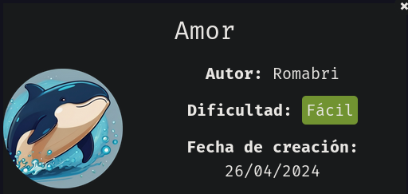

Comenzamos escaneando los puertos abiertos de la máquina víctima.

``sudo nmap 172.17.0.2 -sS -p- --open --min-rate 5000 -n -Pn``

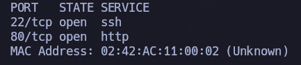

Una vez conocemos los puertos abiertos, volvemos a lanzar otro escaneo sobre estos puertos abiertos para conocer los servicios y versiones que están corriendo sobre dichos puertos.

``nmap 172.17.0.2 -sCV -p22,80``

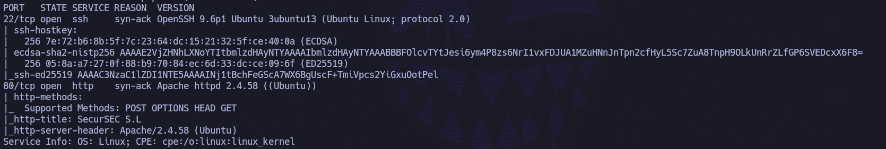

Vale, tenemos SSH (``OpenSSH 9.6``) y HTTP (``Apache 2.4.58``). Por ahora no podemos hacer nada con SSH, por lo que vamos a echar un vistazo a nivel de navegador al servicio HTTP:

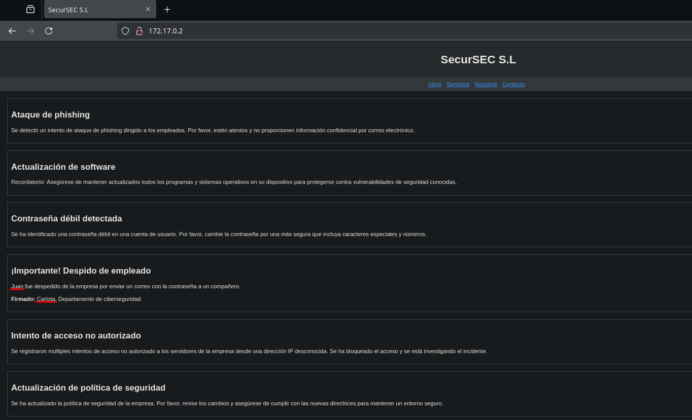

Vemos cositas interesantes, como dos posibles usuarios: ``juan`` y ``carlota``. Los añadimos a ``users.txt``.

Si hacemos fuerza bruta de directorios o miramos el código fuente, no vemos nada interesante.

Como tenemos el servicio SSH abierto, vamos a intentar hacer fuerza bruta con estos dos usuarios utilizando la herramienta ``hydra`` y el diccionario ``rockyou``.

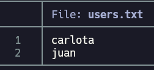

``hydra -L users.txt -P /usr/share/wordlists/rockyou.txt ssh://172.17.0.2``

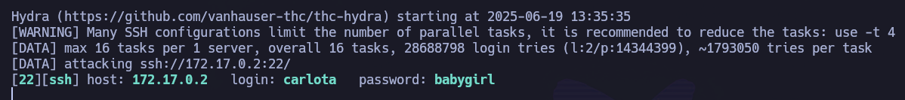

Nos encuentra credenciales válidas: ``carlota``:``babygirl``

Nos conectamos por SSH:

``ssh carlota@172.17.0.2``

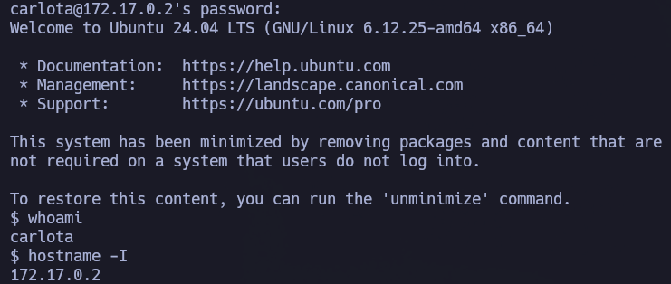

Estamos dentro de la máquina víctima como el usuario ``carlota``.

# PRIVESC

Si indagamos un poco por los directorios dentro del directorio personal de nuestro usuario, vemos:

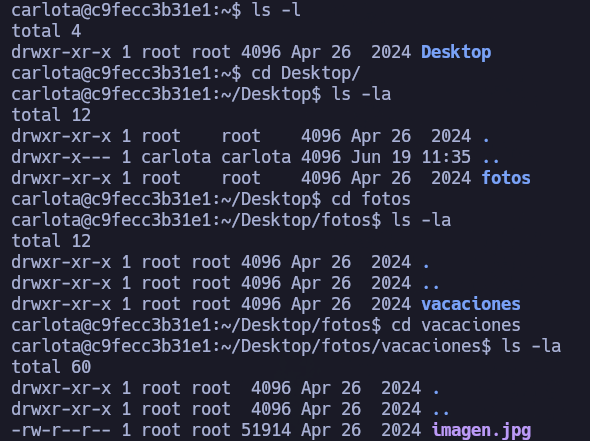

``/home/carlota/Desktop/fotos/vacaciones/imagen.jpg``

Vamos a compartirnos esta imagen con nuestra máquina atacante.

Hacemos la solicitud de recurso desde nuestra máquina atacante:

``scp carlota@172.17.0.2:/home/carlota/Desktop/fotos/vacaciones/imagen.jpg .``

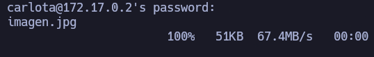

Si le echamos un vistazo:

No parece tener nada inicialmente. Si miramos los metadatos tampoco hay nada interesante. Vamos a ver si tuviese algo de data oculta a través de esteganografía con ``steghide``:

``steghide info imagen.jpg``

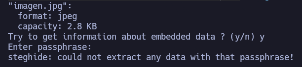

Nos pide una contraseña. Se intenta con la contraseña de carlota, ``babygirl``. Pero no funciona. 

Se repite el proceso sin proporcionar contraseña.

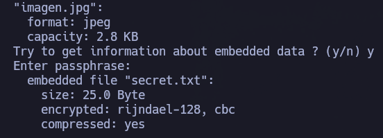

Funciona. Nos ha extraído el fichero embebido "secret.txt". Si echamos un vistazo a su contenido:

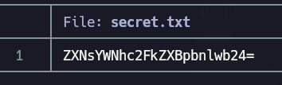)

Parece que está en base64. Vamos a intentar decodearlo:

``cat secret.txt | base64 -d``

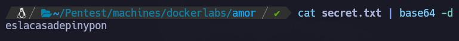

eslacasadepinypon

Se intenta escalar a root con esta contraseña. No funciona.

Si echamos un vistazo al /etc/passwd, vemos que existen otros usuarios:

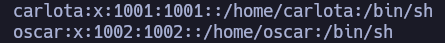

Vamos a intentar pivotar a oscar con esta contraseña.

``su oscar``

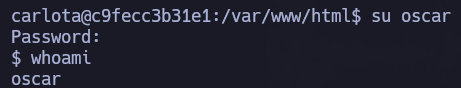

Hemos pivotado correctamente a oscar.

# privesc

``sudo -l``

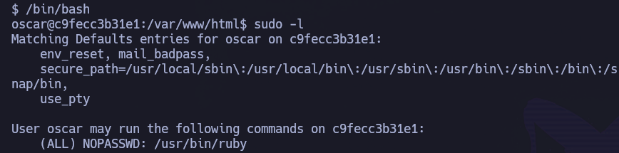

Vemos que podemos ejecutar /usr/bin/ruby como sudo sin proporcionar contraseña de root.

https://gtfobins.github.io/gtfobins/ruby/#sudo

``sudo /usr/bin/ruby -e 'exec "/bin/sh"'``

Hemos pivotado correctamente a root.
