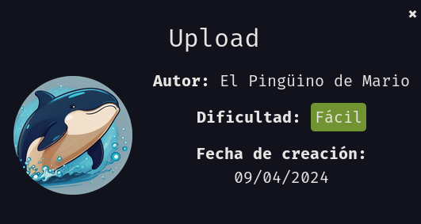

Comenzamos escanenado con ``nmap`` los puertos abiertos de la máquina víctima.

``sudo nmap 172.17.0.2 -sS -p- --open --min-rate 5000 -n -Pn``

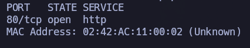

Puerto 80. Muy probablemente sea servicio ``HTTP`` por ``well-known ports``, pero vamos a lanzar un segundo escaneo con ``nmap`` para ver qué tecnología y versión está corriendo.

``nmap 172.17.0.2 -sCV -p80``

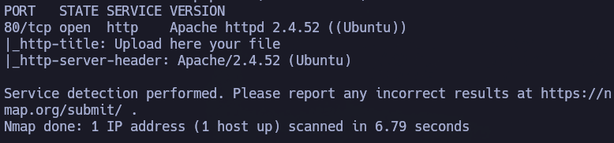

Tenemos un ``Apache 2.4.52``. Vamos a echarle un vistazo a nivel de navegador.

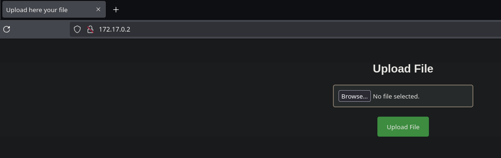

Vale, tenemos una subida de ficheros, pero desconocemos si podremos acceder a posteriori al archivo. Vamos a indagar.

Como no tenemos información sobre el directorio al que se sube y no vemos nada en el código fuente, vamos a tirar fuerza bruta de directorios para intentar averiguarlo.

``gobuster dir -u http://172.17.0.2 -w /usr/share/seclists/Discovery/Web-Content/directory-list-2.3-medium.txt -t 64 -x php,html,txt``

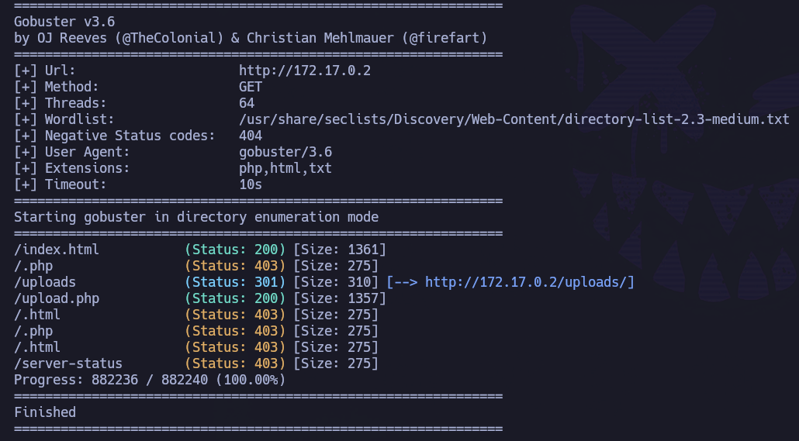

Nos saca ``/uploads``. Muy interesante:

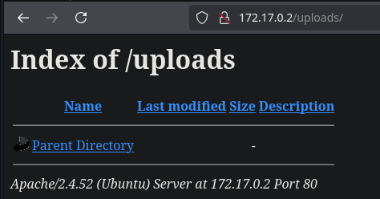

Vale, dado que tenemos posibilidad de subida de archivos y suponemos dónde irán a parar, vamos a probar a subir un .php directamente, y si nos lo niega, intentaremos bypassearlo.

Vamos a nuestra revshell de confianza: pentestmonkey.

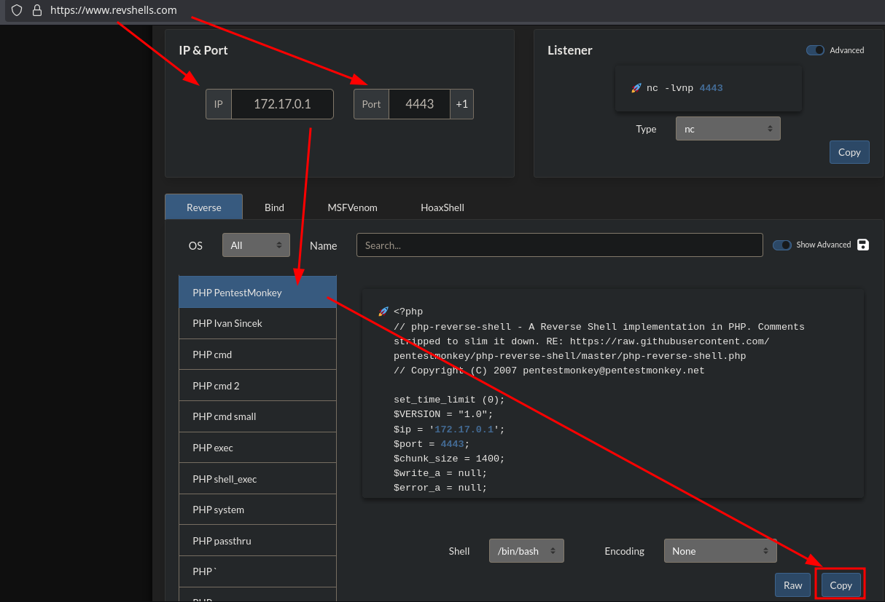

Nos copiamos el contenido, generamos el archivo rev.php y lo subimos:

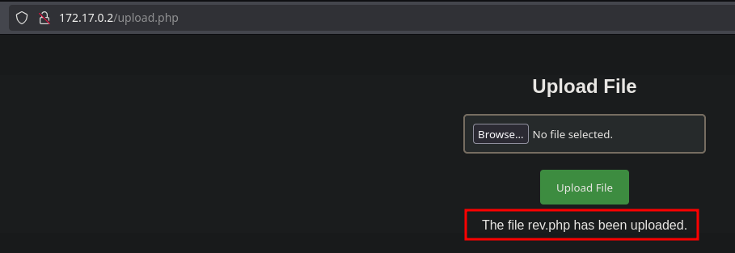

Si accedemos a ``/uploads``:

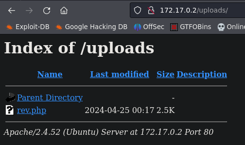

Vale, levantamos listener en el puerto que indicamos anteriormente (``nc -nvlp 4443``) y accedemos a nuestro archivo a través del navegador, a ver si sucede la magia:

Si revisamos listener:

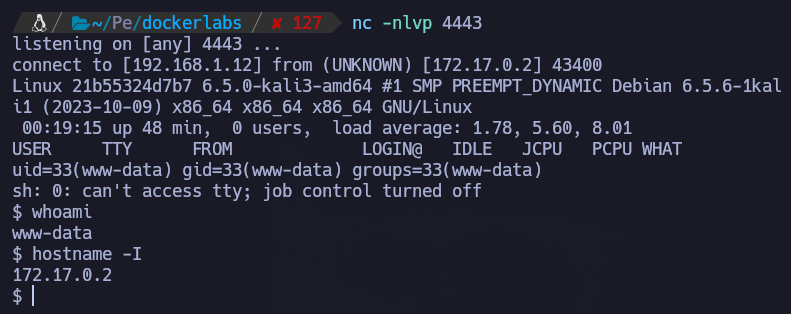

Estamos dentro de la máquina víctima como ``www-data``.

Hacemos tratamiento de la TTY.

# PRIVESC

Si probamos una de las escaladas típicas de linux: ``sudo -l``

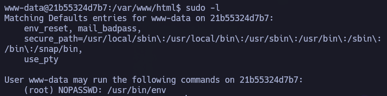

Muy buenas noticias. Podemos ejecutar ``/usr/bin/env`` como sudo sin necesidad de proporcionar contraseña.

https://gtfobins.github.io/gtfobins/env/#sudo

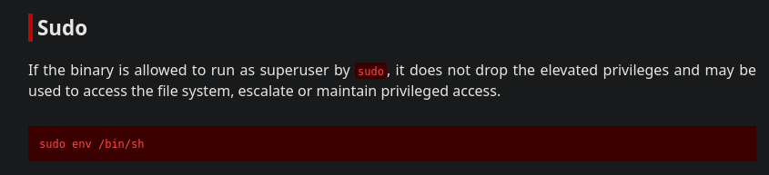

``sudo /usr/bin/env /bin/bash``

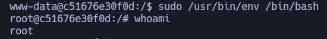

Hemos escalado correctamente a root.
