Se comienza con una fase de enumeración de puertos sobre la máquina objetivo, con el fin de identificar qué puertos se encuentran abiertos.

``sudo nmap 10.129.27.166 -sS -p- --open --min-rate 5000 -n -Pn -oG allPorts``

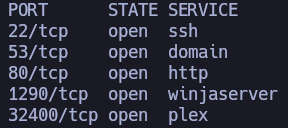

A partir de los puertos detectados, se realiza un análisis más detallado con el objetivo de identificar los servicios asociados, sus versiones y recopilar información adicional mediante scripts de enumeración, lo que permite evaluar posibles vectores de ataque.

``nmap 10.129.27.166 -sCV -p22,53,80,1290,32400 -oN target``

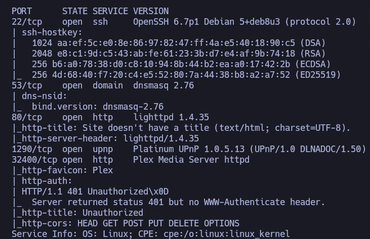

Al acceder directamente al servicio HTTP mediante la IP, el navegador muestra un error de resolución del sitio:

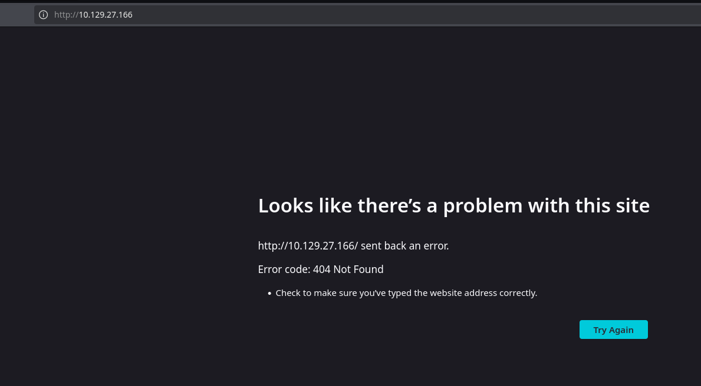

Para solucionarlo, se añade una entrada arbitraria al archivo ``/etc/hosts``, asociando el dominio inventado con la IP de la máquina víctima.

Tras este ajuste, el sitio carga correctamente:
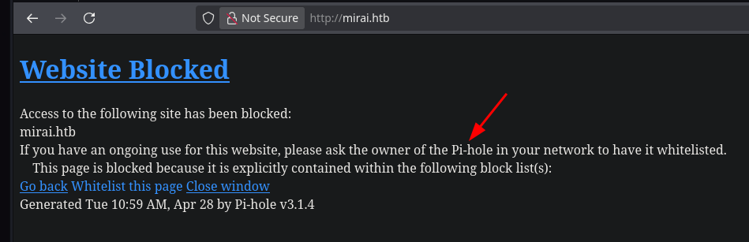

Durante el análisis de la página, puede identificarse que el sistema utilia ``Pi-hole``. Esto explica el comportamiento observado anteriormente, ya que ``Pi-hole`` actúa como un sistema de filtrado DNS (``DNS filtering system``) y requiere una resolución válida del dominio para mostrar correctamente la interfaz.

Además, este contexto sugiere que la máquina probablemente esté basada en ``Raspberry Pi`` o ``Raspberry Pi OS``.

Si se buscan credenciales por defecto:

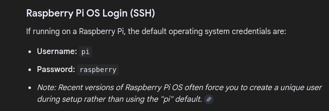

``pi``:``raspberry``

Si se prueban las credenciales por defecto asociadas a ``Pi OS``:

``ssh pi@10.129.27.166``

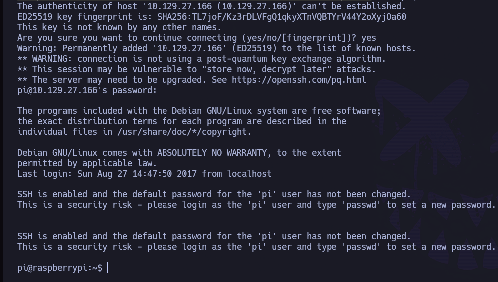

Se consigue acceso a la máquina víctima como el usuario ``pi``.

Una vez dentro, puede obtenerse la flag de usuario en su directorio personal.

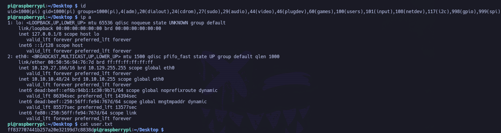

# PRIVESC

Se revisan los privilegios de sudo asignados al usuario actual:

``sudo -l``

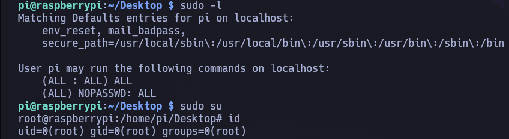

El resultado muestra que el usuario ``pi`` puede ejecutar cualquier comando como ``root`` sin necesidad de proporcionar contraseña, lo que permite una escalada de privilegios inmediata.

Al intentar recoger la flag de root, se observa el siguiente mensaje:

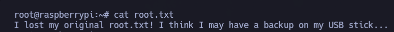

Parece que la flag original ha sido eliminada accidentalmente y únicamente permanece una copia almacenada en un dispositivo USB conectado al sistema.

Se enumeran los dispositivos de almacenamiento conectados:

``lsblk``

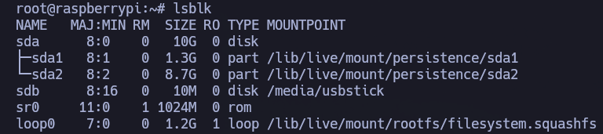

Se identifica un dispositivo externo montado como: ``sdb - disk - /media/usbstick``

Por lo que se analiza directamente el dispositivo: 

``strings /dev/sdb``

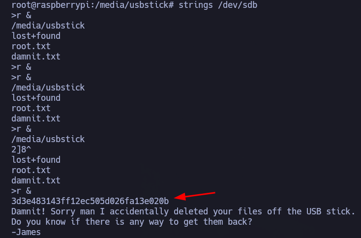

Y se recupera la flag de root almacenada en el dispositivo USB.

