Comenzamos escaneando los puertos abiertos de la máquina objetivo:

``nmap 192.168.205.217 -sS -p- --open --min-rate 5000 -n -Pn -oG allPorts``

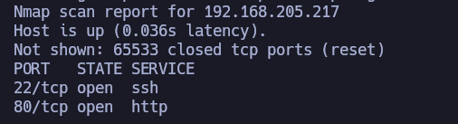

Se sospecha que tendremos SSH y HTTP por ``well-known ports``, pero para estar seguros de qué servicios y versiones están corriendo en estos puertos, repetimos escaneo con nmap para dichos puertos abiertos:

``nmap 192.168.205.217 -sCV -p22,80 -oN target``

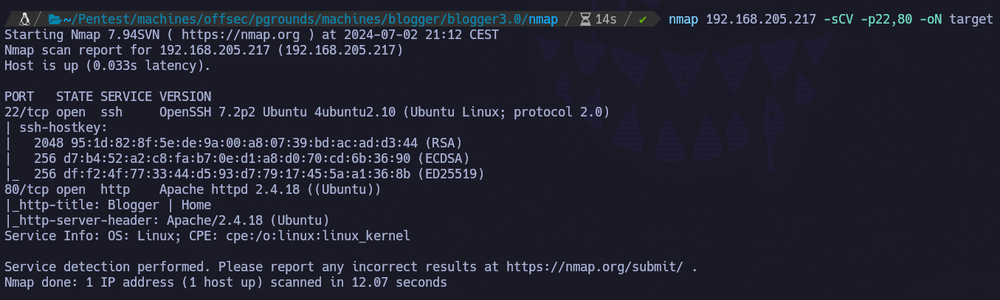

Genial, confirmamos que tenemos SSH (versión de OpenSSH <7.6, por lo que puede que sea vulnerable a ``username enumeration``) y un HTTP (Apache 2.4.18, no vulnerable por versión)

Vamos a echar un vistazo a nivel de navegador. A priori, no encontramos nada de utilidad.

Se lanza fuerza bruta de directorios para el descubrimiento de otras rutas:
`feroxbuster -u http://192.168.205.217 -w /usr/share/seclists/Discovery/Web-Content/directory-list-2.3-medium.txt -t 150 -x php,html,sh,txt, -C 400,404,500,503`

``/assets/fonts/blog``

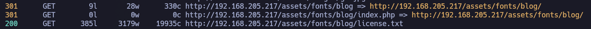

Si intentamos acceder a ``/assets/fonts/blog``, vemos que aparece una página que, a pesar de cargarse, no parece estar haciéndolo correctamente:

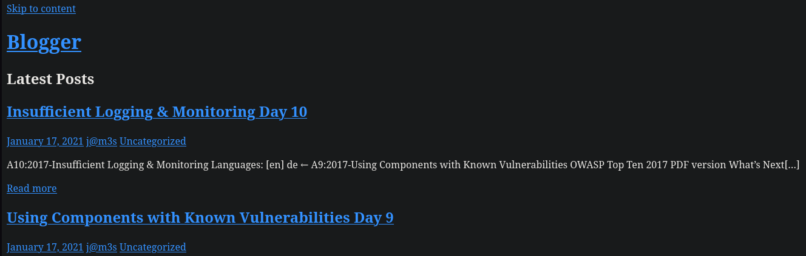

No obstante, ``j@m3s`` resulta sospechoso.

Si vemos el código fuente, vemos:

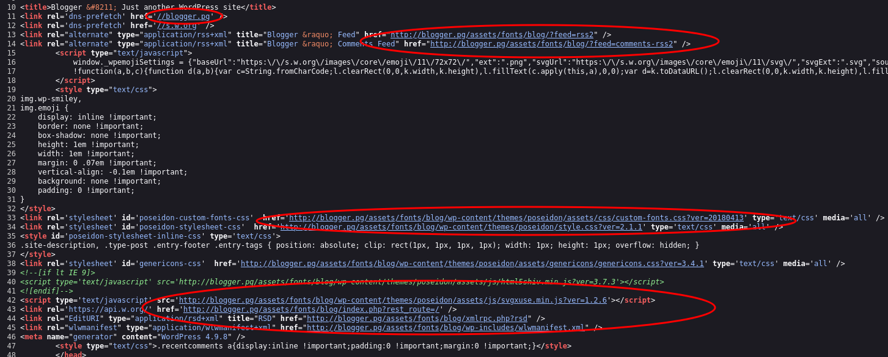

Está cargando recursos de ``blogger.pg``, por lo que lo añadimos al ``/etc/hosts``:

Ya nos ha dado pistas el código fuente antes: ``Just another WordPress site``. Si recargamos la página ahora, después de modificar el ``/etc/hosts``, encontramos una estética muy diferente:

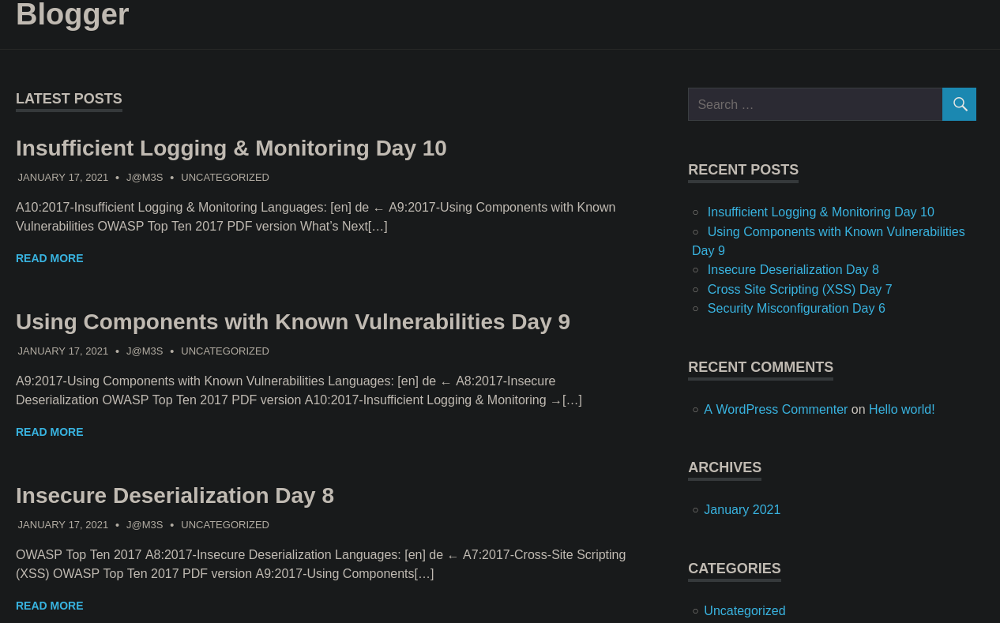

Sabiendo que es un Wordpress, podemos utilizar ``wpscan``:

``wpscan --url http://blogger.pg/assets/fonts/blog/ -e ap,at,u --plugins-detection aggressive``

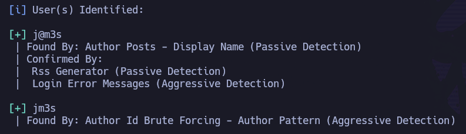

Confirmamos dos usuarios, ``j@m3s`` y ``jm3s``. Aunque intento loguearme con ellos con credenciales básicas, no conseguimos acceder. También nos muestra varios temas, como ``poseidon``, ``twentyfifteen``, ``twentysixteen`` y ``twentyseventeen``, que aparentemente no son vulnerables. Mientras carga la enumeración de plugins, examinamos un poco el contenido del WordPress.

Si investigamos por la página, vemos que en las entradas nos deja poner comentarios, en los que a su vez podemos añadir imágenes:

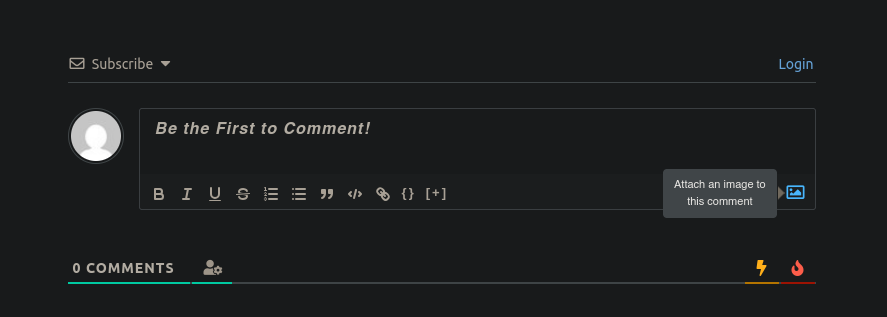

Si subimos un comentario, parece que tiene que estar pendiente de aprobación.

No obstante, si subimos algún archivo al servidor web a través de un comentario, aunque esté pendiente de aprobación, debería almacenarse en algún sitio, ¿no? 

Vamos a probar a subir una imagen random:

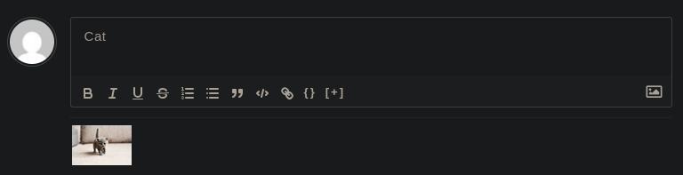

Nos la sube correctamente, y si hacemos ``hovering`` (pasamos el cursor por encima):

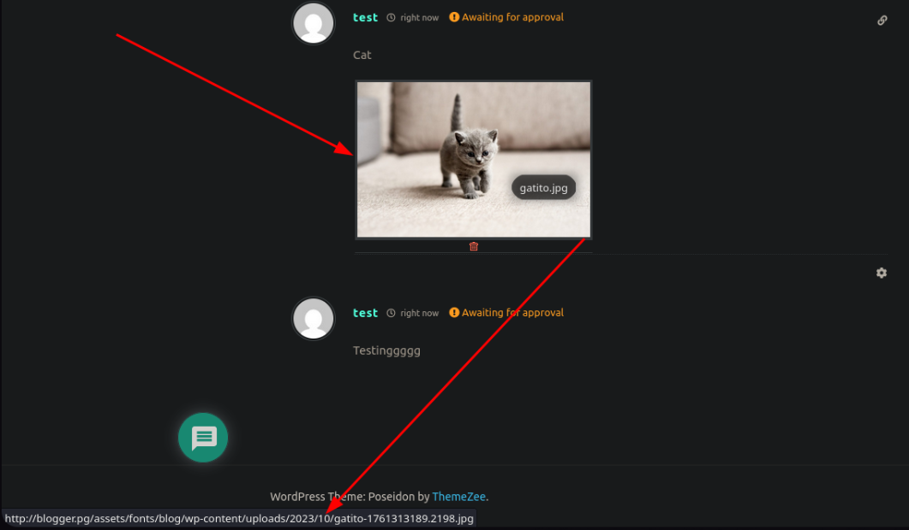

No sólo hemos subido la imagen, sino que también se visualiza en la página (si hacemos click en ella permite hacer una especie de "vista previa"), sino que también podemos ver la ruta: ``http://blogger.pg/assets/fonts/blog/wp-content/uploads/2023/10/gatito-1761313189.2198.jpg``

¿Y si es un archivo PHP en lugar de una imagen?

Vamos a preparar una revshell con un par de clicks: ``https://revshells.com``

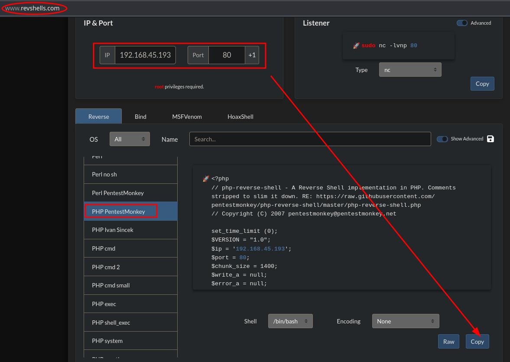

Nos copiamos el contenido en ``rev.php`` y probamos, pero:

``Not allowed file type``

Vale, antes de levantar burpsuite e interceptar la petición, vamos a intentar un bypass sencillo: utilizar magic numbers

https://gist.github.com/leommoore/f9e57ba2aa4bf197ebc5

Modificamos nuestra ``rev.php`` y lo añadimos:

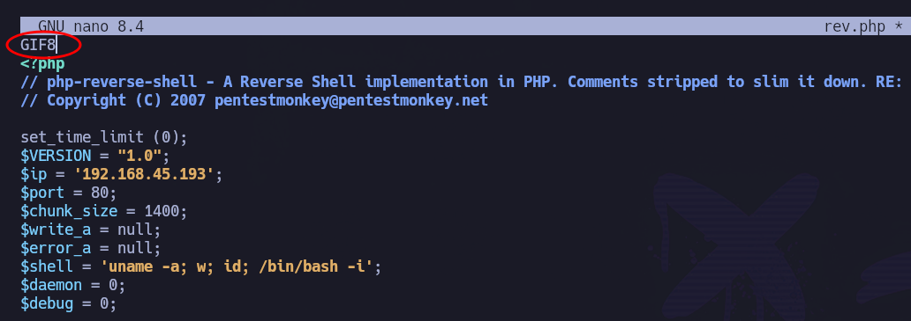

Haber añadido el magic number ``GIF89``, permite:

``file rev.php``

Vamos a intentar subir otra vez nuestro rev.php. Si no funcionara, siempre podemos abrir burpsuite y empezar a toquetear en más profundidad.

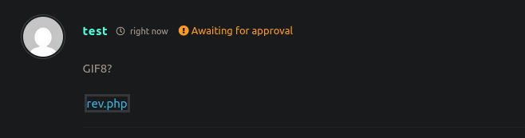

Nos permite subirlo.

- Levantamos listener en el p80: ``nc -nvlp 80``
- Accedemos a rev.php simplemente haciendo click en ella. Otra opción es hacerlo desde ``http://blogger.pg/assets/fonts/blog/wp-content/uploads/2023/10/``
- Revisamos listener

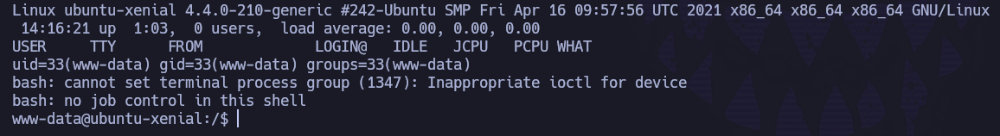

Estamos dentro como ``www-data``.

Podemos recoger la flag de usuario en: ``/home/james/local.txt``

``whoami && ip addr && cat local.txt``

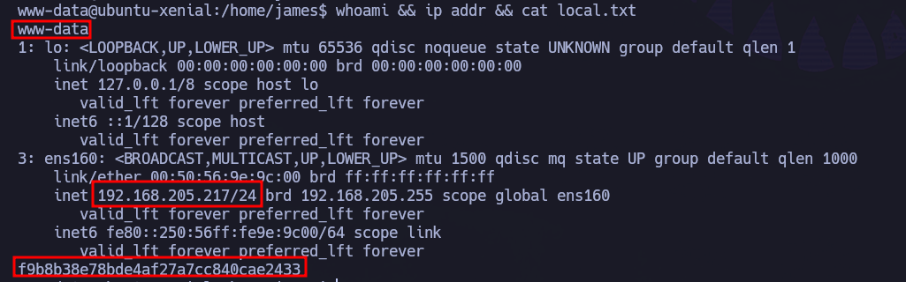

valor local.txt: ``f9b8b38e78bde4af27a7cc840cae2433``

# PRIVESC

Después de probar diferentes opciones, acaba siendo ridículo.

``cat /etc/passwd``

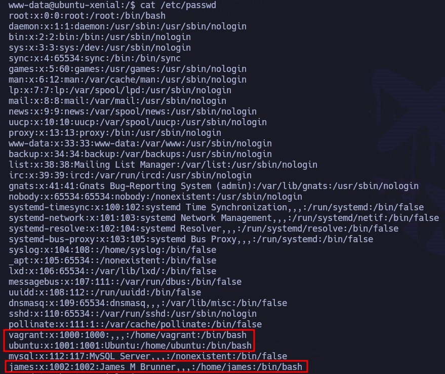

Hay tres usuarios: ``james``, ``vagrant`` y ``ubuntu``.

Pivotamos al usuario ``vagrant``. ¿Las credenciales? ``vagrant``:``vagrant``

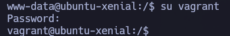

Aunque esto pueda parecer algo medianamente absurdo (que para mí lo es), es algo muy muy presente en la metodología OSCP y que, si no se tiene en cuenta, puede dar muchos dolores de cabeza.

Una vez hemos pivotado al usuario ``vagrant``, desde dicho usuario:

``sudo -l``

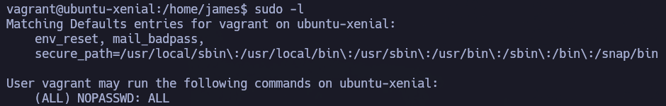

¿Cómo? ¿Podemos ejecutar cualquier comando con privilegios elevados?

``sudo su``

Hemos escalado correctamente a ``root``.

Podemos recoger la flag de root en ``/root/root.txt``.

``whoami && ip addr && cat proof.txt``

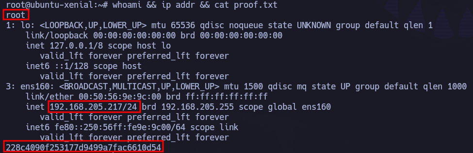

valor de proof.txt : 228c4090f253177d9499a7fac6610d54
