Comenzamos escaneando los puertos abiertos de la máquina víctima:

``sudo nmap 192.168.231.194 -sS -p- --open --min-rate 5000 -n -Pn -oG allPorts``

Tenemos abiertos los puertos 80 y 7744. El puerto 80 apunta, por ``well-known ports`` a HTTP. El 7744 no tengo ni idea. De todas formas, vamos a lanzar otro escaneo de nmap sobre estos puertos abiertos para que me arroje un poco más de información sobre los mismos.

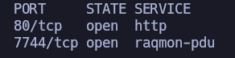

``nmap 192.168.231.194 -sCV -p80,7744 -oN target``

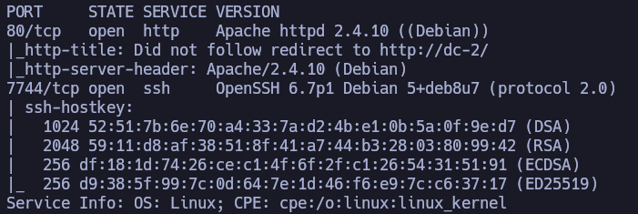

Vale, confirmamos que tenemos un servicio HTTP (Apache 2.4.10) en el p80 y un servicio SSH (OpenSSH 6.7) en el p7744. Puede (depende de su configuración) que el servicio SSH sea vulnerable por versión a ``username enumeration``.

No obstante, vamos a comenzar investigando en el HTTP.

Si nos fijamos en el output de nmap, nos dce: ``Did not follow redirect to http://dc-2/``, por lo que puede que tengamos que modificar nuestro ``/etc/hosts``. Para comprobarlo, si intentamos acceder por navegador a la IP:

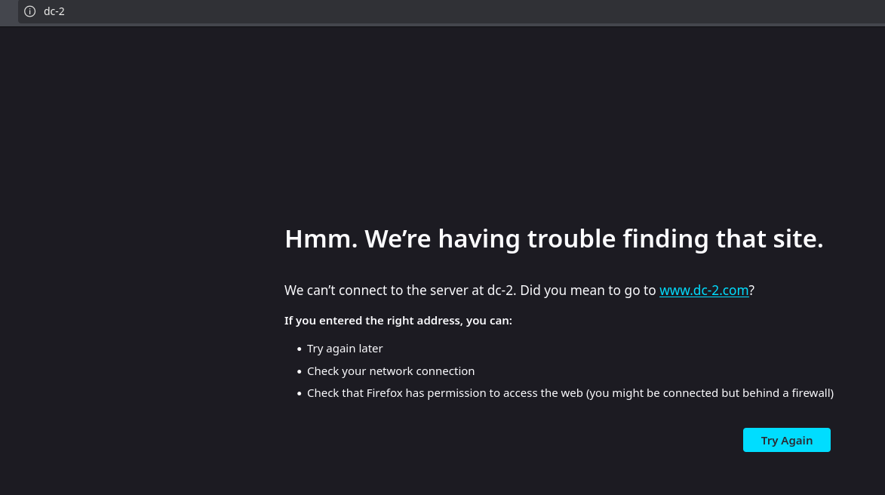

Confirmamos: tenemos que añadir ``dc-2`` al ``/etc/hosts``:

Lanzamos un whatweb para que nos arroje más información:

``whatweb http://dc-2``

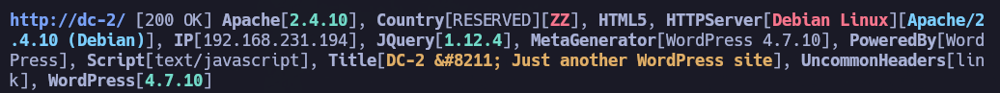

Confirmamos Apache 2.4.10 y sacamos WordPress 4.7.10 

Sabiendo esto, vamos a hacer uso de la herramienta ``wpscan`` para enumerar más información de este WordPress:

``wpscan --url http://dc-2 -e``

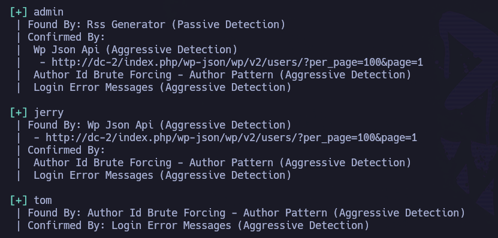

Nos saca varios usuarios: ``admin``, ``tom``, ``jerry``. Nos lo guardamos en ``users.txt``.

Si seguimos echando un vistazo a la web, en el apartado ``/flag``, vemos:

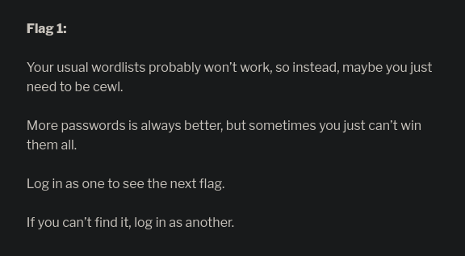

Asumo que con ``usual wordlists`` está haciendo referencia al diccionario ``rockyou``. A su vez, hace referencia al uso de la herramienta ``cewl``, cuya función es generar nuestros propios diccionarios en base a palabras contenidas en urls. Vale, vamos a darle uso.

Vamos a generar un diccionario que contenga todas las palabras (con un mínimo de cuatro caracteres), incluyendo aquellas que contienen números y con una profundidad de 4 para su spider.

``cewl -m 4 --with-numbers -d 4 'http://dc-2/' >> dict.txt``

Si echamos un vistazo a su longitud:

``wc -l dict.txt``

Vamos a hacer fuerza bruta con ``wpscan`` con el diccionario de contraseñas que acabamos de crear contra los usuarios que tenemos en ``users.txt``:

``wpscan --url http://dc-2 -U users.txt -P dict.txt -t 30``

Nos encuentra dos combinaciones válidas:

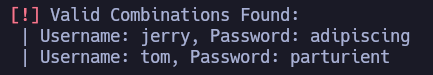

``jerry``:``adipiscing`` y ``tom``:``parturient``

Podemos loguearnos con cualquiera de los dos usuarios en ``/wp-admin``.

Comenzamos con Tom:

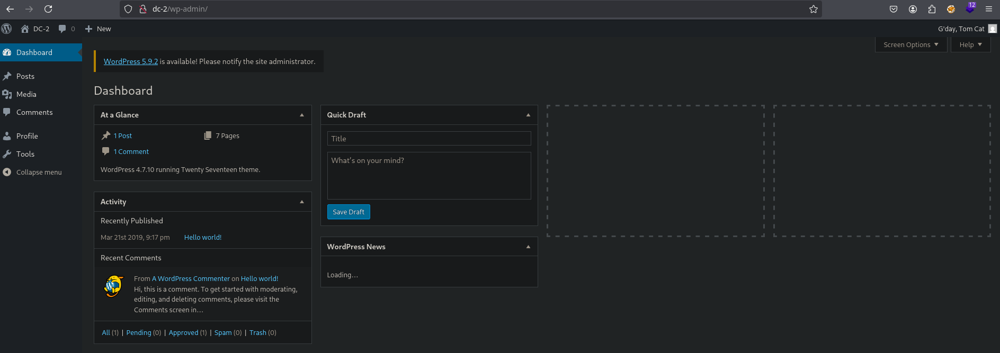

En la esquina superior derecha vemos que el nombre completo del usuario es: ``Tom Cat``. Si nos logueamos con Jerry, vemos ``Jerry Mouse``. Tom&Jerry?

Pero inicialmente no vemos nada más.

Como tenemos un par de credenciales válidas, vamos a intentar validarlas a través de SSH. Las credenciales de Jerry no funcionan, pero las de Tom:

``ssh tom@192.168.231.194 -p 7744``

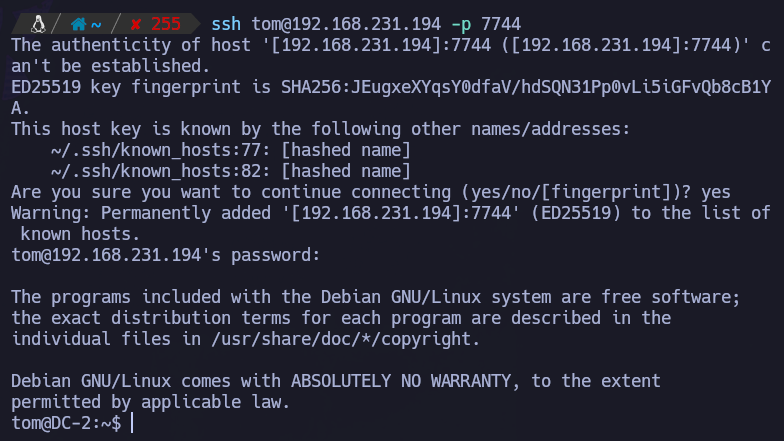

Estamos dentro de la máquina víctima como Tom.

Si intentamos ojear desde dentro la máquina víctima, pronto nos damos cuenta de que estamos en una ``rbash`` (restricted bash):

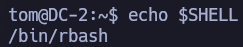

Si intentamos ejecutar una bash a la vez que nos conectamos (con el objetivo de salir de la rbash), nos dice:

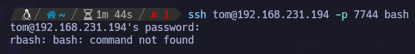

Y si intentamos hacerlo de forma absoluta:

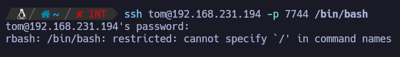

Nos conectamos de forma normal, sin ejecutar comandos. Una vez estamos dentro, podemos ejecutar ``ls -l``:

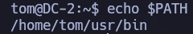

Asumo que dentro de ``/home/tom/usr/bin`` estarán los comandos permitidos por la rbash, vamos a echar un vistazo poco a poco:

``ssh tom@192.168.231.194 -p 7744 ls -l /home/tom/usr``

Repetimos para /home/tom/usr/bin:

``ssh tom@192.168.231.194 -p 7744 ls -l /home/tom/usr/bin``

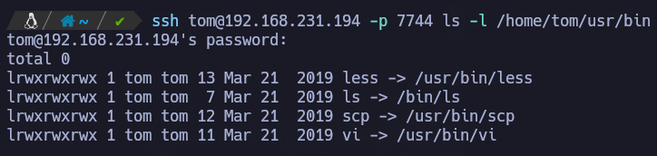

- Con ``less`` podemos ver el contenido de forma paginada de los diferentes archivos.

- Con ``ls`` podemos listar directorios.

- Con ``scp`` podemos compartir archivos con (y desde) nuestra máquina atacante.

- Con ``vi`` podemos editar texto, pero también podemos intentar spawnear cositas.

Como con ``less`` podemos ver de forma paginada el contenido de los archivos, lo probamos con la flag de user:

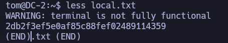

local.txt : ``2db2f3ef5e0af85c88fef02489114359``

También podemos ver otros archivos que pueden ser interesantes: ``flag3.txt``

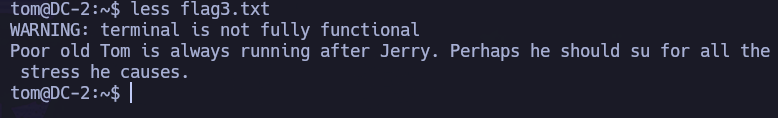

Podemos ver también cositas si hacemos: ``export -p``

``export -p``

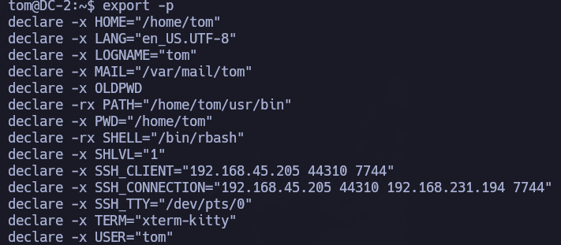

Oye, y si se intenta exportar el path para incluir las rutas típicas de comandos del sistema, ¿me dejará?

``export PATH=$PATH:/usr/local/bin:/usr/local/sbin:/usr/bin:/usr/sbin/:/bin:/sbin``

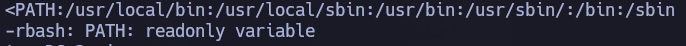

No podemos modificar el path: ``readonly variable``.

No sé hasta qué punto a través de ``SCP`` podríamos compartir utilidades desde nuestra máquina víctima, pero seguro que desde ``vi`` podemos spawnear una shell:

https://gtfobins.github.io/gtfobins/vi/#shell

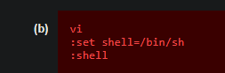

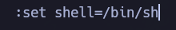

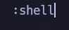

Nos spawnea una sh:

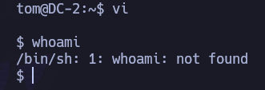

Seguimos teniendo los problemas del path, pero ahora sí nos permite modificarlo:

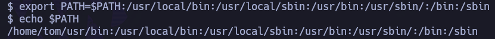

Una vez lo hemos modificado, podemos hacer uso del resto de comandos del sistema.

Ej: sudo -l

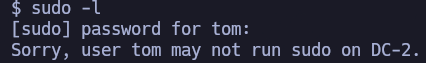

Si echamos un vistazo por dentro del sistema no vemos nada interesante, salvo que el usuario Jerry sí existe. Si revisamos ``flag3.txt``:

``... Perhaps he should su for all the stress he causes.``

¿Puede que esté haciendo referencia a que, aunque no podamos conectarnos por SSH con las credenciales de Jerry, sí se pueda pivotar desde dentro del sistema haciendo uso de la utilidad ``su``? Pues todo es probar.

``su jerry``

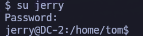

Bingo. Hemos pivotado desde el usuario ``tom`` al usuario ``jerry``.

# PRIVESC

Una vez hemos pivotado a Jerry, en su directorio personal vemos:

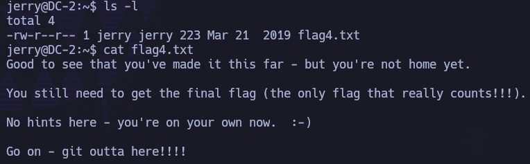

Si probamos escaladas típicas, con ``sudo -l`` encontramos algo jugoso:

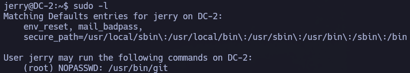

Podemos ejecutar ``/usr/bin/git`` como root sin proporcionar su contraseña.

Podemos hacer algo muy parecido a si tuviésemos permisos de sudo en ``nano`` o ``vim``: entrar en su edición como root y escapar una bash:

``sudo git -p help config``

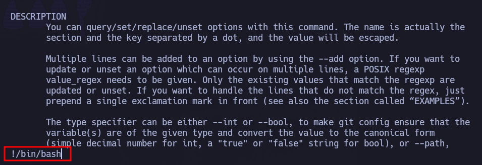

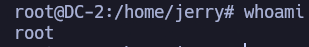

Hemos escalado correctamente a root. Ahora podemos recoger la flag de root en su directorio personal: ``/root/proof.txt``:

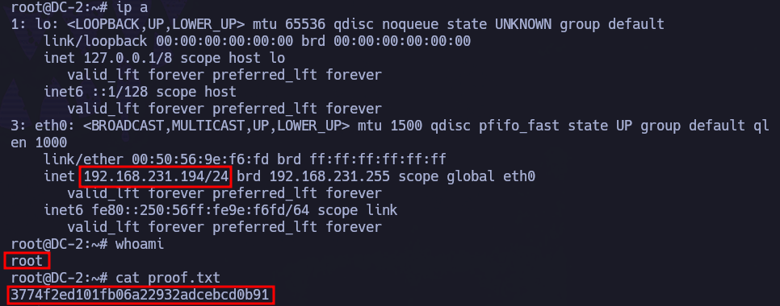

Valor de ``proof.txt``: ``3774f2ed101fb06a22932adcebcd0b91``
