Comenzamos escaneando los puertos abiertos de la máquina objetivo con nmap.

Acto seguido, le pasamos a nmap esos mismos puertos para que pase scripts básicos de reconocimiento para averiguar qué servicios y versiones están corriendo por esos puertos.

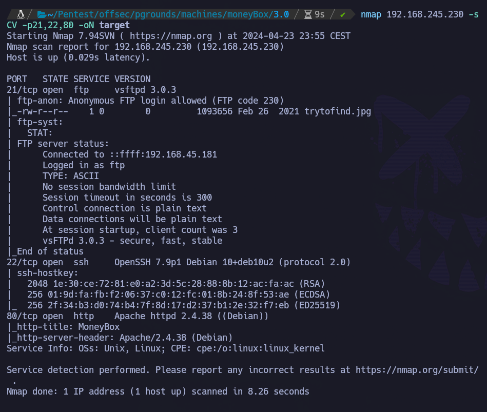

Cositas interesantes que podemos extraer de la imagen anterior:
- Anonymous login permitido en FTP. A su vez, parece haber un archivo llamado trytofind.jpg.
- Tiene puerto SSH, por lo que si conseguimos credenciales podremos conectarnos.
- Tiene una página web en un servidor Apache 2.4.38.

Si nos adentramos en el FTP como anonymous:

``ftp 192.168.245.230``

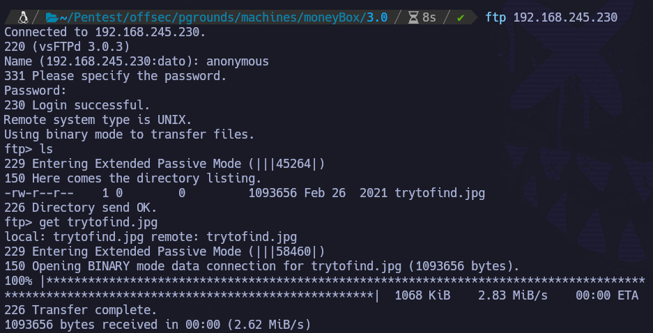

Descargamos `Trytofind.jpg`.

``get trytofind.jpg``

Si la visualizamos, vemos la foto de un gato. A priori nada extraño. Por el nombre podría apuntar a esteganografía, pero no tenemos la contraseña para extraer información embebida en la imagen.

Si analizamos el p80 y la página web, no vemos nada interesante. Para intentar descubrir más información se utiliza fuerza bruta de directorios con gobuster, junto con las herramientas whatweb y nikto.

Con gobuster vemos la existencia de un endpoint: /blogs

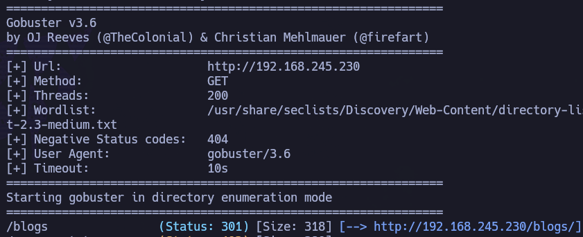

Accedemos a /blogs y es una página muy sencilla. En el código, incrustado, podemos ver este comentario:

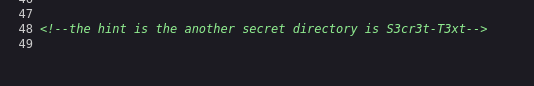

Accedemos a /S3cr3t-T3xt

Otra página muy sencilla, que en el código, abajo del todo, podemos ver otro comentario:

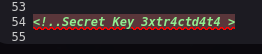

Tenemos una imagen y una contraseña, por lo que todo induce a la esteganografía.

`steghide extract -sf Trytofind.jpg`

Y metemos la contraseña: `3xtr4ctd4t4`

Nos extrae data.txt. Vamos a echarle un vistazo.

Es un mensaje:
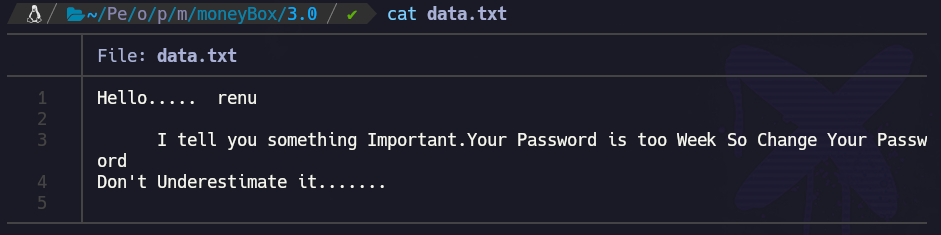

De aquí extraemos que hay un usuario "renu" y que su contraseña es débil, lo que induce a fuerza bruta con rockyou.

Se intenta fuerza bruta con hydra contra el servicio SSH utilizando el rockyou como diccionario.

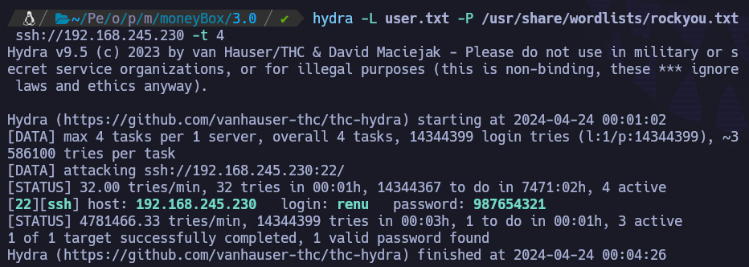

Bingo. Encuentra credenciales. renu:987654321

Nos conectamos por SSH a la máquina víctima con las credenciales obtenidas.

``ssh renu@192.168.245.230``

Estamos dentro como Renu.

Recogemos la flag de usuario en /home/renu/local.txt.

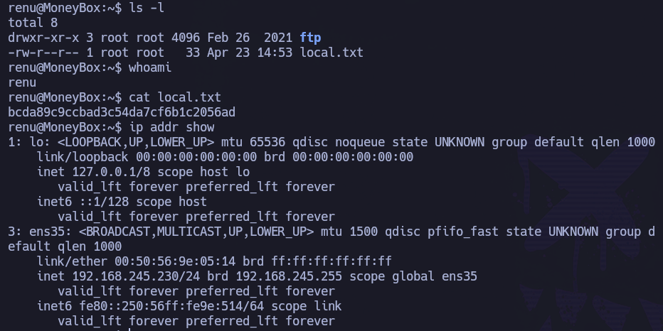

# ESCALADA:

Si enumeramos el sistema desde dentro, observamos que hay otro usuario que se llama lily y que tiene un directorio .ssh, que a su vez contiene:

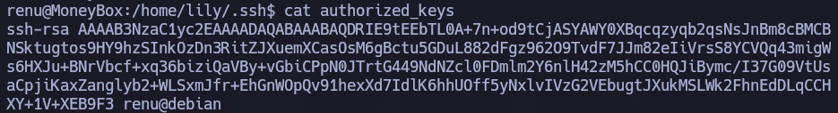

De aquí podemos extraer que podemos pivotar a lily desde renu sin proporcionar contraseña, ya que renu está autorizado.

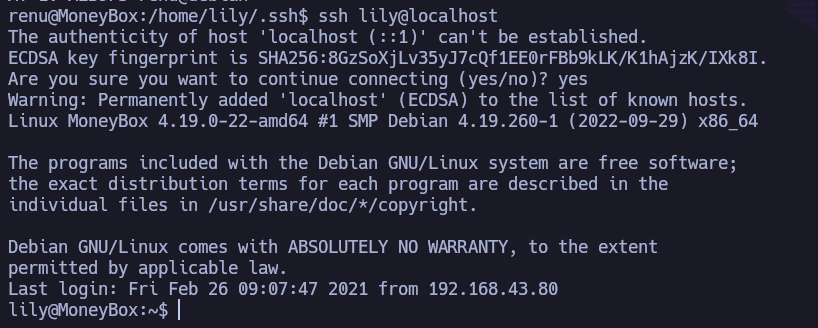

Hemos pivotado correctamente al usuario lily dede renu.

Si probamos una de las escaladas más básicas, ``sudo -l``, vemos:

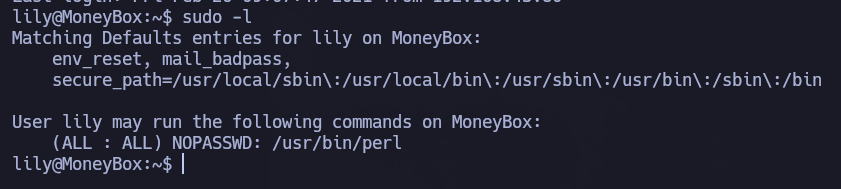

Muy buenas noticias: podemos ejecutar /usr/bin/perl como root sin contraseña.

https://gtfobins.github.io/gtfobins/perl/#sudo

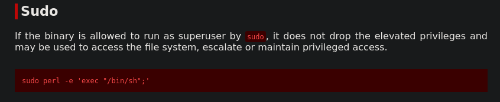

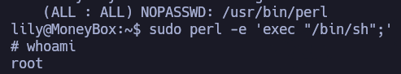

Hemos escalado correctamente a root abusando del binario perl.

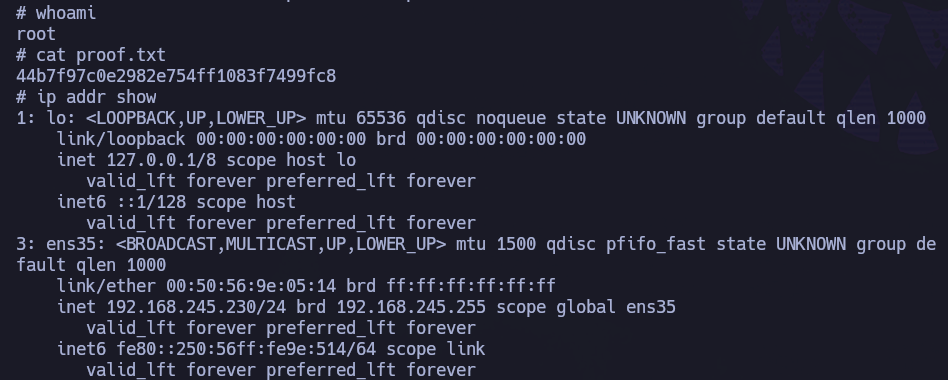

Recogemos la flag de root en /root/root.txt.

Done.
